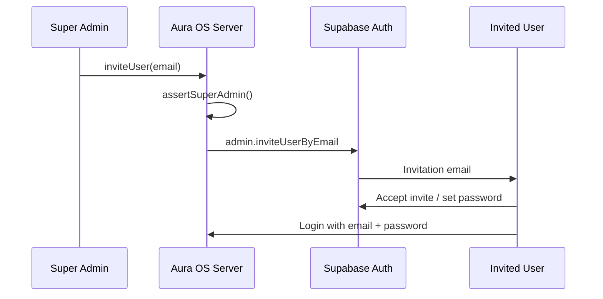

# Authentication — Invitation Only

Aura OS is an **enterprise / invitation-only** product. There is **no public Sign Up**.

## Current login surface

`/login` supports only:

1. Email  
2. Password  
3. Sign In  
4. Forgot Password  

Password recovery lands on `/auth/update-password` after the email link is exchanged via `/auth/callback`.

## Disabled

- Public registration UI  
- Client-side `supabase.auth.signUp`  
- “Need an account? Sign Up” links  

## Required Supabase project setting

In **Supabase Dashboard → Authentication → Providers → Email**:

- **Disable** “Enable sign ups” (or equivalent public signup toggle)

This blocks public registration at the Auth API even if a rogue client calls `signUp`.

Also add redirect URLs for:

- `{APP_URL}/auth/callback`
- `{APP_URL}/auth/callback?next=/auth/update-password`

## Super Admin

Platform privilege (not Workspace Team roles).

A user is Super Admin if either:

1. `user.app_metadata.role === "super_admin"`, or  
2. Their email is listed in `SUPER_ADMIN_EMAILS` (comma-separated)

Only Super Admins may create users (via invite).

## Future invite flow

```text
Super Admin
  → Invite User (server: inviteUser)
  → Email Invitation (Supabase Auth)
  → User Creates Password (/auth/update-password)
  → Login (/login)
```



### Code scaffolding (no full UI yet)

| Path | Purpose |
| --- | --- |
| `src/features/auth/invite/invite-user.ts` | Server-only invite via service role |
| `src/features/auth/lib/assert-super-admin.ts` | Gate for Super Admin actions |
| `src/features/auth/types.ts` | `isSuperAdmin` / `PlatformRole` |
| `src/features/auth/schemas/auth.ts` | `inviteUserSchema` |

Do **not** reintroduce public registration. Future Team / Settings UI should call `inviteUser`, not `signUp`.

## Environment

```bash
# Comma-separated Super Admin emails (bootstrap allowlist)
SUPER_ADMIN_EMAILS=owner@yourcompany.com
```

See `.env.example`.
