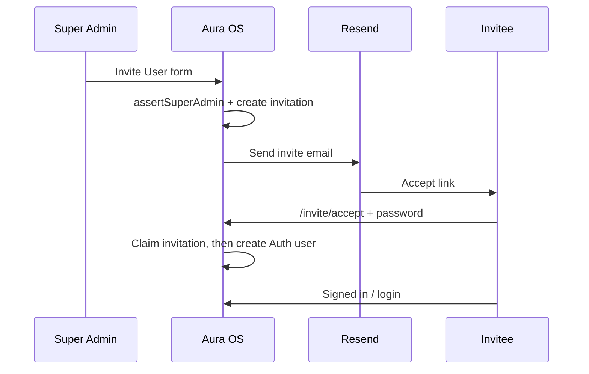

# Authentication — Invitation Only

Aura OS is an **enterprise / invitation-only** product. There is **no public Sign Up**.

## Current login surface

`/login` supports only:

1. Email  
2. Password  
3. Sign In  
4. Forgot Password  

Password recovery lands on `/auth/update-password` after the email link is exchanged via `/auth/callback`.

## Disabled permanently

- Public registration UI  
- Client-side `supabase.auth.signUp`  
- “Need an account? Sign Up” links  

## Required Supabase project setting

In **Supabase Dashboard → Authentication → Providers → Email**:

- **Disable** “Enable sign ups”

Also add redirect URLs for:

- `{APP_URL}/auth/callback`
- `{APP_URL}/auth/callback?next=/auth/update-password`
- `{APP_URL}/invite/accept`

Apply migrations (in order):

1. `supabase/migrations/20260716000300_sprint007_invitations.sql`
2. `supabase/migrations/20260716000400_sprint007_invitation_hardening.sql`

Set `NEXT_PUBLIC_APP_URL` to the public production origin (required for invite links in production).

## Super Admin

A user is Super Admin if either:

1. `user.app_metadata.role === "super_admin"`, or  
2. Their email is listed in `SUPER_ADMIN_EMAILS`

Only Super Admins can open **Settings → User Management** and send invites.

## Invitation flow

```text
Super Admin
  → Settings → User Management → Invite User
  → Secure token generated (hashed at rest)
  → Email sent (Resend) or invite URL shown for manual share
  → User opens /invite/accept?token=…
  → Creates password (single use, 72h max)
  → Account created → Login / dashboard
```



### Rules

| Rule | Enforcement |
| --- | --- |
| 72h expiry | `expires_at` + status `expired` |
| Single use | claim `pending` → `accepted` before `createUser` |
| One pending per email | unique partial index on `lower(email)` |
| Audit | `invitation_audit_logs` (no tokens / invite URLs in metadata) |
| No plaintext token | only `token_hash` (SHA-256) stored |

### Key paths

| Path | Purpose |
| --- | --- |
| `/dashboard/settings/users` | Invitation list |
| `/dashboard/settings/users/invite` | Invite form |
| `/invite/accept` | Accept + set password |
| `src/features/auth/invite/*` | Server domain logic |

## Environment

```bash
NEXT_PUBLIC_APP_URL=https://your-production-domain.com
SUPER_ADMIN_EMAILS=owner@yourcompany.com
RESEND_API_KEY=re_xxx
RESEND_FROM_EMAIL=Aura OS <onboarding@resend.dev>
SUPABASE_SERVICE_ROLE_KEY=...
```

Without `RESEND_API_KEY`, invitations are still created and the Super Admin is shown the invite URL to copy.
