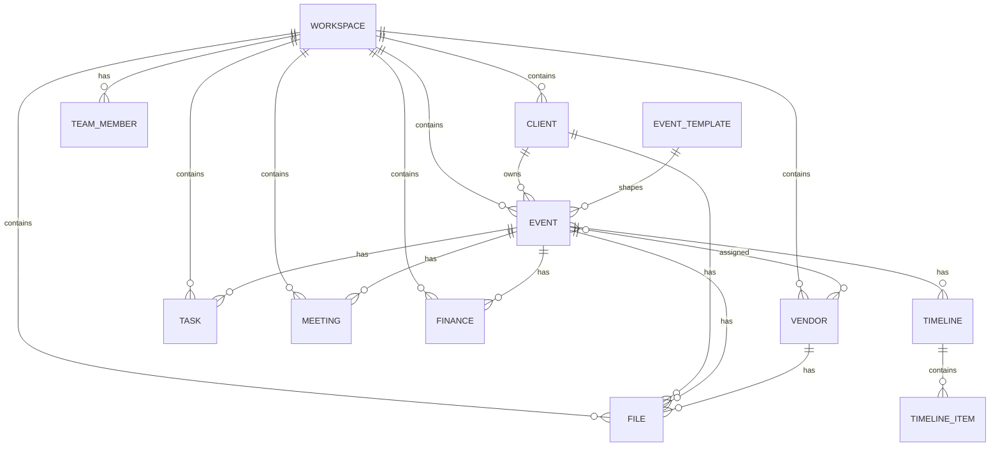
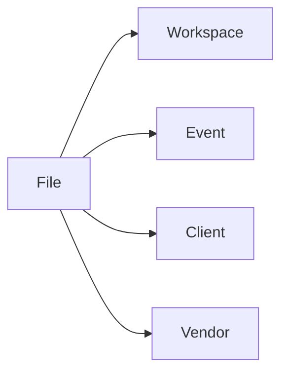
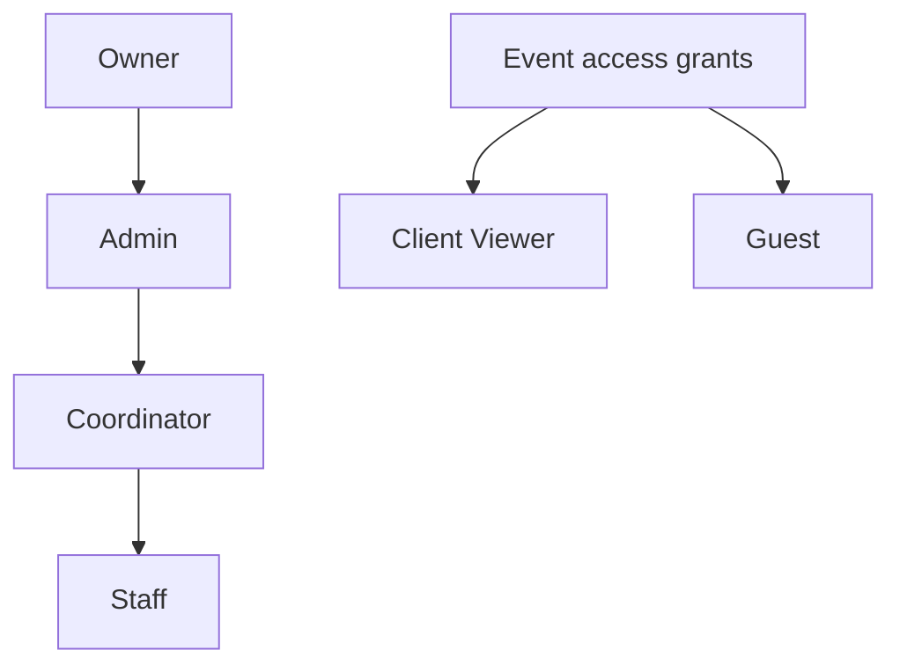
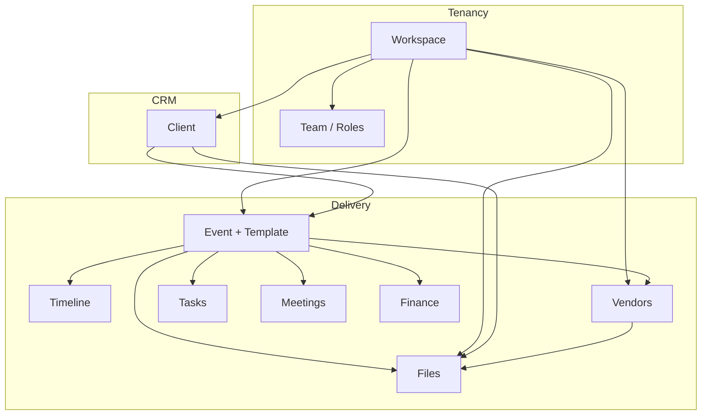

# Aura OS Core Data Model

Sprint 003 — **architecture only**.

This document defines the target conceptual data model for Aura OS. It does **not** change the live database, migrations, or UI.

> **Relation to today:** Sprint 001 ships `profiles`, `clients`, `weddings`, `meetings`, `tasks`, and `financial_records` scoped to a single user. This model introduces **Workspace** as the tenancy root and generalizes **Wedding → Event** via templates. See [DATABASE.md](./DATABASE.md) for the current physical schema.

---

## 1. Design goals

| Goal | Meaning |
| --- | --- |
| One OS, many event types | Wedding, corporate, birthday, concert, exhibition, roadshow share one core model |
| Workspace tenancy | All business data hangs off a Workspace, not a raw user |
| Event-centric operations | Timeline, vendors, files, tasks, meetings, and finance attach primarily to Events |
| Template extensibility | Event *kinds* are templates/config, not separate products |
| Clear viewer roles | Owner → Guest permission ladder, including Client (viewer-only) |
| File polymorphism | Files attach to Workspace, Event, Client, or Vendor |

---

## 2. Primary entities

### Workspace

The **tenant root**. A company, studio, or planning team operates inside one or more Workspaces.

| Concept | Description |
| --- | --- |
| Ownership | Created by an Owner; members join via Team roles |
| Scope | Contains Clients, Events, Vendors, Tasks, Meetings, Finance, Files |
| Isolation | Data never crosses Workspaces unless explicitly shared later |

**Logical fields (conceptual):** `id`, `name`, `slug`, `timezone`, `currency`, `settings`, `created_at`, `updated_at`

---

### Client

A person or organization the Workspace serves.

| Concept | Description |
| --- | --- |
| Ownership | Belongs to exactly one Workspace |
| Events | Can own / be linked to **multiple Events** |
| Access | May receive a **Client (Viewer)** role on their Events |

**Logical fields:** `id`, `workspace_id`, `name`, `email`, `phone`, `status`, `notes`, `follow_up_at`, timestamps

---

### Event

A planned occasion inside a Workspace. Replaces the idea of a hard-coded “wedding-only” system.

| Concept | Description |
| --- | --- |
| Tenancy | Belongs to **exactly one Workspace** |
| Client | Typically linked to one primary Client; may support additional contacts later |
| Template | Uses an **Event Template** (Wedding, Corporate, …) for defaults and modules |
| Contents | Timeline, Vendors, Files, Tasks, Meetings, Finance |

**Logical fields:** `id`, `workspace_id`, `client_id`, `template_id` / `template_key`, `name`, `event_date`, `venue`, `status`, `settings`, timestamps

> **Migration note (future):** today’s `weddings` table maps conceptually to `events` with `template_key = wedding`. No schema change in this sprint.

---

### Vendor

A supplier or partner used across the Workspace and/or assigned to Events.

| Concept | Description |
| --- | --- |
| Workspace catalog | Master vendor list lives at Workspace level |
| Event assignment | Events attach vendors (with role, fee, status) via a join |
| Files | Contracts, moodboards, etc. can hang off the Vendor |

**Logical fields:** `id`, `workspace_id`, `name`, `category`, `email`, `phone`, `notes`, timestamps  
**Join (Event ↔ Vendor):** `event_id`, `vendor_id`, `role`, `status`, `fee`, timestamps

---

### Task

A work item for the team.

| Concept | Description |
| --- | --- |
| Scope | Workspace-level or Event-scoped (preferred for execution) |
| Links | Optional `client_id`, `vendor_id`, assignee (Team member) |
| Lifecycle | Priority + status (todo → done) |

**Logical fields:** `id`, `workspace_id`, `event_id?`, `client_id?`, `vendor_id?`, `assignee_id?`, `title`, `priority`, `status`, `due_at`, timestamps

---

### Meeting

A scheduled interaction.

| Concept | Description |
| --- | --- |
| Scope | Workspace-level or Event-scoped |
| Links | Optional Client, Event, Vendor |
| Time | `starts_at` / `ends_at` |

**Logical fields:** `id`, `workspace_id`, `event_id?`, `client_id?`, `vendor_id?`, `title`, `starts_at`, `ends_at`, `location` / `link`, timestamps

---

### Finance

Money movements and obligations for the Workspace / Event / Client.

| Concept | Description |
| --- | --- |
| Types | Revenue, expense, payment (and future: invoice, deposit, refund) |
| Scope | Usually Event-scoped; may also attach to Client or remain Workspace-only |
| Status | Pending, paid, outstanding, cancelled |

**Logical fields:** `id`, `workspace_id`, `event_id?`, `client_id?`, `vendor_id?`, `record_type`, `amount`, `currency`, `status`, `occurred_on`, `description`, timestamps

> Maps to today’s `financial_records`.

---

### Files

Binary assets and documents in the Aura file system (backed by Supabase Storage later).

| Concept | Description |
| --- | --- |
| Parent | Exactly one of: Workspace, Event, Client, Vendor |
| Kind | Images, PDF, Video, Audio, Contracts, Floor Plans, Moodboards |
| Metadata | Name, mime, size, storage path, tags |

See [§5 File System](#5-file-system).

---

### Timeline

An ordered plan of moments for an **Event** (day-of run of show, planning milestones, or both).

| Concept | Description |
| --- | --- |
| Ownership | Belongs to **one Event** |
| Items | Ordered entries with time, title, owner, location, notes |
| Template-aware | Wedding vs Concert templates may seed different default sections |

**Logical fields (Timeline):** `id`, `event_id`, `name`, `kind` (`planning` \| `day_of` \| …), timestamps  
**Logical fields (Timeline Item):** `id`, `timeline_id`, `sort_order`, `starts_at?`, `ends_at?`, `title`, `assignee_id?`, `location?`, `notes?`

---

### Team

Membership of people in a Workspace (and optional Event-level overrides).

| Concept | Description |
| --- | --- |
| Members | Users invited into a Workspace |
| Roles | Owner, Admin, Coordinator, Staff (+ Client / Guest for external viewers) |
| Event ACL | Optional tighter or viewer grants per Event |

See [§6 Viewer System](#6-viewer-system).

**Logical fields (Membership):** `id`, `workspace_id`, `user_id`, `role`, `status`, timestamps  
**Logical fields (Event access):** `id`, `event_id`, `user_id` / `invite_email`, `role`, timestamps

---

## 3. Relationships

### Workspace tree

```text
Workspace
 ├── Clients
├── Events
├── Vendors
├── Tasks
├── Meetings
├── Finance
├── Files
└── Team (memberships)
```

### Cardinality summary

| From | To | Relationship |
| --- | --- | --- |
| Workspace | Client | 1 → many |
| Workspace | Event | 1 → many |
| Workspace | Vendor | 1 → many |
| Workspace | Task | 1 → many |
| Workspace | Meeting | 1 → many |
| Workspace | Finance | 1 → many |
| Workspace | File | 1 → many (when parent = workspace) |
| Workspace | Team member | 1 → many |
| Client | Event | 1 → many (a Client can own multiple Events) |
| Event | Workspace | many → 1 (each Event belongs to one Workspace) |
| Event | Timeline | 1 → many (usually one planning + one day-of) |
| Event | Vendor | many ↔ many (via assignment) |
| Event | File | 1 → many |
| Event | Task | 1 → many |
| Event | Meeting | 1 → many |
| Event | Finance | 1 → many |
| Client | File | 1 → many |
| Vendor | File | 1 → many |
| Team member | Task | 1 → many (as assignee) |

### Event contents

```text
Event
 ├── Timeline
│     └── Timeline Items
├── Vendors (assignments)
├── Files
├── Tasks
├── Meetings
└── Finance
```

### Relationship diagram (Mermaid)



### ASCII relationship map

```text
                    ┌─────────────┐
                    │  Workspace  │
                    └──────┬──────┘
           ┌───────────────┼───────────────┐
           │               │               │
           ▼               ▼               ▼
       ┌───────┐      ┌────────┐     ┌─────────┐
       │Client │──1:N─│ Event  │     │ Vendor  │
       └───┬───┘      └───┬────┘     └────┬────┘
           │              │               │
           │         ┌────┼────┬────┬─────┤
           │         ▼    ▼    ▼    ▼     ▼
           │     Timeline Tasks Meet Finance Files
           │              │
           └──────────────┴── shared optional links
```

---

## 4. Event templates (future extensibility)

Aura OS must support many occasion types **without** forking into separate systems.

### Principle

**Event Template** = configuration + default modules + vocabulary — not a separate codebase or schema family.

```text
Event Template
├── key / name
├── default statuses
├── default timeline sections
├── suggested vendor categories
├── default task checklists
├── field schema (custom attributes)
└── enabled modules (timeline, gallery, portal, …)
```

### Built-in templates

| Template | Typical use |
| --- | --- |
| **Wedding** | Couples, venues, day-of timeline, bridal vendors |
| **Corporate Event** | Brands, agendas, stakeholders, AV vendors |
| **Birthday** | Hosts, guest counts, entertainment |
| **Concert** | Artists, stage plot, load-in / soundcheck timeline |
| **Exhibition** | Booths, floor plans, exhibitor vendors |
| **Roadshow** | Multi-stop dates, logistics, local vendors |

### How templates attach

```text
┌──────────────────┐         ┌─────────────────┐
│ Event Template   │ 1 ── N  │ Event           │
│ (wedding, …)     │         │ workspace-owned │
└──────────────────┘         └─────────────────┘
```

- Creating an Event **selects a template**.
- Template seeds Timeline, Tasks, and Vendor categories.
- Core tables stay shared; template-specific data lives in:
  - `template_key` on Event
  - JSON/settings for custom fields
  - optional module flags

### Extensibility rules

1. **Never** create parallel `weddings` / `concerts` / `roadshows` product silos.
2. Add a new occasion by adding a **template definition**, not a new tenancy model.
3. Modules (Timeline, Gallery, Portal) toggle per template or per Event.
4. Custom fields are namespaced by template to avoid column explosion.

---

## 5. File System

### Supported kinds

| Kind | Examples |
| --- | --- |
| **Images** | Photos, references, hero assets |
| **PDF** | Proposals, run sheets, invoices |
| **Video** | Recaps, venue walkthroughs |
| **Audio** | Music cues, voice notes |
| **Contracts** | Signed agreements, SOWs |
| **Floor Plans** | Venue maps, booth layouts |
| **Moodboards** | Creative direction boards |

Kinds may map to MIME + a `file_kind` enum for product UX (e.g. a PDF tagged as `contract` vs generic `pdf`).

### Parent attachment (exactly one)

Each file belongs to **either**:

| Parent | When to use |
| --- | --- |
| **Workspace** | Studio-wide assets, brand kits, master contracts |
| **Event** | Event-specific docs, galleries, day-of files |
| **Client** | Client-owned docs shared across their Events |
| **Vendor** | Vendor contracts, portfolios, insurance docs |

```text
File
├── parent_type: workspace | event | client | vendor
├── parent_id
├── kind: image | pdf | video | audio | contract | floor_plan | moodboard
├── storage_provider: supabase_storage (planned)
├── path / bucket
└── metadata (name, size, mime, checksum, created_by)
```

### File diagram



```text
                 ┌────────────┐
                 │    File    │
                 └─────┬──────┘
        ┌──────────┬───┴───┬──────────┐
        ▼          ▼       ▼          ▼
   Workspace    Event   Client     Vendor
```

### Storage (target)

- **Supabase Storage** for blobs
- Database row for metadata + ACL
- RLS / signed URLs respect Workspace membership and Viewer roles

---

## 6. Viewer System

Access is evaluated at **Workspace** level, with optional **Event** grants for external people (Client, Guest).

### Roles

| Role | Who | Default intent |
| --- | --- | --- |
| **Owner** | Workspace creator / billing owner | Full control, including destructive ops and transfer |
| **Admin** | Trusted operators | Full operational control; limited billing/ownership |
| **Coordinator** | Lead planners | Run Events end-to-end; manage assignments |
| **Staff** | Team members | Execute assigned work; limited create/edit |
| **Client (Viewer only)** | Paying / hosted client | Read Event progress; no mutations |
| **Guest** | Temporary external viewer | Narrow read access to shared slices |

### Permission matrix

Legend: **F** = full, **M** = manage (CRUD within policy), **E** = edit assigned / limited, **R** = read, **—** = none, **S** = share/invite within policy

| Capability | Owner | Admin | Coordinator | Staff | Client (Viewer) | Guest |
| --- | --- | --- | --- | --- | --- | --- |
| Workspace settings | F | M | R | — | — | — |
| Billing / plan | F | R* | — | — | — | — |
| Invite Team (Owner/Admin) | F | F | — | — | — | — |
| Invite Team (Coordinator/Staff) | F | F | S | — | — | — |
| Manage Clients | F | F | M | R | — | — |
| Manage Events | F | F | M | E | — | — |
| Manage Vendors | F | F | M | R / E* | — | — |
| Tasks | F | F | M | E | R* | — |
| Meetings | F | F | M | E | R* | — |
| Finance | F | F | M | R | R* | — |
| Timeline | F | F | M | E | R | R* |
| Files (upload/delete) | F | F | M | E* | — | — |
| Files (view) | F | F | F | R | R* | R* |
| Share Client viewer link | F | F | S | — | — | — |
| Share Guest link | F | F | S | — | — | — |
| Delete Workspace | F | — | — | — | — | — |

\* = optional / scoped: Staff may edit vendors or files only when assigned; Client/Guest see only Events (and file subsets) explicitly shared with them. Admin billing may be read-only unless granted.

### Role hierarchy

```text
Owner
 └── Admin
      └── Coordinator
           └── Staff

External (Event-scoped):
  Client (Viewer only)
  Guest
```



### Permission rules (normative)

1. **Owner** — unrestricted within the Workspace; only role that can delete the Workspace or transfer ownership.
2. **Admin** — same operational power as Owner except ownership transfer, Workspace deletion, and (by default) billing mutations.
3. **Coordinator** — create/edit Events and all Event children (Timeline, Vendors, Tasks, Meetings, Finance, Files); can invite Staff and issue Client/Guest viewer shares.
4. **Staff** — read Workspace Event list; create/edit Tasks and Meetings they own or are assigned; limited file upload on assigned Events; no Finance mutations; no Team admin.
5. **Client (Viewer only)** — read-only on Events linked to them: Timeline, approved Files, high-level Tasks/Meetings/Finance summaries as configured; **no writes**.
6. **Guest** — read-only on an explicit share set (e.g. moodboard + floor plan + day-of Timeline); expires or revocable; **no writes**.

### Viewer access diagram

```text
┌─────────────────────────────────────────────┐
│                 Workspace                   │
│  Owner · Admin · Coordinator · Staff        │
│                                             │
│   ┌─────────────────────────────────────┐   │
│   │               Event                 │   │
│   │  + Client (Viewer)                  │   │
│   │  + Guest (shared slice)             │   │
│   └─────────────────────────────────────┘   │
└─────────────────────────────────────────────┘
```

---

## 7. End-to-end conceptual model



---

## 8. Mapping from Sprint 001 (informational)

| Current table | Target concept |
| --- | --- |
| *(implicit single user)* | Workspace + Team Owner |
| `profiles` | User profile (global); Team binds users → Workspace |
| `clients` | Client (`workspace_id` replaces sole `user_id` tenancy) |
| `weddings` | Event with template **Wedding** |
| `tasks` | Task |
| `meetings` | Meeting |
| `financial_records` | Finance |
| *(none yet)* | Vendor, Files, Timeline, Team, Event Template |

This mapping is guidance for **future** migrations. **Sprint 003 does not alter the database.**

---

## 9. Sprint 003 constraints

| Do | Do not |
| --- | --- |
| Document the target model | Modify existing tables |
| Define relationships & permissions | Create migrations |
| Design templates & file parents | Change UI |

---

## 10. Open questions (out of scope)

- Multi-Workspace users and Workspace switching UX
- Whether Finance invoices are first-class vs records-only
- Guest link expiry defaults and watermarking
- Soft-delete / archive vs hard-delete policies

These do not block the core model above.
