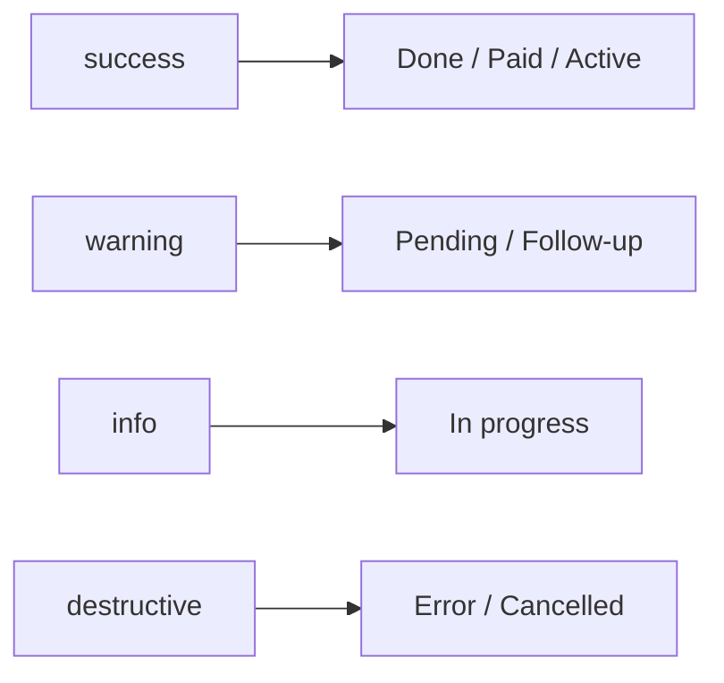

# RIVA OS Design System

Sprint 006 — **UI foundation**.

This document defines the RIVA OS design language and the reusable component library under `src/components/ui`.

> Companion to [UI_GUIDELINES.md](./UI_GUIDELINES.md). Components use **shadcn/ui** (base-nova) + **Tailwind CSS** + CSS variables for light/dark mode.

---

## 1. Design language — Luxury Minimal

| Principle | Practice |
| --- | --- |
| **Luxury** | Refined neutrals, quiet contrast, polished detail — not ornament |
| **Minimal** | Prefer spacing and type hierarchy over borders and cards |
| **Apple-like** | Clarity, soft motion, obvious controls |
| **Fast** | Light loading states; snappy transitions |
| **Mobile-first** | Touch targets ≥ 40px where interactive; single column first |
| **Soft animation** | 150–300ms ease; no bounce or glow stacks |
| **Large spacing** | Generous padding; density is earned |
| **Premium typography** | Clear display → title → body → meta hierarchy |

Avoid: purple-on-white trends, heavy glassmorphism, emoji decoration, rounded-full pill clusters.

---

## 2. Typography

| Token / role | Guidance |
| --- | --- |
| **Display** | Rare; page heroes only — `text-2xl`–`text-4xl`, tracking tight |
| **Title** | Section / card titles — `text-base`–`text-lg`, `font-medium` |
| **Body** | Default UI copy — `text-sm` (`md:text-sm`, inputs `text-base` on mobile) |
| **Meta** | Timestamps, hints — `text-xs` muted |
| **Font** | Geist Sans (`--font-sans` / `--font-heading`) |
| **Mono** | Geist Mono for codes / IDs |

```text
Display  →  Title  →  Body  →  Meta
```

---

## 3. Spacing

Prefer Tailwind spacing scale with **larger section gaps**:

| Use | Scale |
| --- | --- |
| Inline / icon gaps | `gap-1` – `gap-2` |
| Form fields | `gap-3` – `gap-4` |
| Card internal | `--card-spacing` (default `spacing(4)`) |
| Section stack | `space-y-6` – `space-y-10` |
| Page padding | `px-4 py-6` mobile → `px-6 py-8` desktop |

Touch targets: buttons default `h-8`+; prefer `h-9`/`h-10` for primary mobile CTAs when needed.

---

## 4. Radius

CSS variable `--radius: 0.625rem` with derived tokens:

| Token | Use |
| --- | --- |
| `rounded-md` / `--radius-md` | Inputs, small controls |
| `rounded-lg` / `--radius` | Buttons, menus, popovers |
| `rounded-xl` | Cards, empty states, uploaders |
| `rounded-full` | Avatars, status dots — sparingly |

---

## 5. Shadow

Quiet elevation via CSS variables (use as `shadow-soft-sm` / `shadow-soft-md` / `shadow-soft-lg`, or `box-shadow: var(--shadow-sm)`):

| Token | Use |
| --- | --- |
| `--shadow-sm` / `shadow-soft-sm` | Subtle resting controls |
| `--shadow-md` / `shadow-soft-md` | Popovers, dropdowns |
| `--shadow-lg` / `shadow-soft-lg` | Dialogs, drawers |

Prefer `ring-1 ring-foreground/10` on cards over heavy drop shadows.

---

## 6. Animation

| Token | Value | Use |
| --- | --- | --- |
| `--motion-fast` | 150ms | Hover, focus rings |
| `--motion-base` | 200ms | Panels, sheets |
| `--motion-slow` | 300ms | Page-level transitions |
| `--ease-soft` | `cubic-bezier(0.22, 1, 0.36, 1)` | Soft ease-out |

Use `tw-animate-css` / shadcn animate utilities for enter/exit. Prefer opacity + small translate — no bounce.

---

## 7. Color tokens

Defined in `src/app/globals.css` (`:root` + `.dark`).

### Core

| Token | Role |
| --- | --- |
| `--background` / `--foreground` | Page canvas and text |
| `--card` / `--popover` | Elevated surfaces |
| `--primary` / `--primary-foreground` | Primary actions |
| `--secondary` / `--muted` / `--accent` | Quiet surfaces |
| `--border` / `--input` / `--ring` | Lines and focus |
| `--destructive` | Errors / dangerous actions |
| `--sidebar-*` | Sidebar shell |

### State colors

| Token | Role |
| --- | --- |
| `--success` | Positive / completed / paid |
| `--warning` | Caution / pending / follow-up |
| `--info` | Informational / in progress |
| `--destructive` | Error / cancelled / overdue |

Mapped to Tailwind as `bg-success`, `text-warning`, `border-info`, etc.



---

## 8. Component inventory

All live under `src/components/ui/`.

| Component | File | Notes |
| --- | --- | --- |
| Button | `button.tsx` | Variants: default, outline, secondary, ghost, destructive, link |
| Input | `input.tsx` | |
| Textarea | `textarea.tsx` | |
| Select | `select.tsx` | |
| Checkbox | `checkbox.tsx` | |
| Switch | `switch.tsx` | |
| Avatar | `avatar.tsx` | |
| Badge | `badge.tsx` | |
| Tag | `tag.tsx` | Removable optional |
| Card | `card.tsx` | |
| Dialog | `dialog.tsx` | Modal |
| Drawer | `drawer.tsx` | Mobile-friendly sheet |
| Tabs | `tabs.tsx` | |
| Dropdown | `dropdown-menu.tsx` | shadcn `DropdownMenu*` (no alias layer) |
| Sidebar | `sidebar.tsx` | shadcn sidebar primitives |
| Navbar | `navbar.tsx` | Brand / search / actions slots |
| Breadcrumb | `breadcrumb.tsx` | |
| Table | `table.tsx` | |
| EmptyState | `empty-state.tsx` | Presentational; no i18n |
| Loading | `loading.tsx` | Spinner + label |
| Skeleton | `skeleton.tsx` | |
| StatusBadge | `status-badge.tsx` | `default` \| `success` \| `warning` \| `danger` \| `info` |
| Progress | `progress.tsx` | |
| Timeline | `timeline.tsx` | Vertical list |
| Uploader | `uploader.tsx` | Drag-and-drop + click to browse |
| DatePicker | `date-picker.tsx` | Popover + Calendar |
| Calendar | `calendar.tsx` | react-day-picker |

**Import rule:** always import from the component file (`@/components/ui/button`), never a barrel. App bilingual empty states use `AppEmptyState` from `@/components/layout/app-empty-state`.

---

## 9. Component naming

| Rule | Example |
| --- | --- |
| PascalCase components | `StatusBadge`, `DatePicker` |
| `data-slot` attributes | `data-slot="button"` |
| CVA variants co-located | `buttonVariants`, `tagVariants` |
| Compound parts | `DialogContent`, `SidebarMenuButton` |
| Stay close to shadcn names | `DropdownMenu*`, not a parallel `Dropdown*` API |

---

## 10. State colors usage

| Status | Component | Example |
| --- | --- | --- |
| Success / done | `StatusBadge status="success"` | Confirmed event |
| Warning / pending | `StatusBadge status="warning"` | Awaiting payment |
| Danger | `StatusBadge status="danger"` | Overdue / cancelled |
| Info | `StatusBadge status="info"` | In progress |
| Neutral | `StatusBadge status="default"` | Archived |

Domain labels (`pending`, `active`) map to these tokens at the feature layer — do not duplicate aliases in the design system.

Do not invent ad-hoc hex colors in features — extend tokens in `globals.css`.

---

## 11. Accessibility baseline

- Focus-visible rings via `--ring`
- `aria-label` / `role="status"` on Loading
- Icon-only controls need `aria-label`
- Dialog / Drawer use Base UI primitives with focus trap
- Color is never the only status signal (dot + label)
- Avoid nested interactive controls (e.g. button inside button)

---

## 12. Dark mode

- Theme via `next-themes` + `.dark` class
- All tokens defined for `:root` and `.dark`
- Components use semantic tokens (`bg-background`, `text-muted-foreground`) — never hard-coded light-only whites

---

## 13. Minimal usage examples

```tsx
import { Button } from "@/components/ui/button";
import { StatusBadge } from "@/components/ui/status-badge";
import { EmptyState } from "@/components/ui/empty-state";

<Button variant="outline">Save</Button>
<StatusBadge status="success" label="Confirmed" />
<EmptyState title="No events" description="Create your first event." />
```

```tsx
import { AppEmptyState } from "@/components/layout/app-empty-state";

<AppEmptyState />
```

```tsx
import { Timeline } from "@/components/ui/timeline";

<Timeline
  items={[
    { id: "1", title: "Kickoff", time: "09:00", status: "done" },
    { id: "2", title: "Ceremony", time: "11:00", status: "active" },
  ]}
/>
```

---

## 14. Sprint 006 constraints

| Do | Do not |
| --- | --- |
| Reusable UI primitives | Build business pages |
| Tokens + docs | Change database schema |
| Dark mode + a11y | Add mock data beyond tiny examples in docs |
| Direct file imports | Barrel re-exports that pull unused client code |

---

## 15. Related docs

- [UI_GUIDELINES.md](./UI_GUIDELINES.md) — product visual principles
- [PRODUCT_BLUEPRINT.md](./PRODUCT_BLUEPRINT.md) — module IA
- [NAVIGATION.md](./NAVIGATION.md) — shell navigation
