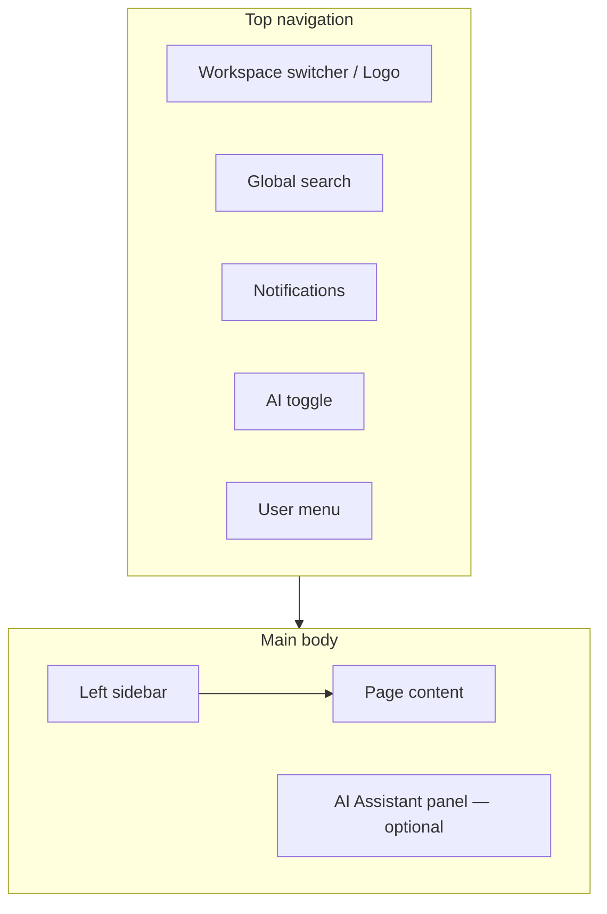
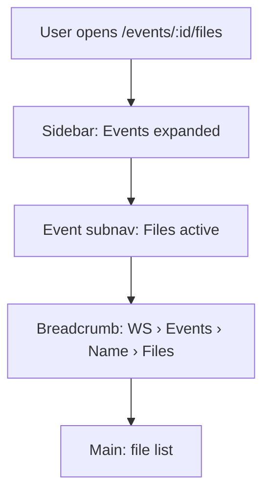
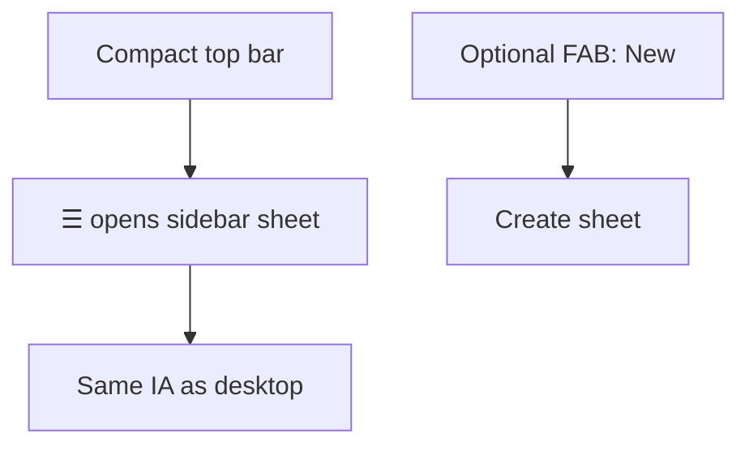

# Navigation

Sprint 005 — product architecture. Companion to [PRODUCT_BLUEPRINT.md](./PRODUCT_BLUEPRINT.md).

Defines **top navigation**, **left sidebar**, and **navigation rules** for the RIVA OS operator shell.

> Documentation only. Does not change the current UI.

---

## 1. Shell overview



| Region | Role |
| --- | --- |
| **Top nav** | Global, Workspace-aware chrome; always visible on operator routes |
| **Left sidebar** | Primary module navigation; supports nested Event / Settings trees |
| **Main** | Page hierarchy (see [PAGE_HIERARCHY.md](./PAGE_HIERARCHY.md)) |
| **AI panel** | Contextual assistant; slides over or docks beside main |

**Viewer routes** (`/viewer/:shareId`) use a **minimal shell** — no operator sidebar.

---

## 2. Top navigation

### Layout (left → right)

```text
┌──────────────────────────────────────────────────────────────────────────┐
│ [Logo / WS ▾]    [Search…………]              [🔔] [AI] [Avatar ▾]         │
└──────────────────────────────────────────────────────────────────────────┘
```

### Items

| Control | Behavior |
| --- | --- |
| **Logo / Workspace switcher** | Click logo → Dashboard. Chevron opens Workspace list / create |
| **Global search** | Search Clients, Events, Tasks, Files, Vendors within active Workspace |
| **Notifications** | Opens notification drawer or `/notifications` |
| **AI toggle** | Opens / closes AI Assistant panel |
| **User menu** | Profile, Preferences, Sign out; Owner/Admin link to Settings |

### Top-nav rules

1. Top nav does **not** duplicate the full module list (that lives in the sidebar).
2. Top nav is **Workspace-scoped** — search and badges apply to the active Workspace.
3. On mobile, search collapses to an icon; sidebar becomes a sheet.
4. Guest Viewer pages hide operator top-nav items except branding (optional).

```mermaid
flowchart LR
  ClickLogo[Click logo] --> Dash[/dashboard]
  ClickBell[Click bell] --> NotifDrawer[Notification drawer]
  ClickAI[Click AI] --> AIPanel[AI panel]
  ClickWS[Workspace ▾] --> Switch[Switch / manage Workspace]
```

---

## 3. Left sidebar

Primary IA is defined in [SIDEBAR_STRUCTURE.md](./SIDEBAR_STRUCTURE.md).

### Behavior summary

| Behavior | Rule |
| --- | --- |
| **Active state** | Highlight item matching current URL prefix |
| **Nesting** | Expand Events / Settings / Files when on child routes |
| **Collapse** | Icon-only rail on desktop optional; sheet on mobile |
| **Role filter** | Hide modules the role cannot access (see USER_JOURNEY matrix) |
| **Workspace label** | Optional header showing active Workspace name |

### Primary sidebar order (operator)

1. Workspace  
2. Dashboard  
3. Clients  
4. Events  
5. Calendar  
6. Tasks  
7. Finance  
8. Files  
9. Templates  
10. Reports  
11. Settings  

Secondary / contextual (may live under Events nest or utility section): Meetings, Vendors, Gallery, Contracts, Notifications, AI — see SIDEBAR_STRUCTURE.

---

## 4. Navigation rules

### R1 — Single active Workspace

All operator navigation assumes one **active Workspace**. Switching Workspace resets module lists and returns to Dashboard (or last path if still valid).

### R2 — List → Detail → Nested

```text
Module list  →  Entity detail  →  Nested resource  →  Attachment / leaf
```

Example: Events → Event → Timeline → Task → Attachment  
See [PAGE_HIERARCHY.md](./PAGE_HIERARCHY.md).

### R3 — Prefer deep links

Every navigable state has a URL ([URL_STRUCTURE.md](./URL_STRUCTURE.md)). Sidebar and breadcrumbs must stay in sync with the URL.

### R4 — Breadcrumbs

Show parent chain in main content header:

```text
Workspace › Events › Chen Wedding › Timeline › Task: Confirm florist
```

### R5 — Event context sticky

When inside `/events/:id/*`, sidebar may show an **Event subnav** (Timeline, Vendors, Files, Finance, …) under Events.

### R6 — External surfaces

| Audience | Entry | Operator sidebar |
| --- | --- | --- |
| Client / Vendor Portal | Invite / magic link | No |
| Guest Viewer | `/viewer/:shareId` | No |
| Operator | Auth → `/dashboard` | Yes |

### R7 — Create actions

Primary “New …” actions appear in:

1. Dashboard quick actions  
2. Module list headers  
3. Optional `+` in top nav (future)

Not scattered as competing CTAs in the sidebar root.

### R8 — Back / escape

Detail drawers or modals do not own the only URL for critical entities. Prefer full pages for Event, Client, Task when shareable.



---

## 5. Mobile navigation



| Rule | Detail |
| --- | --- |
| Sidebar | Off-canvas sheet |
| Event subnav | Horizontal tabs under Event title |
| AI | Full-screen sheet instead of side panel |

---

## 6. Accessibility

- Keyboard: skip link to main; sidebar roving tabindex
- Active page: `aria-current="page"`
- Notifications badge: accessible name includes unread count

---

## 7. Relation to Sprint 001 UI

Current app sidebar routes under `/dashboard/*` are a **transitional shell**. This document defines the **target** navigation IA. Implementation will migrate paths toward [URL_STRUCTURE.md](./URL_STRUCTURE.md) without changing product data in this sprint.
