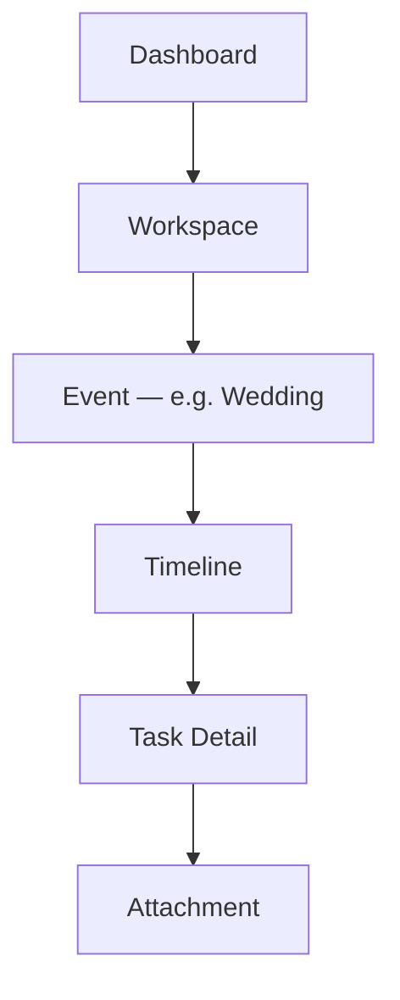
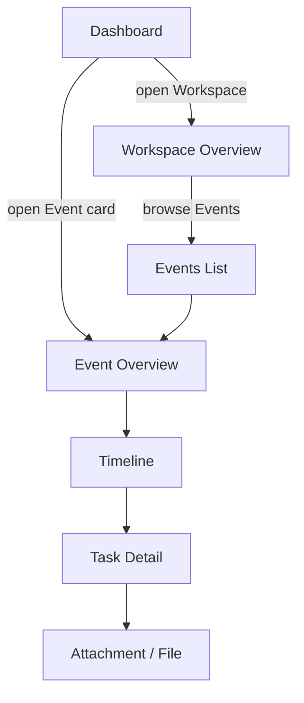
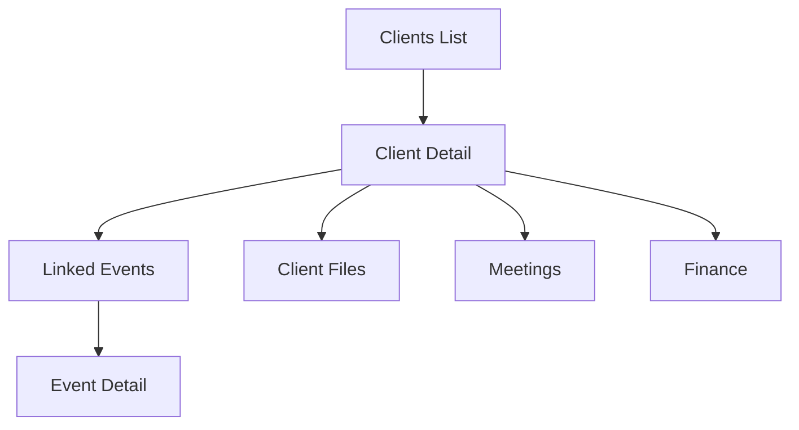
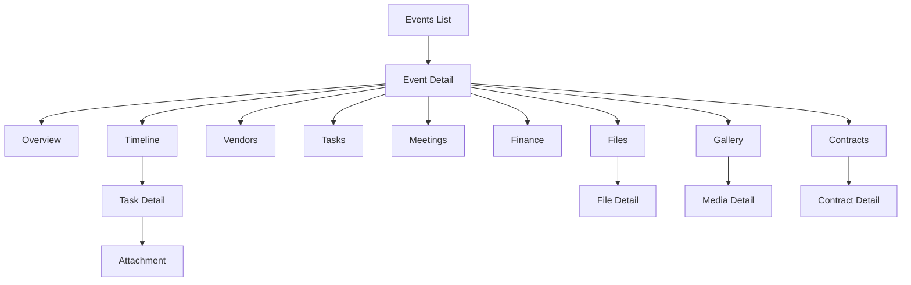
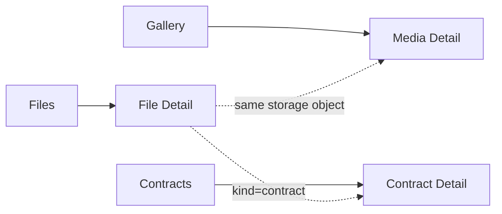
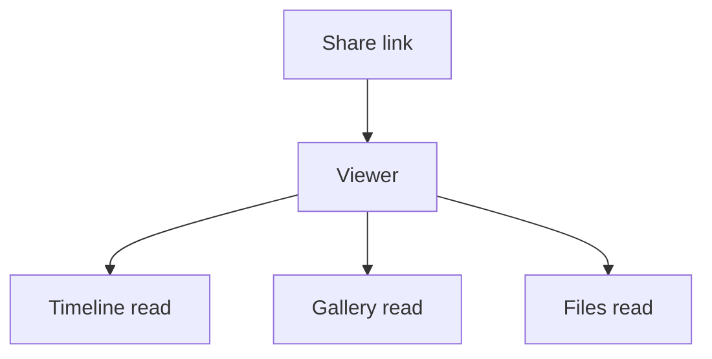

# Page Hierarchy

Sprint 005 — product architecture. Companion to [PRODUCT_BLUEPRINT.md](./PRODUCT_BLUEPRINT.md) and [URL_STRUCTURE.md](./URL_STRUCTURE.md).

Describes **every major page hierarchy** and **parent–child relationships** in Aura OS.

> Documentation only. Does not change the current UI.

---

## 1. Hierarchy principles

| Principle | Meaning |
| --- | --- |
| Workspace is the root tenant | Almost all operator pages live under an active Workspace |
| Event is the delivery hub | Deepest operational trees hang off Event |
| List → Detail → Nested → Leaf | Consistent depth pattern |
| Attachments are leaves | Files / attachments hang off Tasks, Meetings, Events, etc. |
| Viewer is a parallel tree | Share links do not nest under operator Dashboard |



Canonical example from the sprint brief:

```text
Dashboard
  ↓
Workspace
  ↓
Wedding (Event)
  ↓
Timeline
  ↓
Task Detail
  ↓
Attachment
```

---

## 2. Global operator tree

```text
Aura OS (authenticated)
├── Dashboard
├── Workspace
│     ├── Overview
│     └── Team
├── Clients
│     └── Client Detail
│           ├── Linked Events
│           ├── Files
│           ├── Meetings
│           └── Finance summary
├── Events
│     └── Event Detail  ← primary hub
│           ├── Overview
│           ├── Timeline
│           │     ├── Timeline Item
│           │     └── Task Detail
│           │           └── Attachment
│           ├── Vendors
│           │     └── Vendor Assignment Detail
│           ├── Tasks
│           │     └── Task Detail → Attachment
│           ├── Meetings
│           │     └── Meeting Detail → Attachment
│           ├── Finance
│           │     └── Record Detail
│           ├── Files
│           │     └── File Detail
│           ├── Gallery
│           │     └── Media Detail
│           └── Contracts
│                 └── Contract Detail
├── Calendar
│     └── Day / Week / Month → Meeting | Event | Task
├── Tasks (workspace-wide)
│     └── Task Detail → Attachment
├── Meetings (workspace-wide)
│     └── Meeting Detail
├── Finance (workspace-wide)
│     └── Record Detail
├── Vendors (workspace-wide)
│     └── Vendor Detail → Files / Contracts / Events
├── Files
│     ├── File Detail
│     ├── Gallery → Media Detail
│     └── Contracts → Contract Detail
├── Templates
│     └── Template Detail → seed Tasks / Timeline sections
├── Notifications
├── Reports
├── AI Assistant
└── Settings
      ├── Profile
      ├── Workspace
      ├── Team
      ├── Notifications prefs
      ├── Billing
      └── Integrations
```

---

## 3. Parent–child relationship table

| Parent | Child | Relationship |
| --- | --- | --- |
| Workspace | Dashboard | Context for home KPIs |
| Workspace | Clients, Events, Vendors, … | 1 → many modules |
| Client | Events | 1 → many |
| Client | Files | 1 → many |
| Event | Timeline | 1 → many timelines / sections |
| Event | Vendors (assignments) | many ↔ many |
| Event | Tasks, Meetings, Finance, Files | 1 → many |
| Event | Gallery, Contracts | 1 → many (specialized Files) |
| Timeline | Timeline items / Tasks | 1 → many |
| Task | Attachments (Files) | 1 → many |
| Meeting | Attachments | 1 → many |
| Vendor | Files, Contracts | 1 → many |
| File | Versions / preview | 1 → many versions (future) |
| Template | Seeded Event structure | 1 → many Events created from it |
| Share | Viewer page | 1 share → 1 Viewer tree |

---

## 4. Detailed hierarchies

### 4.1 Dashboard → Workspace → Event → …



**User intent:** Start from today → enter Workspace context → dive into a Wedding (Event) → run Timeline → open a Task → open its Attachment.

---

### 4.2 Clients

```text
Clients (list)
  └── Client Detail
        ├── Overview (status, notes, follow-up)
        ├── Events (children)
        │     └── → Event Detail tree
        ├── Files
        │     └── File Detail
        ├── Meetings
        │     └── Meeting Detail
        └── Finance (summary + records)
              └── Record Detail
```



---

### 4.3 Events (hub)

```text
Events (list)
  └── Event Detail
        ├── Overview
        ├── Timeline
        │     ├── Item / milestone
        │     └── Task Detail
        │           └── Attachment
        ├── Vendors
        │     └── Assignment Detail
        │           └── Vendor Files
        ├── Tasks → Task Detail → Attachment
        ├── Meetings → Meeting Detail → Attachment
        ├── Finance → Record Detail
        ├── Files → File Detail
        ├── Gallery → Media Detail
        └── Contracts → Contract Detail
```



---

### 4.4 Calendar

```text
Calendar
  ├── Month / Week / Day views
  └── Occurrence click
        ├── → Event Overview
        ├── → Meeting Detail
        └── → Task Detail
```

Calendar is a **lens**, not a separate data parent. Children resolve to existing entities.

---

### 4.5 Tasks & Meetings (workspace-wide)

```text
Tasks
  └── Task Detail
        ├── Metadata (priority, status, assignees)
        ├── Links (Event, Client, Vendor)
        └── Attachments
              └── File Detail

Meetings
  └── Meeting Detail
        ├── Attendees / time
        ├── Links (Event, Client)
        └── Attachments
```

---

### 4.6 Finance

```text
Finance (list / dashboard)
  └── Record Detail
        ├── Links (Event, Client, Vendor)
        └── Related Contract / File
```

Event Finance is the **same records** filtered by `event_id`, presented under the Event hub.

---

### 4.7 Files → Gallery → Contracts

```text
Files (all)
  └── File Detail
        └── Preview / download / versions

Gallery
  └── Media Detail
        └── (same File entity, image/moodboard kind)

Contracts
  └── Contract Detail
        ├── Status (draft / sent / signed)
        └── Linked Finance / Event / Vendor
```



---

### 4.8 Templates

```text
Templates (list)
  └── Template Detail
        ├── Default modules
        ├── Seed Timeline sections
        ├── Seed Tasks
        └── Create Event from template → Event Detail
```

---

### 4.9 Settings

```text
Settings
  ├── Profile
  ├── Workspace
  ├── Team
  │     └── Member Detail / Invite
  ├── Notifications
  ├── Billing
  └── Integrations
```

---

### 4.10 Viewer (external)

Parallel hierarchy — **not** under Dashboard:

```text
Viewer (:shareId)
  ├── Shared Event slice
  │     ├── Timeline (read)
  │     ├── Gallery (read)
  │     └── Files (read subset)
  └── Optional: Guest Q&A (AI bounded)
```



---

## 5. Depth limits

| Depth | Example | Guidance |
| --- | --- | --- |
| 1 | `/events` | Module list |
| 2 | `/events/:id` | Entity hub |
| 3 | `/events/:id/timeline` | Nested module |
| 4 | `/events/:id/tasks/:taskId` | Detail |
| 5 | `.../tasks/:taskId/files/:fileId` | Leaf attachment |

Avoid deeper than **5** URL segments under Event; use drawers for comments if needed.

---

## 6. Breadcrumb mapping

| Hierarchy node | Breadcrumb label |
| --- | --- |
| Workspace | Workspace name |
| Events | Events |
| Event | Event name (e.g. Chen Wedding) |
| Timeline | Timeline |
| Task Detail | Task title |
| Attachment | File name |

Example:

```text
Aura Studio › Events › Chen Wedding › Timeline › Confirm florist › floorplan.pdf
```

---

## 7. Sprint 005 note

This hierarchy is the **target** page tree. Current Sprint 001 routes under `/dashboard/*` are transitional and will converge toward this model in later implementation sprints — without schema changes in Sprint 005.
