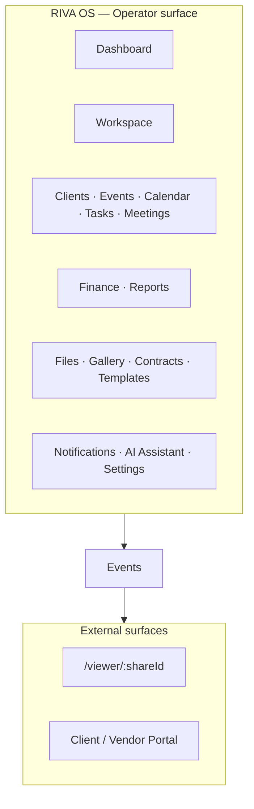
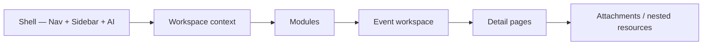
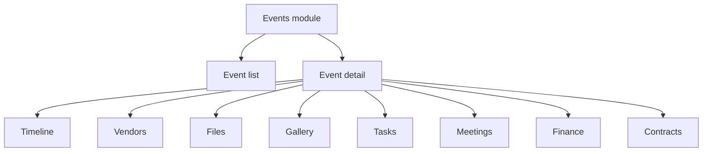
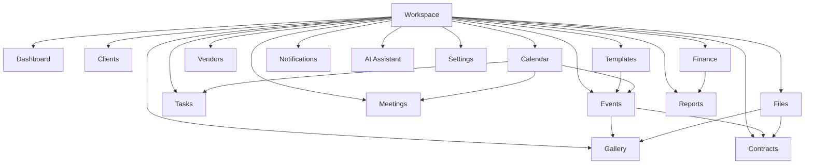

# RIVA OS Product Blueprint

Sprint 005 — **documentation and product architecture only**.

This document defines RIVA OS as an **Event Operating System**: one product surface for planning, coordinating, and delivering any occasion type (Wedding, Corporate, Birthday, Concert, Exhibition, Roadshow) inside a Workspace.

> **No code, schema, migrations, or UI changes in this sprint.** Target product design for future implementation. Aligns with [DATA_MODEL.md](./DATA_MODEL.md), [USER_JOURNEY.md](./USER_JOURNEY.md), and [ROADMAP.md](./ROADMAP.md).

---

## 1. Product vision

**RIVA OS** is the operating system for event businesses.

| Principle | Meaning |
| --- | --- |
| Event-first | Work orbits Events; Clients, Vendors, Tasks, Files, and Finance attach around them |
| Workspace tenancy | Every operator works inside a Workspace; data never leaks across tenants |
| Template extensibility | Event kinds are templates, not separate apps |
| Role-aware UX | Dashboards and modules adapt to Owner → Guest journeys |
| Portal separation | Operators use the OS; Clients, Vendors, and Guests use Viewer / Portal surfaces |

---

## 2. System layers

| Layer | Responsibility |
| --- | --- |
| **Shell** | Top nav, left sidebar, AI panel, notifications |
| **Workspace context** | Active tenant; switcher when user has multiple Workspaces |
| **Modules** | Primary product areas listed below |
| **Event workspace** | Per-Event tabs: Timeline, Vendors, Files, Finance, … |
| **Detail** | Task, Meeting, File, Contract, Vendor assignment |
| **Viewer** | Share-link read surfaces outside the operator shell |

---

## 3. Main modules

### Dashboard

**Command Center** — role-aware home for the active Workspace.

| Concern | Content |
| --- | --- |
| Purpose | Today’s priorities: meetings, events, tasks, finance signals |
| Primary users | All internal roles (layout differs by role — see USER_JOURNEY) |
| Key actions | Quick create (Client, Event, Task, Meeting, Finance record) |
| Links to | Events, Calendar, Tasks, Finance, Notifications |

---

### Workspace

Tenant home and switcher — the container for all business data.

| Concern | Content |
| --- | --- |
| Purpose | Select / inspect Workspace; overview of capacity and health |
| Contains | Team, settings summary, module entry points |
| Key actions | Switch Workspace, invite members, open Settings |
| Related | [DATA_MODEL.md](./DATA_MODEL.md) Workspace entity |

---

### Clients

CRM for people and organizations the Workspace serves.

| Concern | Content |
| --- | --- |
| Purpose | Contact records, status, follow-ups, linked Events |
| Key actions | Create Client, schedule follow-up, open linked Events |
| Nested | Client detail → Events, Files, Meetings, Finance summaries |

---

### Events

Core delivery unit — any occasion type via templates.

| Concern | Content |
| --- | --- |
| Purpose | List, filter, and open Event workspaces |
| Templates | Wedding, Corporate, Birthday, Concert, Exhibition, Roadshow |
| Nested | Timeline, Vendors, Files, Gallery, Tasks, Meetings, Finance, Contracts |
| Key actions | Create from template, change status, share Viewer / Portal |

---

### Calendar

Unified schedule across Meetings, Event dates, and Task due dates.

| Concern | Content |
| --- | --- |
| Purpose | Day / week / month views for the Workspace |
| Sources | Meetings, Events (`event_date`), Tasks (`due_at`) |
| Key actions | Create Meeting, jump to Event or Task detail |

---

### Tasks

Work items — Workspace-level or Event-scoped.

| Concern | Content |
| --- | --- |
| Purpose | Prioritized execution for team and vendors |
| Nested | Task detail → attachments, comments, linked Client / Event / Vendor |
| Key actions | Assign, change status / priority, attach Files |

---

### Meetings

Scheduled interactions with Clients, team, or Vendors.

| Concern | Content |
| --- | --- |
| Purpose | Agenda time blocks with optional Event / Client links |
| Surfaces | Standalone Meetings module + Calendar + Event Meetings tab |
| Key actions | Schedule, reschedule, attach notes / Files |

---

### Finance

Money records and reporting for the Workspace and per Event.

| Concern | Content |
| --- | --- |
| Purpose | Revenue, expenses, payments, outstanding balances |
| Nested | Record detail; Event finance rollup; Reports |
| Key actions | Log payment, mark outstanding, export |

---

### Vendors

Supplier catalog and Event assignments.

| Concern | Content |
| --- | --- |
| Purpose | Workspace vendor directory + per-Event vendor roster |
| Nested | Vendor detail → Files, Contracts, assigned Events / Tasks |
| Key actions | Add vendor, assign to Event, request deliverable |

---

### Files

Polymorphic file system (Workspace, Event, Client, or Vendor parent).

| Concern | Content |
| --- | --- |
| Purpose | Upload, tag, and find documents and media |
| Kinds | Images, PDF, Video, Audio, Contracts, Floor Plans, Moodboards |
| Nested | File detail → preview, versions, attachments on Tasks |

---

### Gallery

Curated visual surface — primarily Event photo / moodboard presentation.

| Concern | Content |
| --- | --- |
| Purpose | Client-facing and operator gallery views over image / moodboard Files |
| Scope | Usually Event-scoped; may surface Workspace brand assets |
| Related | Files module (source of truth for blobs) |

---

### Contracts

Commercial documents — specialized Files with status and signatory metadata.

| Concern | Content |
| --- | --- |
| Purpose | Track proposals, SOWs, signed agreements |
| Parent | Workspace, Event, Client, or Vendor |
| Key actions | Upload, mark signed, link to Finance |

---

### Templates

Event Template library and checklist / Timeline seeds.

| Concern | Content |
| --- | --- |
| Purpose | Configure how new Events are created |
| Includes | Built-in event kinds + custom Workspace templates |
| Key actions | Duplicate template, toggle modules, edit default tasks |

---

### Notifications

In-app (and later email / push) alert center.

| Concern | Content |
| --- | --- |
| Purpose | Role-filtered alerts: approvals, deadlines, finance, shares |
| Surfaces | Top-nav bell + Notifications page |
| Related | [USER_JOURNEY.md](./USER_JOURNEY.md) notification framework |

---

### Reports

Analytics and exports for Owners, Admins, Finance, Sales.

| Concern | Content |
| --- | --- |
| Purpose | Revenue, pipeline, event load, utilization |
| Phase | Deep Analytics in Phase 3; lightweight Reports earlier |
| Key actions | Filter by date / template, export CSV / PDF |

---

### AI Assistant

Contextual assistant in the shell (panel), not a separate product silo.

| Concern | Content |
| --- | --- |
| Purpose | Drafts, summaries, conflict checks, portal Q&A — within RLS |
| Surfaces | Persistent AI panel + optional full AI page |
| Rules | Role-bounded; human confirms destructive / finance actions |

---

### Settings

Workspace and personal configuration.

| Concern | Content |
| --- | --- |
| Purpose | Profile, Workspace, Team, billing (Owner), notifications prefs |
| Nested | Settings → Team, Billing, Integrations, Preferences |

---

## 4. Module relationship map

---

## 5. Operator vs Viewer surfaces

| Surface | Audience | Shell | URL family |
| --- | --- | --- | --- |
| **Operator OS** | Owner → Designer | Top nav + Sidebar + AI | `/dashboard`, `/workspaces/...`, `/events/...` |
| **Client / Vendor Portal** | Client, Vendor | Portal chrome | Future `/portal/...` or Event portal tabs |
| **Guest Viewer** | Guest (view only) | Minimal chrome | `/viewer/:shareId` |

See [URL_STRUCTURE.md](./URL_STRUCTURE.md) and [USER_JOURNEY.md](./USER_JOURNEY.md).

---

## 6. Navigation companions

| Document | Covers |
| --- | --- |
| [NAVIGATION.md](./NAVIGATION.md) | Top nav, sidebar, rules |
| [SIDEBAR_STRUCTURE.md](./SIDEBAR_STRUCTURE.md) | Nested sidebar IA |
| [PAGE_HIERARCHY.md](./PAGE_HIERARCHY.md) | Parent → child pages |
| [URL_STRUCTURE.md](./URL_STRUCTURE.md) | REST-friendly routes |

---

## 7. Implementation phasing (blueprint → build)

| Phase | Blueprint modules emphasized |
| --- | --- |
| **Phase 1** | Dashboard, Clients, Events (as weddings today), Tasks, Meetings, Finance, Settings |
| **Phase 2** | Calendar, Vendors, Files, Gallery, Contracts, Templates, Event nested tabs |
| **Phase 3** | Notifications depth, Reports / Analytics, AI Assistant, Viewer, Mobile |

Sprint 001 already ships a partial operator shell; this blueprint is the **target IA**, not a description of the current UI.

---

## 8. Sprint 005 constraints

| Do | Do not |
| --- | --- |
| Document product modules and IA | Modify database tables |
| Design URLs and page hierarchy | Create migrations |
| Update docs index | Modify existing UI |
| Use Mermaid for structure | Ship application code |

---

## 9. Open questions

- Workspace-prefixed URLs (`/w/:slug/...`) vs global `/events/:id` with Workspace inferred from auth
- Gallery as Files filter vs first-class module route
- Contracts as Files subtype UI vs separate module with its own list
- Portal host: same domain path vs subdomain

Resolve in implementation sprints; blueprint defaults are in [URL_STRUCTURE.md](./URL_STRUCTURE.md).
