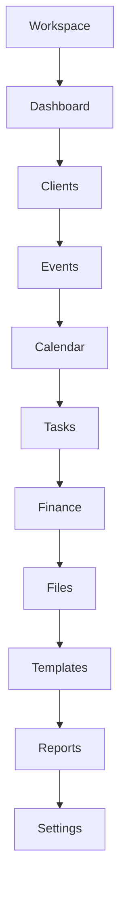
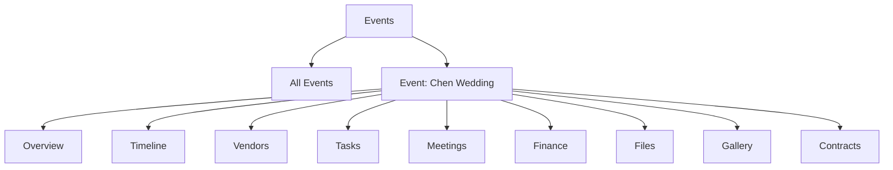
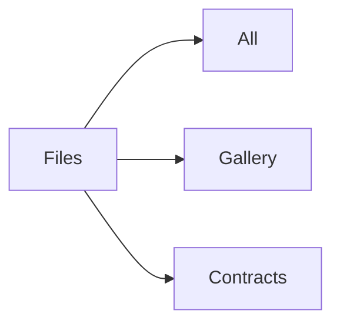
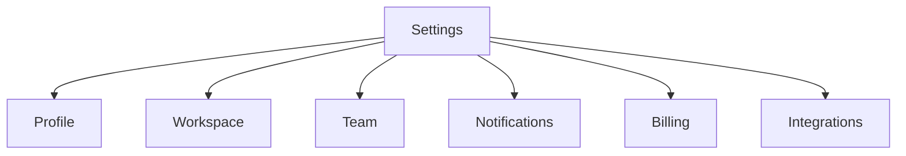

# Sidebar Structure

Sprint 005 — product architecture. Companion to [NAVIGATION.md](./NAVIGATION.md).

Defines the **left sidebar** information architecture, including **nested navigation**.

> Documentation only. Does not change the current UI.

---

## 1. Design goals

| Goal | Meaning |
| --- | --- |
| Scanable | One primary list of Workspace modules |
| Nested where needed | Events, Files, Settings expand to children |
| Role-aware | Items hidden or disabled by permission |
| Event-sticky | When inside an Event, show Event subnav |

---

## 2. Root sidebar tree

Required root order:

```text
Workspace
Dashboard
Clients
Events
Calendar
Tasks
Finance
Files
Templates
Reports
Settings
```

### Full tree (with nesting)

```text
├── Workspace
│     ├── Overview
│     ├── Switch Workspace
│     └── Team                          → /workspaces/:id/team
├── Dashboard                           → /dashboard
├── Clients                             → /clients
│     └── :clientId                     → /clients/:id  (detail; optional pin)
├── Events                              → /events
│     └── :eventId                      → /events/:id
│           ├── Overview
│           ├── Timeline
│           ├── Vendors
│           ├── Tasks
│           ├── Meetings
│           ├── Finance
│           ├── Files
│           ├── Gallery
│           └── Contracts
├── Calendar                            → /calendar
├── Tasks                               → /tasks
│     └── :taskId                       → /tasks/:id
├── Finance                             → /finance
│     ├── Records
│     └── Reports shortcut              → /reports?source=finance
├── Files                               → /files
│     ├── All
│     ├── Gallery                       → /gallery  (or /files?kind=gallery)
│     └── Contracts                     → /contracts
├── Templates                           → /templates
│     └── :templateId                   → /templates/:id
├── Reports                             → /reports
└── Settings                            → /settings
      ├── Profile
      ├── Workspace
      ├── Team
      ├── Notifications
      ├── Billing
      └── Integrations
```

Utility items (footer or top-nav only — not required in root list):

```text
├── Notifications                       → /notifications
├── Vendors                             → /vendors   (also under Event)
├── Meetings                            → /meetings  (also under Calendar / Event)
└── AI Assistant                        → panel / /ai
```

---

## 3. Mermaid — root structure



---

## 4. Nested: Events

When the user is on `/events` or `/events/:id/*`, expand **Events**:



| Child | URL | Purpose |
| --- | --- | --- |
| Overview | `/events/:id` | Summary, status, client, date |
| Timeline | `/events/:id/timeline` | Planning / day-of |
| Vendors | `/events/:id/vendors` | Assignments |
| Tasks | `/events/:id/tasks` | Event-scoped tasks |
| Meetings | `/events/:id/meetings` | Event meetings |
| Finance | `/events/:id/finance` | Event money |
| Files | `/events/:id/files` | Event files |
| Gallery | `/events/:id/gallery` | Visual gallery |
| Contracts | `/events/:id/contracts` | Event contracts |

**Rule:** Only the **active** Event expands in the sidebar. Recent Events may appear as a short “Recents” list under Events.

---

## 5. Nested: Files

```text
Files
├── All files          → /files
├── Gallery            → /gallery
└── Contracts          → /contracts
```

Gallery and Contracts are first-class modules in the blueprint but **nest under Files** in the sidebar to keep the root list short. They may also appear as Event children.



---

## 6. Nested: Settings

```text
Settings
├── Profile            → /settings/profile
├── Workspace          → /settings/workspace
├── Team               → /settings/team
├── Notifications      → /settings/notifications
├── Billing            → /settings/billing
└── Integrations       → /settings/integrations
```



**Role filter:** Billing visible to Owner (and Admin if granted). Team manage for Owner / Admin.

---

## 7. Nested: Workspace

```text
Workspace
├── Overview           → /workspaces/:id
├── Switch…            → modal / /workspaces
└── Team               → /workspaces/:id/team
```

---

## 8. Nested: Finance & Tasks

Optional shallow nests:

```text
Finance
├── All records        → /finance
└── By Event           → filter chip / /finance?eventId=

Tasks
├── My tasks           → /tasks?assignee=me
├── All                → /tasks
└── Overdue            → /tasks?status=overdue
```

Prefer **filters in page chrome** over deep sidebar nests for Tasks/Finance unless density requires it.

---

## 9. Mobile presentation

| Desktop | Mobile |
| --- | --- |
| Persistent left rail | Sheet from ☰ |
| Event children as nested list | Horizontal tabs on Event layout |
| Files nest | Tabs: All / Gallery / Contracts |

---

## 10. Active-state rules

| URL | Active root | Expanded nest |
| --- | --- | --- |
| `/dashboard` | Dashboard | — |
| `/clients/:id` | Clients | — |
| `/events/:id/timeline` | Events | That event → Timeline |
| `/files` | Files | All |
| `/gallery` | Files | Gallery |
| `/settings/team` | Settings | Team |
| `/viewer/:shareId` | *(no sidebar)* | — |

---

## 11. Items intentionally not in root

| Item | Placement |
| --- | --- |
| Meetings | Calendar + Event nest + `/meetings` utility |
| Vendors | `/vendors` utility + Event → Vendors |
| Notifications | Top nav + `/notifications` |
| AI Assistant | Top nav toggle / panel |

This keeps the required root list clean while preserving full module coverage from [PRODUCT_BLUEPRINT.md](./PRODUCT_BLUEPRINT.md).
