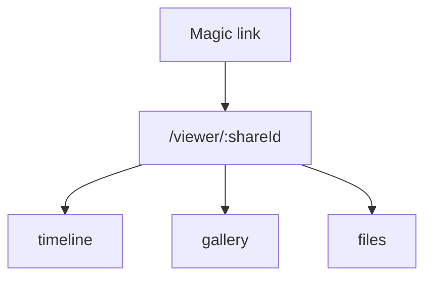
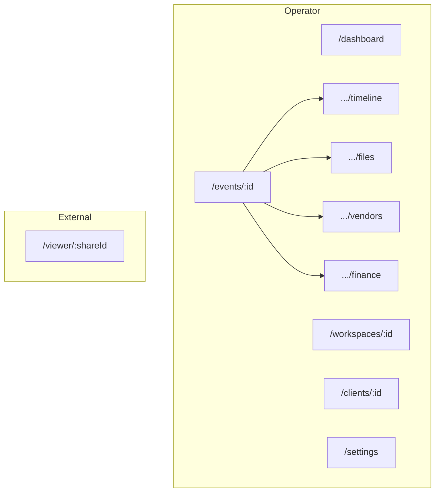

# URL Structure

Sprint 005 — product architecture. Companion to [PAGE_HIERARCHY.md](./PAGE_HIERARCHY.md) and [NAVIGATION.md](./NAVIGATION.md).

Defines **REST-friendly** URL naming for Aura OS operator routes and the Client / Guest **Viewer**.

> Documentation only. Does not change the current UI or routes.

---

## 1. Conventions

| Rule | Example |
| --- | --- |
| Plural collection nouns | `/events`, `/clients`, `/tasks` |
| `:id` for resource identity | `/events/:id` |
| Nested resources under parent | `/events/:id/timeline` |
| Kebab-case path segments | `/settings/notifications` |
| Query for filters / views | `/tasks?assignee=me&status=overdue` |
| No verbs in paths | Prefer `POST` actions / UI, not `/events/:id/delete` |
| Lowercase | `/finance` not `/Finance` |

```mermaid
flowchart LR
  Coll[/events] --> Item[/events/:id]
  Item --> Nested[/events/:id/timeline]
  Nested --> Leaf[/events/:id/tasks/:taskId]
```

---

## 2. Auth & app entry

| Path | Purpose |
| --- | --- |
| `/login` | Sign in (email + password) + Forgot Password |
| `/auth/update-password` | Set password after invite or reset |
| `/auth/callback` | Auth code exchange |
| `/auth/error` | Auth error |
| `/` | Redirect → `/dashboard` if authed, else `/login` |

---

## 3. Core operator URLs

### Dashboard & Workspace

| Path | Page |
| --- | --- |
| `/dashboard` | Command Center |
| `/workspaces` | Workspace list / switcher |
| `/workspaces/:id` | Workspace overview |
| `/workspaces/:id/team` | Team members |

### Clients

| Path | Page |
| --- | --- |
| `/clients` | Client list |
| `/clients/:id` | Client detail |
| `/clients/:id/events` | Linked events |
| `/clients/:id/files` | Client files |
| `/clients/:id/meetings` | Client meetings |
| `/clients/:id/finance` | Client finance summary |

### Events (hub)

| Path | Page |
| --- | --- |
| `/events` | Event list |
| `/events/:id` | Event overview |
| `/events/:id/timeline` | Timeline |
| `/events/:id/timeline/:itemId` | Timeline item (optional) |
| `/events/:id/vendors` | Event vendors |
| `/events/:id/vendors/:assignmentId` | Assignment detail |
| `/events/:id/tasks` | Event tasks |
| `/events/:id/tasks/:taskId` | Task detail (event context) |
| `/events/:id/meetings` | Event meetings |
| `/events/:id/meetings/:meetingId` | Meeting detail |
| `/events/:id/finance` | Event finance |
| `/events/:id/finance/:recordId` | Finance record |
| `/events/:id/files` | Event files |
| `/events/:id/files/:fileId` | File detail |
| `/events/:id/gallery` | Event gallery |
| `/events/:id/gallery/:fileId` | Media detail |
| `/events/:id/contracts` | Event contracts |
| `/events/:id/contracts/:fileId` | Contract detail |

**Required examples from sprint brief:**

```text
/dashboard
/workspaces
/workspaces/:id
/events/:id
/events/:id/timeline
/events/:id/files
/events/:id/vendors
/events/:id/finance
/settings
```

### Calendar, Tasks, Meetings

| Path | Page |
| --- | --- |
| `/calendar` | Unified calendar |
| `/tasks` | Workspace tasks |
| `/tasks/:id` | Task detail |
| `/tasks/:id/files/:fileId` | Task attachment |
| `/meetings` | Workspace meetings |
| `/meetings/:id` | Meeting detail |

### Finance, Vendors, Files

| Path | Page |
| --- | --- |
| `/finance` | Finance home / records |
| `/finance/:id` | Record detail |
| `/vendors` | Vendor directory |
| `/vendors/:id` | Vendor detail |
| `/vendors/:id/files` | Vendor files |
| `/files` | All files |
| `/files/:id` | File detail |
| `/gallery` | Gallery (Workspace or filtered) |
| `/gallery/:id` | Media detail |
| `/contracts` | Contracts list |
| `/contracts/:id` | Contract detail |

### Templates, Notifications, Reports, AI

| Path | Page |
| --- | --- |
| `/templates` | Template library |
| `/templates/:id` | Template detail |
| `/notifications` | Notification center |
| `/reports` | Reports |
| `/ai` | Full-page AI (optional; panel preferred) |

### Settings

| Path | Page |
| --- | --- |
| `/settings` | Settings hub (redirect to profile or workspace) |
| `/settings/profile` | User profile |
| `/settings/workspace` | Workspace settings |
| `/settings/team` | Team (alias of workspace team) |
| `/settings/notifications` | Notification preferences |
| `/settings/billing` | Billing (Owner) |
| `/settings/integrations` | Integrations |

---

## 4. Client Viewer (future)

Read-only share surface — **no operator sidebar**.

| Path | Page |
| --- | --- |
| `/viewer/:shareId` | Guest / shared slice entry |
| `/viewer/:shareId/timeline` | Shared timeline (if granted) |
| `/viewer/:shareId/gallery` | Shared gallery |
| `/viewer/:shareId/files` | Shared files |
| `/viewer/:shareId/files/:fileId` | Shared file detail |



**Portal** (authenticated Client / Vendor) may later use:

| Path | Page |
| --- | --- |
| `/portal` | Portal home |
| `/portal/events/:id` | Client event view |
| `/portal/vendors/assignments` | Vendor assignments |

Portal paths are reserved; Viewer is the Sprint 005 mandated external URL pattern.

---

## 5. Query parameters

| Param | Used on | Purpose |
| --- | --- | --- |
| `status` | `/events`, `/tasks`, `/clients` | Filter by status |
| `assignee` | `/tasks` | `me` or user id |
| `eventId` | `/finance`, `/tasks`, `/files` | Scope to event |
| `clientId` | `/events`, `/meetings` | Scope to client |
| `kind` | `/files` | `image`, `pdf`, `contract`, … |
| `view` | `/calendar` | `day` \| `week` \| `month` |
| `q` | any list | Search string |
| `from` / `to` | `/reports`, `/finance` | Date range |

Example:

```text
/tasks?assignee=me&status=overdue
/files?eventId=:id&kind=moodboard
/calendar?view=week
/reports?from=2026-01-01&to=2026-03-31
```

---

## 6. URL map diagram



---

## 7. Identity & tenancy

| Approach | Choice for blueprint |
| --- | --- |
| Workspace in path | `/workspaces/:id` for Workspace pages |
| Events without Workspace prefix | `/events/:id` — Workspace inferred from auth + RLS |
| Optional future | `/w/:slug/events/:id` for multi-tenant vanity URLs |

Default: **short REST paths** + server-side Workspace scoping.

---

## 8. Mapping from Sprint 001 routes (informational)

| Current (approx.) | Target |
| --- | --- |
| `/dashboard` | `/dashboard` |
| `/dashboard/crm` | `/clients` |
| `/dashboard/weddings` | `/events` |
| `/dashboard/tasks` | `/tasks` |
| `/dashboard/finance` | `/finance` |
| `/dashboard/calendar` | `/calendar` |
| `/dashboard/vendors` | `/vendors` |
| `/dashboard/settings` | `/settings` |
| `/dashboard/ai` | AI panel + `/ai` |

Migration of routes is a **future implementation** concern — not Sprint 005.

---

## 9. HTTP semantics (for future APIs)

When APIs are added, mirror resources:

| Method | Path | Intent |
| --- | --- | --- |
| `GET` | `/api/events` | List |
| `GET` | `/api/events/:id` | Read |
| `POST` | `/api/events` | Create |
| `PATCH` | `/api/events/:id` | Update |
| `GET` | `/api/events/:id/files` | Nested list |

UI routes above remain App Router pages; APIs stay under `/api/*`.

---

## 10. Sprint 005 constraints

| Do | Do not |
| --- | --- |
| Document target URLs | Change Next.js routes now |
| Support `/viewer/:shareId` | Modify database |
| Keep REST-friendly naming | Create migrations |
