# RIVA OS User Journey

Sprint 004 — **documentation only**.

This document defines the complete user journey for RIVA OS across ten roles. It extends the conceptual model in [DATA_MODEL.md](./DATA_MODEL.md) with dashboards, workflows, permissions, notifications, and AI assistance patterns.

> **No code, schema, or UI changes in this sprint.** This is the target experience design for implementation in later phases.

---

## 1. Role taxonomy

RIVA OS separates **internal operators**, **functional specialists**, **external partners**, and **viewers**.

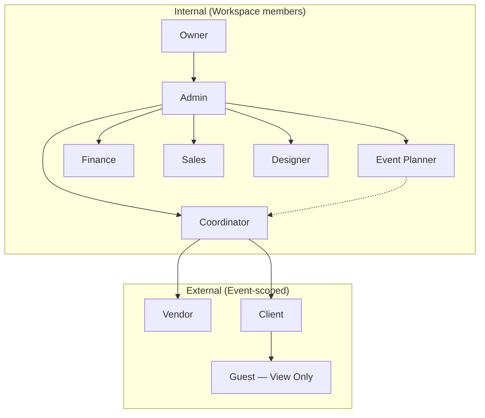

| Role | Type | Primary lens |
| --- | --- | --- |
| **Owner** | Internal | Business ownership, billing, strategy |
| **Admin** | Internal | Workspace operations and team governance |
| **Event Planner** | Internal | Event design, planning, client experience |
| **Coordinator** | Internal | Execution, vendors, day-of operations |
| **Finance** | Internal | Money, invoices, payments, reporting |
| **Sales** | Internal | Pipeline, proposals, client acquisition |
| **Designer** | Internal | Creative assets, moodboards, floor plans |
| **Vendor** | External | Deliverables, contracts, assigned scope |
| **Client** | External | Progress visibility, approvals, collaboration |
| **Guest** | External | Read-only access to a shared slice |

### Module catalog

Modules referenced throughout this document:

| Module | Description |
| --- | --- |
| **Command Center** | Role-aware home dashboard |
| **Clients** | CRM — contacts, status, follow-ups |
| **Events** | Event projects (all templates) |
| **Tasks** | Work items and assignments |
| **Meetings** | Calendar meetings and calls |
| **Finance** | Revenue, expenses, payments, reports |
| **Vendors** | Vendor directory and event assignments |
| **Timeline** | Planning and day-of run of show |
| **Files** | Documents, media, contracts, moodboards |
| **Calendar** | Unified schedule view |
| **Team** | Members, roles, invites |
| **Settings** | Workspace profile, billing, preferences |
| **Portal** | Client / vendor-facing shared views |
| **AI Assistant** | Contextual help and automation |
| **Analytics** | Business and event insights (Phase 3) |

---

## 2. Global user journey

### Lifecycle from lead to completion

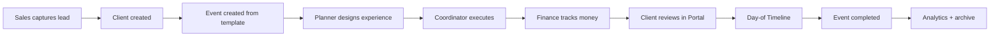

### Daily entry flow (all internal roles)

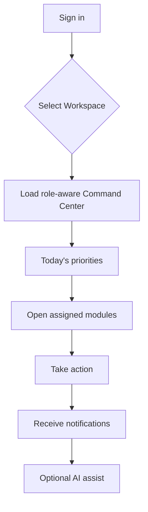

### Event-centric collaboration

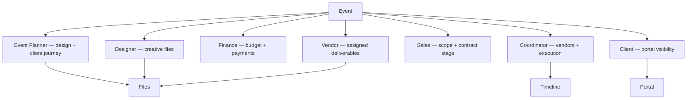

---

## 3. Module access summary

Legend: **F** full, **M** manage, **E** edit assigned, **R** read, **P** portal slice, **—** none

| Module | Owner | Admin | Event Planner | Coordinator | Finance | Sales | Designer | Vendor | Client | Guest |
| --- | --- | --- | --- | --- | --- | --- | --- | --- | --- | --- |
| Command Center | F | F | F | F | F | F | F | P | P | P |
| Clients | F | F | M | R | R | M | R | — | — | — |
| Events | F | F | M | M | R | M | E | P | P | P |
| Tasks | F | F | M | M | E | E | E | E | R | — |
| Meetings | F | F | M | M | E | M | E | E | R | — |
| Finance | F | F | R | R | F | R | — | R* | R* | — |
| Vendors | F | F | M | M | R | R | R | P | — | — |
| Timeline | F | F | M | M | — | R | E | E | R | R |
| Files | F | F | M | M | R | R | M | E | R | R |
| Calendar | F | F | F | F | F | F | F | E | R | — |
| Team | F | F | R | — | — | — | — | — | — | — |
| Settings | F | M | — | — | — | — | — | — | — | — |
| Portal | F | F | M | M | — | M | M | P | P | P |
| AI Assistant | F | F | F | F | F | F | F | P | P | — |
| Analytics | F | F | R | R | F | F | — | — | — | — |

\* Vendor / Client finance visibility is limited to their invoices or approved summaries.

---

## 4. Role definitions

---

### 4.1 Owner

#### Main responsibilities

- Own the Workspace: billing, plan, legal entity, and strategic direction
- Appoint Admins and define operating policies
- Final authority on high-risk actions (workspace deletion, ownership transfer)
- Review business health: revenue, pipeline, capacity, and client satisfaction

#### Dashboard view

**Command Center — Executive**

- Workspace health score (events in flight, revenue MTD, overdue tasks)
- Upcoming events (next 30 / 90 days)
- Finance snapshot (cash in, outstanding, margin signals)
- Team capacity and open roles
- Client pipeline summary (from Sales)
- Alerts requiring Owner attention (billing, escalations)

#### Available modules

All modules at full access. Primary surfaces: **Command Center**, **Finance**, **Analytics**, **Team**, **Settings**, **Events**.

#### Daily workflow

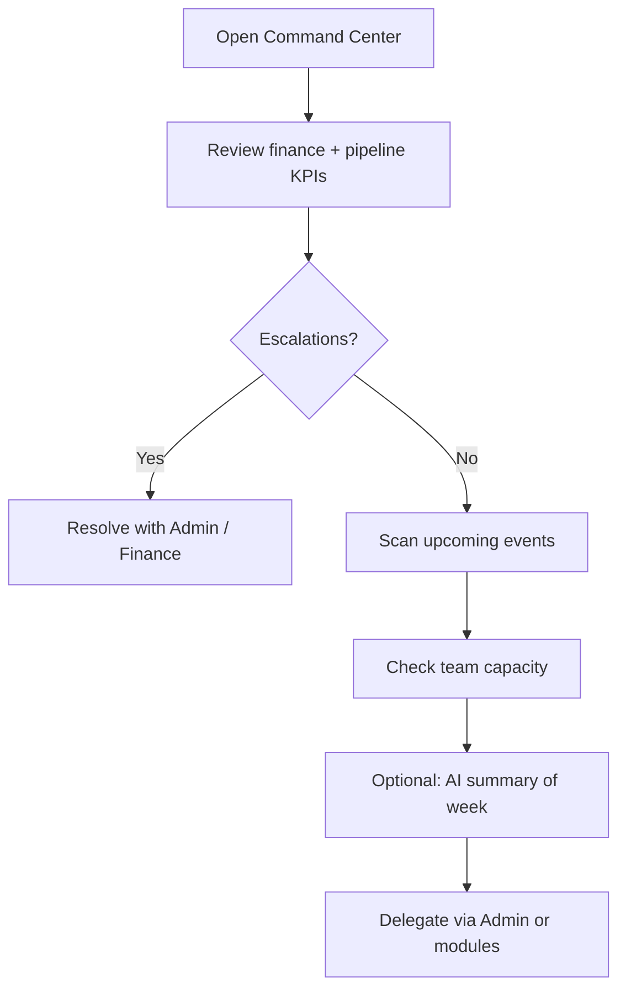

1. Morning: scan KPIs and escalations
2. Midday: approve major contracts or pricing exceptions (if configured)
3. Weekly: review Analytics, team structure, and template strategy
4. Ad hoc: billing, ownership, and policy decisions

#### Permissions

- **Full** on all Workspace data and settings
- Only role that can delete Workspace or transfer ownership
- Can invite/remove any role including Admin

#### Common actions

- Invite Admin or key hires
- Update billing and Workspace settings
- Approve large financial commitments
- Archive completed events
- Export business reports

#### Notifications

| Trigger | Channel |
| --- | --- |
| Billing / plan issues | Email + in-app (high) |
| Finance threshold alerts | In-app + email |
| Client escalation | In-app |
| Event at risk (date slip, budget overrun) | In-app digest |
| New Admin invited / role change | Email |

#### AI assistance opportunities

- Weekly executive brief: revenue, risks, capacity
- Natural-language Q&A over Analytics
- Draft policy summaries for team handbook
- Scenario modeling (“if we add 3 events in Q4…”)

---

### 4.2 Admin

#### Main responsibilities

- Day-to-day Workspace governance without ownership transfer
- Manage team invites, roles, and module policies
- Oversee Events, Clients, and cross-functional coordination
- Enforce standards (templates, file naming, client portal rules)

#### Dashboard view

**Command Center — Operations**

- Active events by status and template
- Overdue tasks across teams
- Meetings today / this week
- Vendor and client follow-ups
- Open invites and pending portal shares
- Finance highlights (read; edit if granted)

#### Available modules

All internal modules except destructive ownership actions. Heavy use of **Events**, **Team**, **Clients**, **Tasks**, **Settings**.

#### Daily workflow

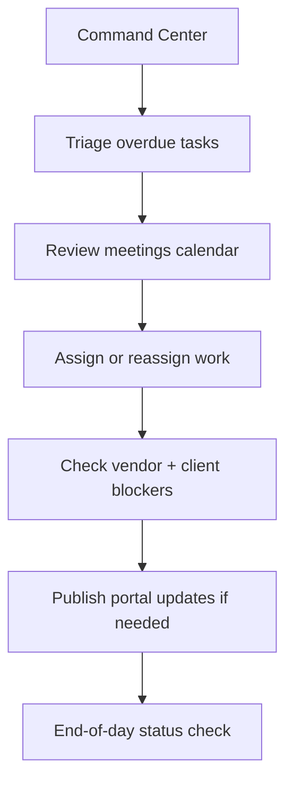

#### Permissions

- **Full** operational CRUD on Clients, Events, Tasks, Meetings, Vendors, Timeline, Files
- **Manage** Settings (not delete Workspace)
- **Full** Team invites except Owner role
- Finance: **full** or **manage** per policy; billing often read-only

#### Common actions

- Invite team members and set roles
- Create Events from templates
- Reassign Coordinators / Planners
- Configure portal visibility for Clients
- Resolve cross-team conflicts on Tasks

#### Notifications

| Trigger | Channel |
| --- | --- |
| Task overdue (any team) | In-app |
| New team member joined | In-app |
| Client portal comment / approval | In-app |
| Vendor deliverable uploaded | In-app |
| Event status change | In-app digest |

#### AI assistance opportunities

- Suggest task reassignment based on workload
- Summarize blockers across active events
- Draft team announcements
- Recommend template for new Event type

---

### 4.3 Event Planner

#### Main responsibilities

- Own the **client experience** and event design for assigned Events
- Translate client goals into Timeline, Tasks, and creative briefs
- Lead client Meetings and portal narrative
- Collaborate with Designer (creative) and Coordinator (execution)

#### Dashboard view

**Command Center — Planner**

- My Events (design phase / confirmed / in progress)
- Client follow-ups and portal pending approvals
- Upcoming client Meetings
- My Tasks (high priority)
- Recent Files (moodboards, proposals)
- Timeline milestones due this week

#### Available modules

**Events**, **Clients**, **Tasks**, **Meetings**, **Timeline**, **Files**, **Portal**, **Calendar**, **Vendors** (read/manage assignments), **Finance** (read-only summaries).

#### Daily workflow

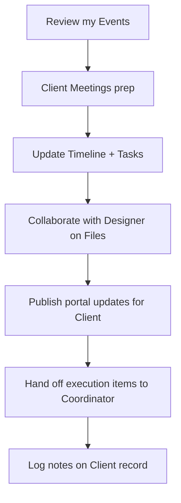

#### Permissions

- **Manage** assigned Events and their Timeline, Tasks, Meetings, Files
- **Manage** linked Clients (or edit assigned subset)
- **Read** Finance summaries; no payment mutations
- **Share** Client portal slices (within policy)

#### Common actions

- Create / edit Event plan and Timeline
- Schedule client Meetings
- Upload proposals and creative briefs
- Request moodboards from Designer
- Mark portal sections “ready for client”

#### Notifications

| Trigger | Channel |
| --- | --- |
| Client approved / rejected portal item | In-app + email |
| Meeting reminder | In-app + calendar |
| Designer uploaded asset | In-app |
| Coordinator flagged execution risk | In-app |
| Task assigned to me | In-app |

#### AI assistance opportunities

- Draft client meeting agendas
- Generate Timeline drafts from template + client notes
- Suggest task checklists per event template
- Rewrite client-facing portal copy in brand tone

---

### 4.4 Coordinator

#### Main responsibilities

- **Execute** Events: vendors, logistics, day-of Timeline
- Maintain vendor assignments, deliverable status, and run-of-show
- Coordinate Staff, Vendors, and on-site Tasks
- Escalate design changes to Event Planner and budget issues to Finance

#### Dashboard view

**Command Center — Execution**

- Events in **in progress** and approaching event date
- Vendor deliverables due / overdue
- Day-of Timeline (next 7 days)
- My Tasks + unassigned critical Tasks
- Meetings with vendors
- File requests (contracts, floor plans)

#### Available modules

**Events**, **Vendors**, **Timeline**, **Tasks**, **Meetings**, **Files**, **Calendar**, **Clients** (read), **Finance** (read).

#### Daily workflow

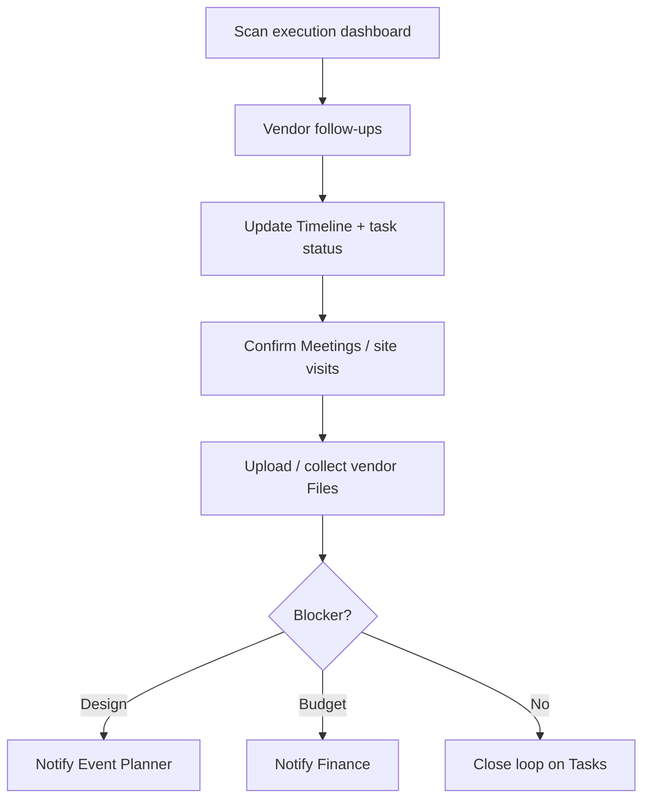

#### Permissions

- **Manage** Event execution: Vendors, Timeline, Tasks, Meetings, Files
- **Edit** vendor assignments and day-of Timeline
- **Invite** Vendor portal access (scoped)
- No Workspace Settings or Team admin

#### Common actions

- Assign vendors to Events
- Update task and vendor status
- Build and lock day-of Timeline
- Upload contracts and floor plans
- Share Guest links for venue walkthrough (policy)

#### Notifications

| Trigger | Channel |
| --- | --- |
| Vendor missed deadline | In-app + email |
| Event date within 7 days | In-app (high) |
| Timeline item changed | In-app |
| New vendor upload | In-app |
| Client portal change affecting logistics | In-app |

#### AI assistance opportunities

- Generate vendor follow-up emails
- Detect Timeline conflicts (overlap, travel time)
- Suggest vendor backup options
- Day-of checklist from template + venue constraints

---

### 4.5 Finance

#### Main responsibilities

- Own **money record accuracy**: revenue, expenses, payments, outstanding
- Produce reports for Owner / Admin
- Align contracts and invoices with Sales and Event scope
- Flag budget overruns to Planners and Coordinators

#### Dashboard view

**Command Center — Finance**

- Revenue / expense MTD and by Event
- Outstanding and overdue payments
- Recent transactions
- Events over budget threshold
- Upcoming payment due dates
- Export / report shortcuts

#### Available modules

**Finance** (full), **Events** (read), **Clients** (read), **Vendors** (read), **Tasks** (limited — finance-related), **Files** (contracts, invoices), **Analytics**.

#### Daily workflow

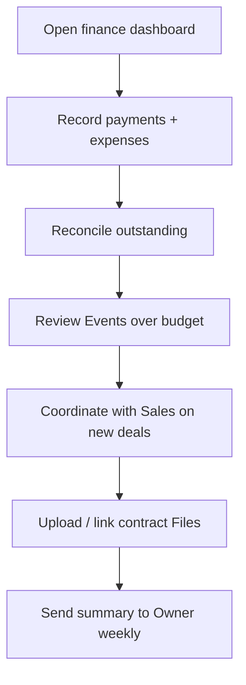

#### Permissions

- **Full** on Finance records and finance reports
- **Read** Events, Clients, Vendors for context
- **Upload** contract and invoice Files
- No Event design, Timeline, or Team admin

#### Common actions

- Create / update financial records
- Mark payments paid / outstanding
- Attach invoices to Events or Clients
- Export P&L and event-level reports
- Comment on budget risk on Event

#### Notifications

| Trigger | Channel |
| --- | --- |
| Payment received (integration) | In-app |
| Invoice overdue | In-app + email |
| Event spend exceeds threshold | In-app |
| Sales marked deal won | In-app |
| Contract file uploaded | In-app |

#### AI assistance opportunities

- Categorize expenses from descriptions
- Forecast cash flow from pipeline Events
- Flag duplicate or anomalous entries
- Draft monthly finance summary for Owner

---

### 4.6 Sales

#### Main responsibilities

- **Pipeline and acquisition**: leads, proposals, conversion
- Create Clients and initiate Events (often with Planner handoff)
- Own early-stage Meetings and commercial terms (with Finance review)
- Maintain CRM hygiene: follow-ups, status, notes

#### Dashboard view

**Command Center — Sales**

- Pipeline by stage (inquiry → confirmed)
- Follow-ups due today
- Recent Clients and open proposals
- Meetings with prospects
- Win / loss signals (Phase 3 Analytics)
- Tasks tied to sales follow-ups

#### Available modules

**Clients** (manage), **Events** (create inquiry stage), **Meetings**, **Tasks**, **Files** (proposals), **Portal** (preview), **Finance** (read quotes), **Calendar**.

#### Daily workflow

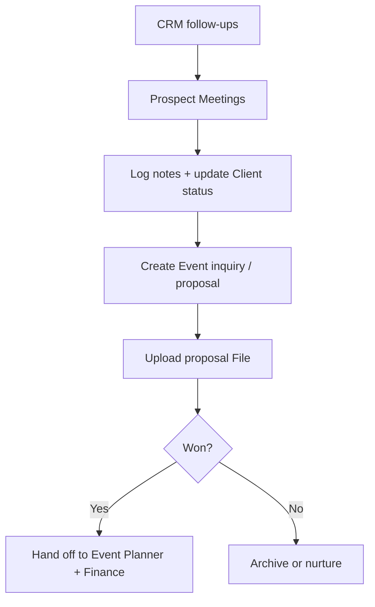

#### Permissions

- **Manage** Clients and early-stage Events (inquiry / proposal)
- **Manage** sales Tasks and Meetings
- **Read** Finance for quoting; no payment posting
- Cannot delete Workspace or manage Team roles

#### Common actions

- Add Client and schedule discovery call
- Create Event from template (inquiry)
- Upload proposal PDF
- Set follow-up reminders
- Convert inquiry → confirmed (with Admin/Planner policy)

#### Notifications

| Trigger | Channel |
| --- | --- |
| Follow-up due | In-app + email |
| Client opened portal proposal | In-app |
| Meeting reminder | Calendar |
| Deal marked confirmed | In-app |
| Finance requested contract clarification | In-app |

#### AI assistance opportunities

- Draft proposal outlines from template
- Suggest follow-up timing from Client status
- Summarize call notes into CRM fields
- Recommend event template from discovery notes

---

### 4.7 Designer

#### Main responsibilities

- Produce **creative deliverables**: moodboards, floor plans, visual direction
- Maintain Files linked to Events and Clients
- Collaborate with Event Planner on portal presentation
- Support Coordinator with venue / layout assets

#### Dashboard view

**Command Center — Creative**

- Assigned Events needing creative work
- My Tasks (design deadlines)
- Recent moodboards and floor plans
- Files awaiting review
- Meetings (creative reviews)

#### Available modules

**Files** (manage creative kinds), **Events** (assigned, edit creative context), **Tasks**, **Meetings**, **Timeline** (read / annotate layout blocks), **Portal** (preview), **Vendors** (read for brand assets).

#### Daily workflow

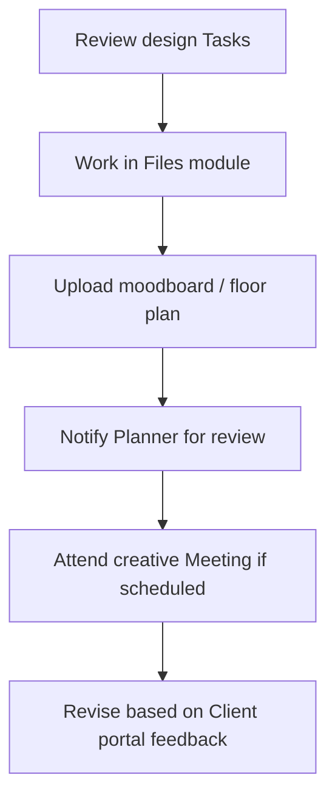

#### Permissions

- **Manage** Files (images, moodboards, floor plans) on assigned Events
- **Edit** assigned Tasks and creative Meetings
- **Read** Event and Client context; no Finance mutations
- No Team or Settings access

#### Common actions

- Upload and tag moodboards / floor plans
- Complete design Tasks
- Comment on Timeline layout sections
- Mark assets “approved for portal”

#### Notifications

| Trigger | Channel |
| --- | --- |
| New design Task assigned | In-app |
| Planner requested revision | In-app |
| Client commented on portal asset | In-app |
| Event date approaching (creative freeze) | In-app |
| File version replaced by another user | In-app |

#### AI assistance opportunities

- Generate moodboard briefs from client keywords
- Suggest layout annotations for floor plans
- Organize file tags and naming consistency
- Draft alt text and portal captions

---

### 4.8 Vendor

#### Main responsibilities

- Deliver **scoped services** for assigned Events (catering, AV, florals, etc.)
- Upload contracts, specs, and deliverable Files
- Update assigned Tasks and confirm Meetings (site visits, load-in)
- Operate only within **Vendor portal** scope — not full Workspace

#### Dashboard view

**Portal — Vendor Home**

- Events I’m assigned to
- My deliverables and due dates
- Upcoming Meetings (load-in, rehearsal)
- Files I uploaded / requested
- Messages or task comments (scoped)

#### Available modules

**Portal** (vendor slice), **Tasks** (assigned), **Meetings** (assigned), **Files** (upload to Vendor or Event parent), **Timeline** (read day-of relevant sections), **Vendors** (own profile only).

#### Daily workflow

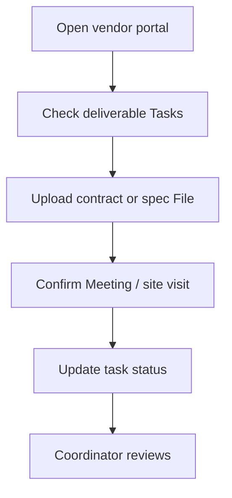

#### Permissions

- **Portal** access to assigned Events only
- **Edit** own vendor profile and assigned Tasks
- **Upload** Files to Vendor or Event (policy-limited kinds)
- **Read** Timeline slices needed for execution
- No access to other Clients, Finance (except own invoices if shared), or Team

#### Common actions

- Mark task in progress / done
- Upload insurance, contract, portfolio
- Accept Meeting invite
- Download floor plan or moodboard shared by Designer

#### Notifications

| Trigger | Channel |
| --- | --- |
| New assignment on Event | Email + portal |
| Task due reminder | Email + portal |
| Meeting invite / change | Email + calendar |
| Coordinator comment | Portal |
| Timeline published for event date | Portal |

#### AI assistance opportunities

- Summarize deliverable requirements from Event brief
- Checklist for load-in from Timeline
- Draft status update messages to Coordinator
- Translate spec PDF highlights (if multilingual team)

---

### 4.9 Client

#### Main responsibilities

- **View progress** on their Events via Client Portal
- Approve or comment on shared materials (moodboards, Timeline drafts, proposals)
- Attend Meetings scheduled by the planning team
- Provide information when requested (forms / file upload if enabled)

#### Dashboard view

**Portal — Client Home**

- My Events (name, date, status, template)
- Progress summary (milestones completed)
- Pending approvals
- Upcoming Meetings
- Shared Files (gallery, proposals, contracts for signature)
- Timeline preview (approved sections)

#### Available modules

**Portal** (client slice), **Events** (read), **Timeline** (read), **Files** (read + limited upload if enabled), **Meetings** (read / RSVP), **Tasks** (read summary), **Finance** (read approved summaries — deposits, balance).

#### Daily workflow

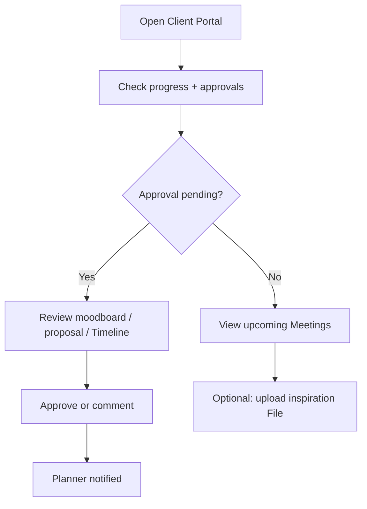

#### Permissions

- **Read** linked Events and approved portal content
- **Comment / approve** on enabled portal sections
- **No write** to internal Tasks, Vendors, or Workspace data
- Optional **upload** to Client or Event File parent (inspiration photos)

#### Common actions

- Approve moodboard or Timeline section
- Comment on portal items
- RSVP to Meetings
- Download shared contract or invoice summary
- Share Guest link (if policy allows) for family / stakeholders

#### Notifications

| Trigger | Channel |
| --- | --- |
| New portal content ready | Email + portal |
| Approval requested | Email + portal |
| Meeting reminder | Email + calendar |
| Event milestone completed | Portal digest |
| Invoice / payment reminder (if shown) | Email |

#### AI assistance opportunities

- Explain Timeline in plain language
- FAQ about next steps in planning
- Summarize what changed since last visit
- Help find shared Files (“where is the floor plan?”)

---

### 4.10 Guest (View Only)

#### Main responsibilities

- **View only** a deliberately limited share (e.g. day-of Timeline, seating, venue map)
- No account required in minimal mode (magic link) or lightweight Guest profile
- No mutations — cannot comment unless upgraded to Client

#### Dashboard view

**Portal — Guest View**

- Single shared Event (or section): e.g. day-of Timeline, venue map, parking
- Optional gallery slice
- No CRM, Finance, Tasks, or Team visibility

#### Available modules

**Portal** (guest slice only) — typically **Timeline** (read) and **Files** (read subset).

#### Daily workflow

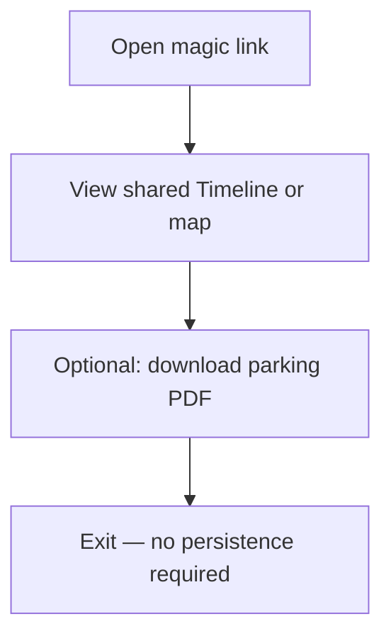

#### Permissions

- **Read** only on explicit share set
- **No** create, edit, comment, or upload (default)
- Link may **expire** or be **revoked** by Coordinator / Admin
- No access to other Events or Workspace modules

#### Common actions

- View day-of schedule
- Open venue / floor plan PDF
- View public gallery slice

#### Notifications

| Trigger | Channel |
| --- | --- |
| Share link issued | Email / SMS (one-time) |
| Timeline updated (if subscribed) | Email optional |
| Link expiring soon | Email |

#### AI assistance opportunities

- “What time is ceremony?” from day-of Timeline
- Directions / parking summary from shared Files
- Minimal Q&A bounded to shared content only (no data leakage)

---

## 5. Cross-role workflows

### 5.1 New Client → Event kickoff

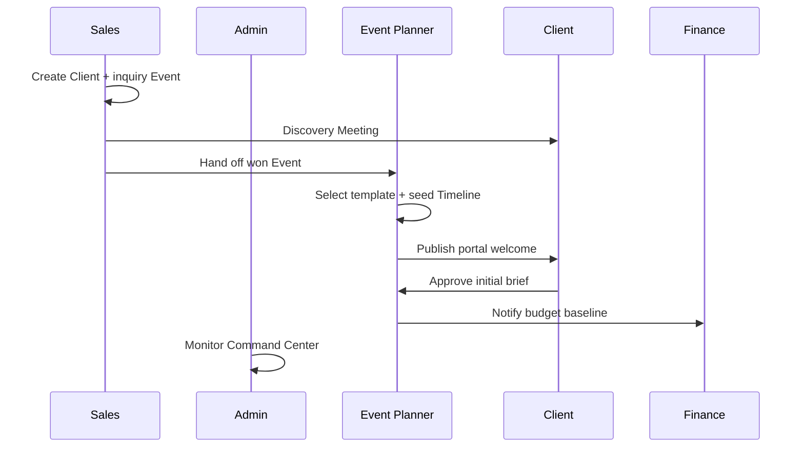

### 5.2 Creative → Client approval

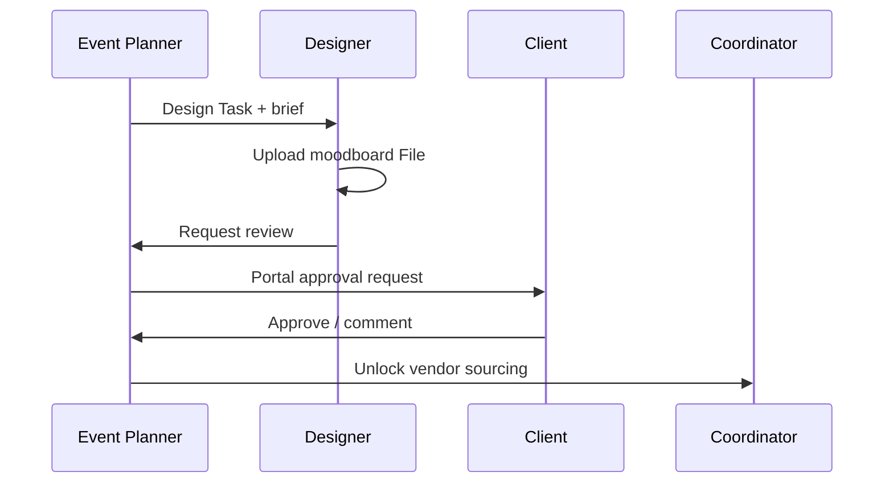

### 5.3 Day-of execution

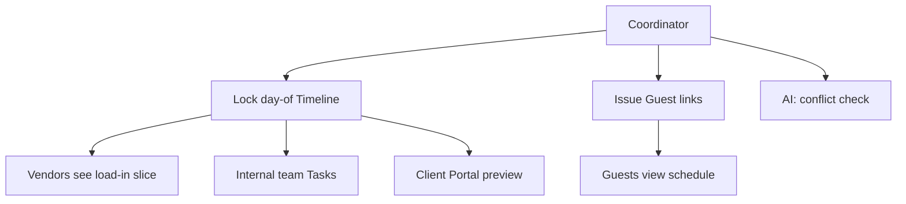

### 5.4 Vendor deliverable loop

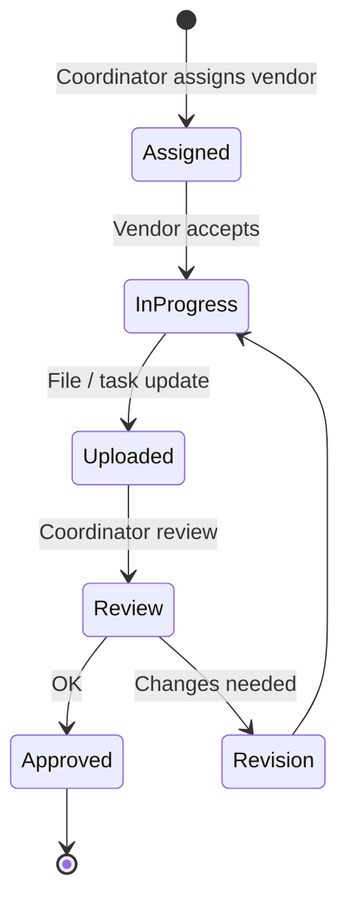

### 5.5 Finance close-out

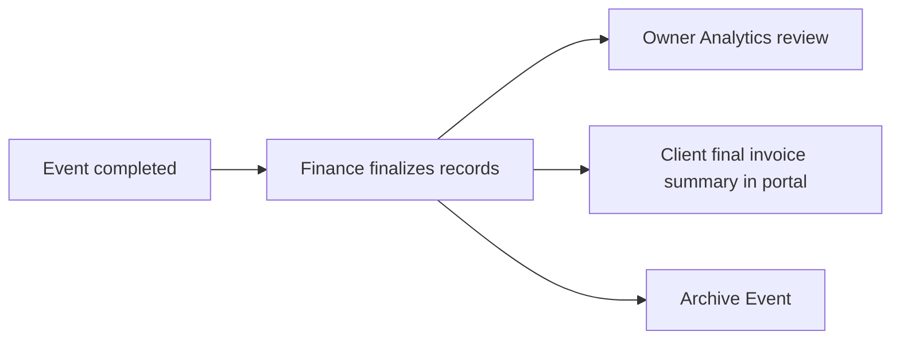

---

## 6. Notification framework

### Channels

| Channel | Typical roles |
| --- | --- |
| **In-app** | All internal roles |
| **Email** | All roles; primary for Client, Vendor, Guest |
| **Calendar** | Meetings for internal + Client + Vendor |
| **Digest** | Owner, Admin (daily / weekly) |
| **Push** (Phase 3) | Coordinators, Planners on event week |

### Priority levels


| Priority | Examples |
| --- | --- |
| **High** | Event within 48h, payment failed, vendor no-show risk |
| **Medium** | Approval pending, task overdue, meeting in 2h |
| **Low** | Weekly summary, new file uploaded, comment threads |

### Role-based notification defaults

| Role | High | Medium | Low digest |
| --- | --- | --- | --- |
| Owner | Billing, escalations | Budget overrun | Weekly KPI |
| Admin | Cross-team blockers | Overdue tasks | Daily ops |
| Event Planner | Client approval | Meetings | Portal activity |
| Coordinator | Event week | Vendor deadlines | File uploads |
| Finance | Overdue invoice | New deal won | Weekly P&L |
| Sales | — | Follow-ups | Pipeline |
| Designer | Creative freeze | Revisions | Assignments |
| Vendor | Event week | Task due | Portal updates |
| Client | Event week | Approvals | Milestones |
| Guest | — | Link expiry | — |

---

## 7. AI assistance framework

AI is **contextual per role** — same assistant, different tools and data boundaries.

```mermaid
flowchart TB
  User[User + Role] --> ACL[Permission boundary]
  ACL --> Ctx[Event / Client context]
  Ctx --> AI[AI Assistant]
  AI --> Out[Drafts · summaries · checks]
  Out --> Human[Human confirms action]
```

| Pattern | Roles | Example |
| --- | --- | --- |
| **Summarize** | Owner, Admin, Finance | Week in review |
| **Draft** | Sales, Planner, Coordinator | Emails, proposals, agendas |
| **Check** | Coordinator, Finance | Timeline conflicts, budget |
| **Explain** | Client, Guest | Portal content Q&A |
| **Organize** | Designer, Admin | Files, tags, naming |
| **Forecast** | Owner, Finance | Pipeline + cash flow |

**Rules**

1. AI respects RLS and role — no cross-Client leakage
2. Destructive or financial actions require human confirmation
3. Guest AI is bounded to shared slice only
4. Vendor AI sees only assigned Event context

---

## 8. Journey maps by phase (product alignment)

| Phase | Roles most affected | Journey focus |
| --- | --- | --- |
| **Phase 1** | Owner, Admin, Planner, Sales, Finance, Client (basic) | Auth, Command Center, CRM, Events, Tasks, Meetings, Finance |
| **Phase 2** | Coordinator, Designer, Vendor, Client | Timeline, Vendors, Files, Portal, Calendar |
| **Phase 3** | All + Guest | AI Assistant, Notifications, Analytics, Mobile |

```mermaid
timeline
  title RIVA OS role maturity
  Phase 1 : Internal ops core
          : Client read-only portal basics
  Phase 2 : Coordinator day-of
          : Vendor portal
          : Designer Files
  Phase 3 : AI per role
          : Guest magic links
          : Push notifications
```

---

## 9. Relation to DATA_MODEL.md

| DATA_MODEL role | USER_JOURNEY expansion |
| --- | --- |
| Owner | §4.1 |
| Admin | §4.2 |
| Coordinator | §4.4 |
| Staff | Split into **Event Planner**, **Finance**, **Sales**, **Designer** for clearer journeys |
| Client (Viewer) | §4.9 |
| Guest | §4.10 |
| — | **Vendor** added as external role §4.8 |

Future schema work may map functional roles to Workspace memberships with capability flags rather than separate tenancy.

---

## 10. Sprint 004 constraints

| Do | Do not |
| --- | --- |
| Define journeys for all 10 roles | Generate application code |
| Document permissions and workflows | Modify database |
| Provide Mermaid diagrams | Create migrations |
| Align with DATA_MODEL and ROADMAP | Modify UI |

---

## 11. Open questions

- Can one user hold multiple functional roles (e.g. Planner + Coordinator)?
- Vendor portal: authenticated login vs magic link per Event
- Client upload: inspiration Files on by default or opt-in per Event?
- Guest upgrade path: Guest → Client when they need approvals

These do not block journey definition; resolve during implementation sprints.
