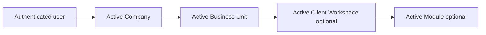
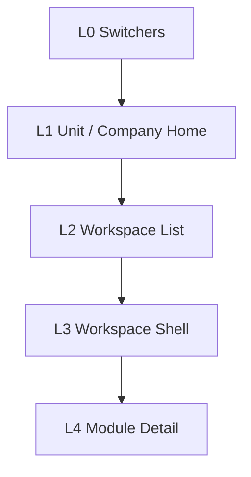
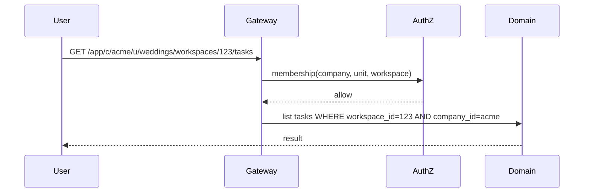

# 01 — Navigation Architecture

**Status:** Architecture Phase  
**Scale:** Designed for 100,000 companies  
**Surfaces:** Agent Portal · Client Portal · Platform Admin  
**Companion:** [03_COMPANY_HIERARCHY.md](./03_COMPANY_HIERARCHY.md) · [07_PORTAL_SYSTEM.md](./07_PORTAL_SYSTEM.md)

---

## 1. Purpose

Define how users **orient, switch context, and move** through RIVA without mixing portals or leaking tenants.

Navigation is an architecture concern: **context stack + route grammar + authorization**, not menu cosmetics.

---

## 2. Navigation contexts

Every Agent Portal session carries an explicit **context stack**:

```text
Platform? → Company → Business Unit → Client Workspace? → Module?
```



| Context | Required for | Persistence |
| --- | --- | --- |
| **Company** | Almost all agent work | Session + last-used preference |
| **Business Unit** | Unit lists, creating workspaces | Session + last-used per company |
| **Client Workspace** | Module work, portal publish | Route param + recent list |
| **Module** | In-workspace tools | Route segment |

**Rule:** No agent screen may load delivery data without a resolved **Company** (and for delivery, **Business Unit** / **Workspace** as required by the resource).

---

## 3. Three shells (never mixed)

| Shell | Audience | Base path (functional) |
| --- | --- | --- |
| **Platform Admin** | Super Admin | `/platform/...` |
| **Agent Portal** | Company agents | `/app/...` |
| **Client Portal** | Clients | `/portal/...` |

```mermaid
flowchart TB
  subgraph Shells
    P[/platform]
    A[/app]
    C[/portal]
  end
  P -.->|no shared chrome| A
  A -.->|no shared chrome| C
```

Prototype V0 paths (`/dashboard/...`) are **not** the target grammar.

---

## 4. Agent Portal navigation model

### 4.1 Levels

| Level | Purpose | Examples |
| --- | --- | --- |
| **L0 — Switchers** | Change Company / Business Unit | Company switcher, Unit switcher |
| **L1 — Company / Unit home** | Attention + directories | Home, Clients directory, Vendors directory, Team, Settings |
| **L2 — Workspace list** | Find engagements | Client Workspaces index, filters, status |
| **L3 — Workspace shell** | Operate one engagement | Workspace home + module nav |
| **L4 — Module detail** | Deep work | Task detail, invoice detail, file detail |



### 4.2 Global agent destinations (company/unit scoped)

| Destination | Scope | Notes |
| --- | --- | --- |
| Home (attention) | Unit (default) or Company rollup | Never unscoped global across companies |
| Clients | Company | CRM directory |
| Vendors | Company | Catalog |
| Client Workspaces | Unit | Primary operating list |
| Team | Company / Unit | Memberships |
| Settings | Company / Unit | Config |
| Automation | Company / Unit | Rules (phase-gated) |

### 4.3 Workspace-local destinations

Appear only inside an active Client Workspace:

Timeline · Tasks · Meetings · Vendors (assignments) · Finance · Files · Gallery · Approvals · Portal Config · Activity

---

## 5. Target route grammar (functional)

### 5.1 Agent Portal

```text
/app
/app/c/:companySlug
/app/c/:companySlug/u/:unitSlug
/app/c/:companySlug/u/:unitSlug/home
/app/c/:companySlug/u/:unitSlug/workspaces
/app/c/:companySlug/u/:unitSlug/workspaces/:workspaceId
/app/c/:companySlug/u/:unitSlug/workspaces/:workspaceId/:moduleKey
/app/c/:companySlug/u/:unitSlug/workspaces/:workspaceId/:moduleKey/:entityId
/app/c/:companySlug/clients
/app/c/:companySlug/vendors
/app/c/:companySlug/team
/app/c/:companySlug/settings
```

**Why slugs + ids:** Human-readable company/unit context; opaque ids for high-volume workspaces (scale + renames).

### 5.2 Client Portal

```text
/portal/:portalKey
/portal/:portalKey/timeline
/portal/:portalKey/files
/portal/:portalKey/gallery
/portal/:portalKey/invoices
/portal/:portalKey/payments
/portal/:portalKey/notifications
```

`portalKey` is an opaque, non-sequential public identifier (not raw workspace UUID in URLs if avoidable).

### 5.3 Platform Admin

```text
/platform
/platform/companies
/platform/companies/:companyId
/platform/invitations
/platform/health
```

---

## 6. Context resolution algorithm (Agent)

On each Agent request:

1. Authenticate identity  
2. Resolve `companySlug` → `company_id`  
3. **Authorize** membership on that company  
4. Resolve `unitSlug` → `business_unit_id` under that company  
5. **Authorize** unit membership (or company-wide role that implies it)  
6. If workspace route: resolve workspace **under that unit**  
7. **Authorize** workspace access  
8. Load module only if enabled for company/unit/template  

Failure at any step → 404/403 (do not leak existence across tenants).



---

## 7. Switchers (scale behavior)

| Switcher | Behavior at 100k companies |
| --- | --- |
| Company | Searchable; show only companies the user belongs to (tiny set per user) |
| Business Unit | List units for **active company only** |
| Workspace | Search + filters inside **active unit**; recent workspaces cached per user |

**Never** present a global workspace browser across all companies.

---

## 8. Client Portal navigation model

Flat, journey-oriented, **no company switcher**.

```mermaid
flowchart LR
  Land[Landing] --> Sec[Sections]
  Sec --> TL[Timeline]
  Sec --> FL[Files]
  Sec --> GL[Gallery]
  Sec --> $ [Invoices / Payments]
  Sec --> N[Notifications]
```

Section availability comes from **Portal Config** + publish flags — not agent module nav mirrored 1:1.

---

## 9. Deep links and notifications

| Source | Link target |
| --- | --- |
| Agent notification | Full `/app/c/.../u/.../workspaces/...` path |
| Client notification | `/portal/:portalKey/...` path |
| Email CTA | Same; tokenized entry if needed |

Deep links must re-run context resolution; stale unit membership → safe failure.

---

## 10. Navigation anti-patterns (reject)

- Single `/dashboard` dumping all companies’ data  
- Sidebar links that omit company/unit context  
- Client users routed into `/app`  
- Agents browsing `/portal` as their primary OS  
- Hard-coded “Weddings” top-level equal to Company  
- Unscoped “All tasks in the world” queries  

---

## 11. Prototype V0 → target mapping (discard, don’t polish)

| V0 | Target |
| --- | --- |
| `/dashboard` | `/app/c/:company/u/:unit/home` |
| `/dashboard/crm` | `/app/c/:company/clients` |
| `/dashboard/weddings` | `/app/c/:company/u/:unit/workspaces` |
| `/dashboard/settings/users` | Company team + platform invites (split) |
| Flat sidebar of modules | Context stack + workspace module nav |

---

## 12. Acceptance criteria

Navigation architecture is approved when:

1. Three shells are separated by path and chrome  
2. Agent routes always encode company (and unit where required)  
3. Context resolution + AuthZ order is defined  
4. Client Portal nav is section-based and config-driven  
5. Design supports 100k companies without global agent indexes
