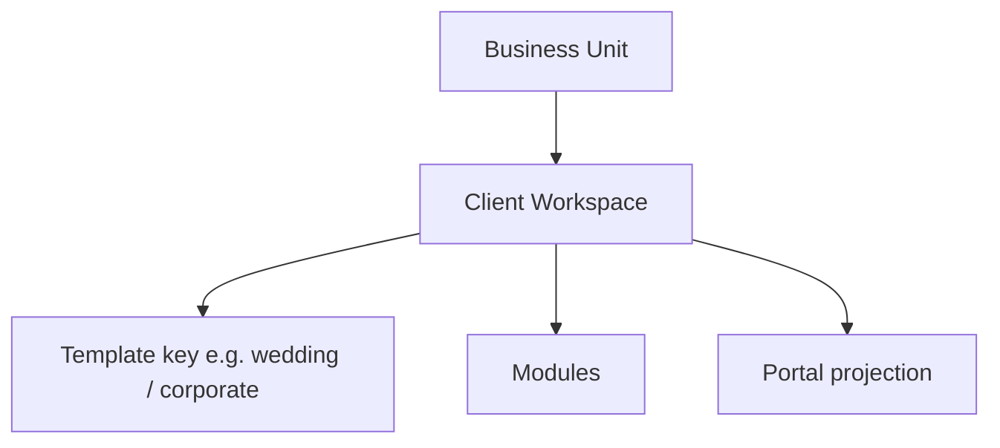
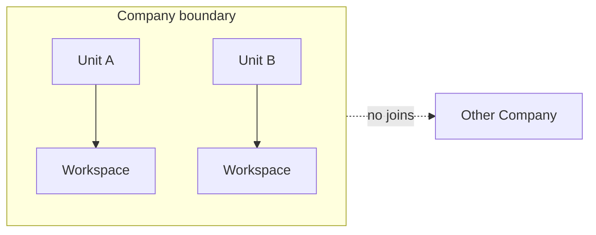
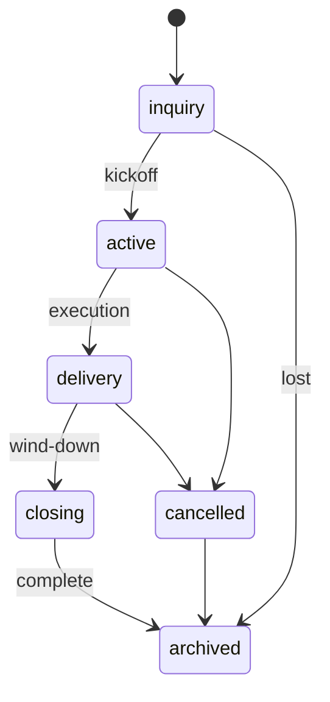
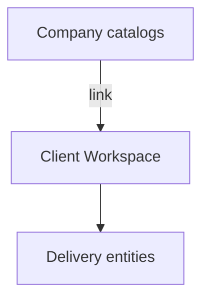

# 02 — Workspace Architecture

**Status:** Architecture Phase  
**Scale:** Millions of Client Workspaces across 100,000 companies  
**Companion:** [05_CLIENT_WORKSPACE_STRUCTURE.md](./05_CLIENT_WORKSPACE_STRUCTURE.md) · [03_COMPANY_HIERARCHY.md](./03_COMPANY_HIERARCHY.md)

---

## 1. Purpose

Define what a **workspace** is in RIVA, how workspaces are isolated, lifecycled, and indexed at global scale.

---

## 2. Workspace taxonomy

RIVA has **one primary workspace type** for delivery:

| Type | Product name | Purpose |
| --- | --- | --- |
| `client_workspace` | **Client Workspace** | System of record for one client engagement |

Future optional types (not required for v1 rebuild):

| Type | Purpose |
| --- | --- |
| `internal_workspace` | Company-only projects (non-client) |
| `template_workspace` | Non-live blueprint (or keep templates as data, not workspaces) |

**Rule:** Do not invent parallel “project / board / wedding” containers. Wedding is a **template** on a Client Workspace, not a separate architecture object.

---

## 3. Hard isolation boundaries

Every Client Workspace row logically includes:

| Field | Role |
| --- | --- |
| `id` | Globally unique workspace id |
| `company_id` | Tenant denormalized for enforcement & partitioning |
| `business_unit_id` | Owning unit |
| `primary_client_id` | CRM link |
| `status` | Lifecycle |
| `template_key` | Module defaults |

**Invariant:** `business_unit.company_id == workspace.company_id` always.

At 100k companies:

- All workspace queries **filter by `company_id` first** (and unit/workspace as needed)
- Cross-tenant access is impossible by API contract, not only UI hiding
- Prefer composite indexes `(company_id, business_unit_id, status, updated_at)`

---

## 4. Lifecycle

| Status | Agent meaning | Client Portal |
| --- | --- | --- |
| `inquiry` | Pre-contract | Optional limited / off |
| `active` | Planning | On (configured) |
| `delivery` | Execution | On |
| `closing` | Final artifacts & payments | On |
| `cancelled` | Stopped | Off or read-only message |
| `archived` | Immutable-ish reference | Optional keepsake |

Transitions are domain events → Automation hooks.

---

## 5. Workspace as authorization scope

Access to a workspace is granted by **Workspace Membership** (see permissions doc), not by “knowing the URL”.

| Principal | Typical access |
| --- | --- |
| Unit member with role | Workspaces in unit (policy may require explicit assignment) |
| Explicit workspace assignee | Only assigned workspaces |
| Company admin | All units’ workspaces in company |
| Client portal user | Projection only, via portal membership |
| Other company | None |

**Scale default (recommended):**

- Prefer **explicit workspace assignment** for agents at large companies  
- Allow unit-wide access only for small teams / unit admins  

---

## 6. Data gravity

All delivery entities hang off the workspace:

Tasks · Meetings · Timeline · Finance · Files · Gallery · Approvals · Portal Config · Notifications (workspace-scoped) · Vendor assignments

Company-level directories (Clients, Vendor master, Templates) **link into** workspaces; they do not replace them.

---

## 7. Concurrency and collaboration

| Concern | Architecture stance |
| --- | --- |
| Multi-agent edit | Workspace is shared; entities use optimistic concurrency / updated_at |
| Client + agent | Same records; different authz + visibility |
| Archive | Write freeze policy for delivery entities (admin override only) |

---

## 8. Indexing & list performance (logical)

Agent “workspace list” must never scan globally.

**List key:** `(company_id, business_unit_id)` + filters (`status`, `assignee`, `query`)

**Recent workspaces:** per-user projection table or cache keyed by `user_id` (small)

**Search:** company-scoped search index later; not a cross-tenant search engine in v1

---

## 9. Sharding / tenancy readiness (logical, not vendor-specific)

Design so physical storage can evolve:

1. **Tenant id on every delivery table** (`company_id`)  
2. Stable `workspace_id` as partition key candidate  
3. No application reliance on “single database = single company”  
4. Portal public keys separable from internal ids  

No implementation in this phase — only constraints for rebuild.

---

## 10. What Workspace Architecture is not

- Not the Client Portal UX  
- Not the CRM Client record itself  
- Not a Business Unit  
- Not Prototype V0’s user-scoped `weddings` table model  

---

## 11. Acceptance criteria

1. Single delivery container type: Client Workspace  
2. Lifecycle states defined  
3. Isolation invariants defined  
4. Membership model referenced  
5. List/search strategy is company/unit scoped for 100k tenants
