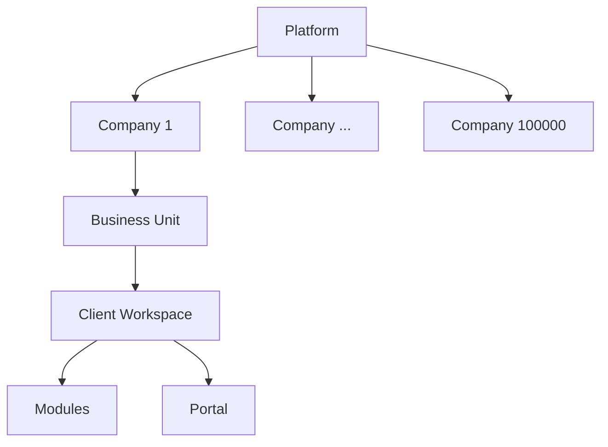
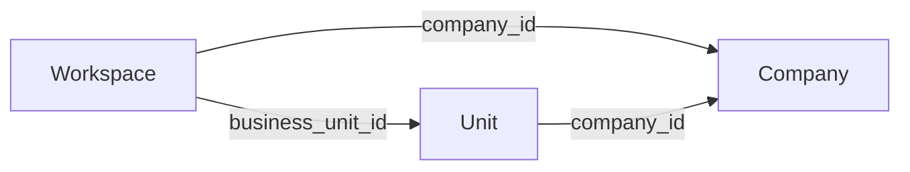
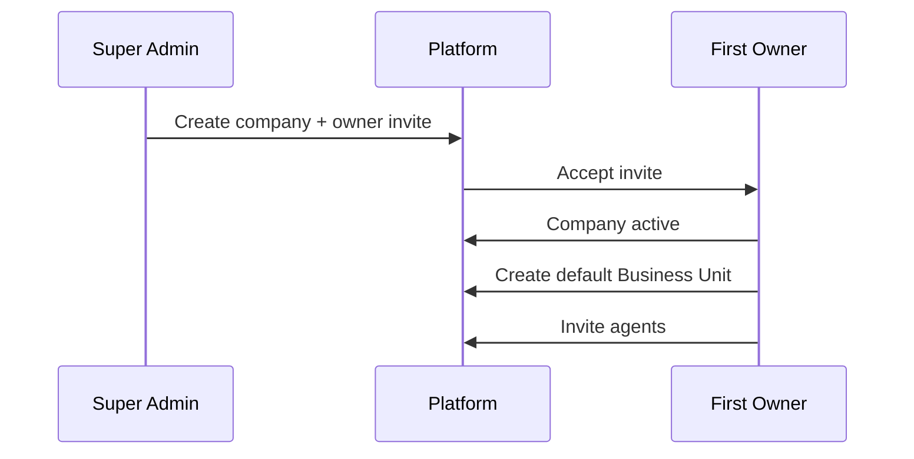

# 03 — Company Hierarchy

**Status:** Architecture Phase  
**Scale:** 100,000 Companies  
**Companion:** Product Bible [03_INFORMATION_ARCHITECTURE.md](../product/03_INFORMATION_ARCHITECTURE.md)

---

## 1. Purpose

Specify the **tenant tree** RIVA implements in software: ownership, cardinality, invariants, and operational implications at global scale.

---

## 2. Hierarchy (authoritative)

```text
Platform
  └── Company                              × 100,000
        └── Business Unit                  × N per company
              └── Client Workspace         × M per unit
                    ├── Client Modules
                    └── Client Portal
```

Cross-cutting (not children of workspace, but attached):

- **Automation** (scoped rules)
- **AI** (scoped inference)



---

## 3. Node definitions (software)

### 3.1 Platform

| Concern | Spec |
| --- | --- |
| Cardinality | Exactly one logical platform |
| Actors | Super Admins |
| Responsibilities | Provision companies, platform policy, feature flags, billing (later), abuse controls |
| Data | Platform admins, company registry, platform audit |

Platform **does not** store client delivery data.

---

### 3.2 Company

| Concern | Spec |
| --- | --- |
| Cardinality | Up to 100,000+ |
| Identity | `id`, unique `slug`, display name |
| Responsibilities | Legal tenant, billing customer (later), brand defaults, agent directory, CRM clients, vendor catalog |
| Children | Business Units |
| Isolation | Hard boundary — no shared rows with other companies |

**Company status (logical):** `provisioning` → `active` → `suspended` → `closed`

Suspended companies: auth may succeed but Agent Portal writes blocked.

---

### 3.3 Business Unit

| Concern | Spec |
| --- | --- |
| Parent | Exactly one Company |
| Identity | `id`, `slug` unique **within company** |
| Responsibilities | Operating division, unit membership, workspace ownership, unit templates/playbooks |
| Children | Client Workspaces |

**Examples (functional):** Weddings, Corporate Events, Retainer Studio.

**Invariant:** Unit cannot move across companies. Archive + recreate if needed.

---

### 3.4 Client Workspace

See [02_WORKSPACE_ARCHITECTURE.md](./02_WORKSPACE_ARCHITECTURE.md) and [05_CLIENT_WORKSPACE_STRUCTURE.md](./05_CLIENT_WORKSPACE_STRUCTURE.md).

Parent: exactly one Business Unit (thus one Company).

---

## 4. Cardinality guidelines (planning)

| Node | Typical | Stress |
| --- | --- | --- |
| Companies | 100,000 | 1,000,000 |
| Units / company | 1–20 | 100 |
| Workspaces / unit | 10–5,000 | 100,000 |
| Agents / company | 3–500 | 5,000 |
| Clients / company | 100–100,000 | 1,000,000+ |

Architecture must not assume “one unit” or “dozens of workspaces”.

---

## 5. Identity and addressing

| Node | Public address | Internal key |
| --- | --- | --- |
| Company | `slug` in Agent URLs | UUID |
| Business Unit | `slug` within company | UUID |
| Client Workspace | opaque id in Agent URLs | UUID |
| Client Portal | `portalKey` | Maps 1:1 (or 1:active) to workspace |

Slug rename rules: company/unit slugs are renameable with redirect policy; workspace ids are stable.

---

## 6. Hierarchy invariants (must hold in every API)

1. `business_unit.company_id` is immutable after create.  
2. `workspace.business_unit_id` points to a unit in the same `company_id`.  
3. `workspace.company_id` is denormalized and always matches the unit’s company.  
4. CRM `client.company_id` matches workspace company when linked.  
5. No resource exists without a resolvable company tenant (except pure platform tables).  



---

## 7. Provisioning flows

### 7.1 Company bootstrap (invitation era)



### 7.2 Business Unit create

Company Admin → create unit → optional default template pack → assign unit admins.

### 7.3 Workspace create

Unit member (permitted) → select/create Client → create Client Workspace under unit → apply template → assign agents.

---

## 8. Multi-company users

A single human identity **may** belong to multiple companies (consultant, holding group).

| Rule | Detail |
| --- | --- |
| Memberships | Separate per company |
| Context | Exactly one **active company** in Agent session |
| No blend | Queries never union companies implicitly |

---

## 9. Hierarchy vs catalogs

| Lives on Company | Lives on Unit | Lives on Workspace |
| --- | --- | --- |
| Clients (CRM) | Unit playbooks | Timeline, tasks, finance docs |
| Vendor master | Unit members | Vendor assignments |
| Brand defaults | Unit defaults override | Portal config override |
| Company roles | Unit roles | Workspace membership |

---

## 10. Scale implications

| Topic | Decision |
| --- | --- |
| Listing companies (platform) | Paginated admin search only |
| Listing companies (user) | Membership set only (small) |
| Metrics | Per-tenant aggregates; no full-table global scans for product UX |
| Deletes | Soft-close company; cascade archive policies documented before hard delete |
| Backups / export | Per-company export job (Phase 8+) |

---

## 11. Anti-patterns

- Flat “accounts” without Business Units when multi-line services exist  
- Workspace parented directly to User (Prototype V0 pattern)  
- Sharing a workspace across two companies  
- Using Business Unit as a fake Client Workspace  

---

## 12. Acceptance criteria

1. Tree and invariants are unambiguous  
2. Addressing (slug/id/portalKey) defined  
3. Multi-company users supported without data blend  
4. Provisioning flows defined for invite-era scale-out
