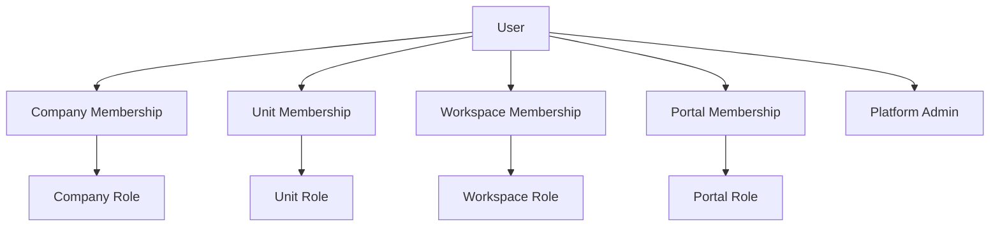
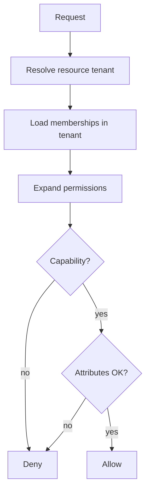

# 04 — User Permission System

**Status:** Architecture Phase  
**Scale:** Millions of memberships across 100,000 companies  
**Companion:** [01_NAVIGATION_ARCHITECTURE.md](./01_NAVIGATION_ARCHITECTURE.md) · [02_WORKSPACE_ARCHITECTURE.md](./02_WORKSPACE_ARCHITECTURE.md)

---

## 1. Purpose

Design RIVA authorization for global multi-tenancy: **who can do what, on which scope**, with evaluation that stays fast as tenant counts grow.

---

## 2. Core model

```text
Identity (User)
  └── Membership bindings (scoped)
        └── Role
              └── Permissions (capabilities)
```



**Principle:** Authorization is **membership + role + permission + resource scope** — never email allowlists alone (allowlists may bootstrap Super Admin only).

---

## 3. Identities

| Identity kind | Surface | Notes |
| --- | --- | --- |
| **Agent user** | Agent Portal | Company staff |
| **Client user** | Client Portal | End customer |
| **Vendor user** (future) | Limited portal | External partner |
| **Platform admin** | Platform Admin | RIVA operators |

One login identity may hold multiple kinds over time; **active surface** determines which memberships apply.

---

## 4. Scopes

| Scope | Grants access to |
| --- | --- |
| `platform` | Platform admin APIs |
| `company` | Company catalogs, settings, all units (if role allows) |
| `business_unit` | Unit home, workspace lists, unit settings |
| `workspace` | Modules & entities inside one Client Workspace |
| `portal` | Client Portal projection for one workspace |

Effective access to a workspace resource requires a path:

```text
platform OR
company membership (with sufficient role) OR
unit membership (policy) OR
explicit workspace membership
```

…and then **permission** on the action.

---

## 5. Roles (functional defaults)

### 5.1 Platform

| Role | Capabilities |
| --- | --- |
| `platform_super_admin` | Provision companies, suspend tenants, platform invites, health |

### 5.2 Company

| Role | Capabilities |
| --- | --- |
| `company_owner` | Full company control including billing (later), delete/close |
| `company_admin` | Users, units, settings, catalogs; not platform |
| `company_member` | Baseline; actual power via unit/workspace roles |

### 5.3 Business Unit

| Role | Capabilities |
| --- | --- |
| `unit_admin` | Unit settings, assign members, all workspaces in unit |
| `unit_member` | Access per workspace policy |

### 5.4 Workspace (Agent)

| Role | Capabilities |
| --- | --- |
| `workspace_lead` | Full module control + portal publish |
| `workspace_editor` | Create/update delivery entities |
| `workspace_finance` | Finance module elevated |
| `workspace_viewer` | Read-only agent view |

Functional specialties (planner, coordinator, designer) map to **permission sets** or templates — not separate tenancy.

### 5.5 Portal (Client)

| Role | Capabilities |
| --- | --- |
| `portal_owner` | Primary client; pay + approve |
| `portal_member` | View published content; limited actions |
| `portal_viewer` | Read-only |

---

## 6. Permission catalog (capability keys)

Capabilities are stable strings, checked server-side.

### Examples

| Key | Meaning |
| --- | --- |
| `company.settings.write` | Edit company settings |
| `company.members.invite` | Invite agents |
| `unit.workspaces.create` | Create Client Workspace |
| `workspace.read` | View workspace |
| `workspace.tasks.write` | Mutate tasks |
| `workspace.finance.write` | Mutate finance |
| `workspace.portal.publish` | Publish to Client Portal |
| `workspace.approvals.decide` | Agent-side approval acts |
| `portal.content.read` | Read published portal content |
| `portal.invoice.pay` | Pay invoices |
| `portal.approval.decide` | Client approvals |
| `platform.companies.write` | Provision tenants |

Modules declare required capabilities ([06_MODULE_SYSTEM.md](./06_MODULE_SYSTEM.md)).

---

## 7. Evaluation algorithm

On each protected operation:

1. Identify **actor**  
2. Identify **resource** and its `company_id` / `workspace_id`  
3. Load **candidate memberships** for actor on that tenant (never other tenants)  
4. Expand roles → permission set  
5. Check capability  
6. Apply **attribute rules** (e.g. portal visibility, own-assignee only)  
7. Allow or deny  



**Performance:** Memberships per user per company are small; cache permission expansion per `(user_id, company_id)` with short TTL / invalidation on role change.

---

## 8. Invitation as access provisioning

| Invite type | Creates |
| --- | --- |
| Platform → Company owner | Company + owner membership |
| Company → Agent | Company membership (+ optional unit) |
| Unit → Agent | Unit membership |
| Workspace → Agent | Workspace membership |
| Workspace → Client | Portal membership |

Invitations are **not** permissions themselves; acceptance materializes memberships. Expired/revoked invites grant nothing.

---

## 9. Deny-by-default & leakage rules

1. Missing membership ⇒ deny.  
2. Cross-company resource id ⇒ deny with generic error.  
3. Client portal tokens never authorize Agent Portal APIs.  
4. Agent sessions never authorize Client Portal as the client.  
5. List endpoints return **only** authorized rows (query-level enforcement).  

---

## 10. Row-level strategy (logical)

Prefer:

- **Tenant column** on every sensitive table (`company_id`)  
- Application AuthZ before query  
- Database policies as defense-in-depth where applicable  

Avoid:

- “Fetch all then filter in UI”  
- Permission checks only in React components  

---

## 11. Audit requirements

Log at minimum:

- Membership grants/revokes  
- Role changes  
- Portal publish  
- Finance send/void/pay  
- Permission denials on sensitive actions (rate-limited)

---

## 12. Scale notes (100k companies)

| Topic | Approach |
| --- | --- |
| Super Admin | Separate platform table; not a company role |
| Hot path | Cache memberships; indexed `(user_id, company_id)` |
| Fan-out | No “grant user access to all workspaces in all companies” |
| Reviews | Periodic access review tooling (Phase 8 enterprise) |

---

## 13. Anti-patterns

- Global `role = admin` without company scope  
- Email allowlist as the only AuthZ for product features  
- Sharing service-role keys to the browser  
- Portal users listed in Agent team directory as staff  

---

## 14. Acceptance criteria

1. Scoped memberships defined for platform/company/unit/workspace/portal  
2. Capability catalog exists and is extensible  
3. Evaluation order is deterministic  
4. Invite → membership materialization defined  
5. Deny-by-default and no cross-tenant leakage
