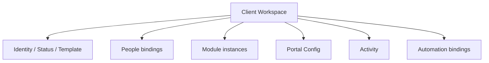
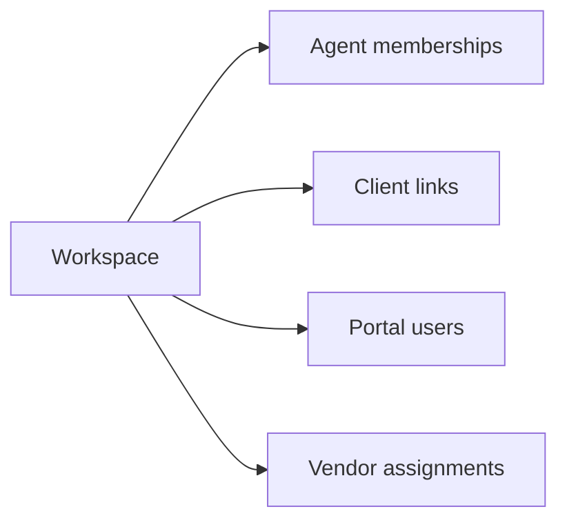
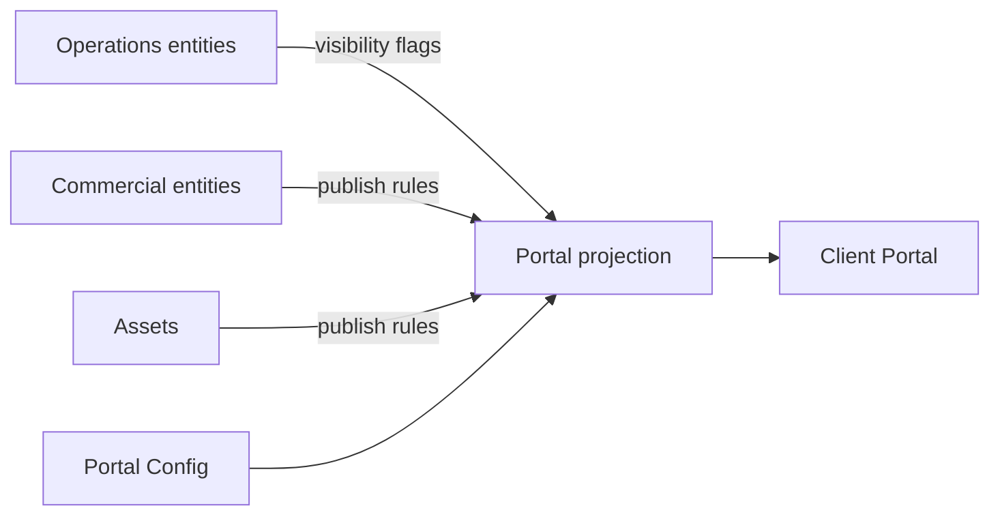

# 05 — Client Workspace Structure

**Status:** Architecture Phase  
**Companion:** [02_WORKSPACE_ARCHITECTURE.md](./02_WORKSPACE_ARCHITECTURE.md) · [06_MODULE_SYSTEM.md](./06_MODULE_SYSTEM.md) · Product [06_CLIENT_PORTAL.md](../product/06_CLIENT_PORTAL.md)

---

## 1. Purpose

Define the **internal structure** of a Client Workspace: composition, sections, relationships, and what “complete” means for delivery at scale.

---

## 2. Structural overview

```text
Client Workspace
├── Identity & status
├── People bindings (agents, clients, vendors)
├── Module instances (enabled set)
├── Portal projection config
├── Activity / audit stream
└── Automation bindings
```



---

## 3. Identity block

| Field (logical) | Purpose |
| --- | --- |
| `id` | Stable internal key |
| `company_id` | Tenant |
| `business_unit_id` | Parent unit |
| `name` | Display title |
| `code` / reference | Human ops reference (optional) |
| `primary_client_id` | Main CRM client |
| `template_key` | wedding, corporate, … |
| `status` | Lifecycle |
| `timezone` | Overrides company default if set |
| `currency` | Overrides if set |
| `primary_date` | Countdown / planning anchor |
| `archived_at` | Soft archive marker |

---

## 4. People bindings

| Binding | Meaning |
| --- | --- |
| **Workspace memberships** | Agents + workspace roles |
| **Client links** | Primary + related contacts |
| **Portal users** | Who can open Client Portal |
| **Vendor assignments** | Vendors engaged on this workspace |



---

## 5. Interior zones

Think in **zones**, not screens:

| Zone | Contents |
| --- | --- |
| **Operations** | Tasks, meetings, timeline, approvals |
| **Commercial** | Quotes, invoices, payments, expenses |
| **Assets** | Files, gallery |
| **Partners** | Vendor assignments & deliverables |
| **Experience** | Portal config, personalization, publish state |
| **Signal** | Notifications, activity, automation runs |

Zones map to modules ([06_MODULE_SYSTEM.md](./06_MODULE_SYSTEM.md)).

---

## 6. Module instance model

A workspace does not automatically include every module forever.

| Concept | Meaning |
| --- | --- |
| **Enabled modules** | Subset allowed by company plan + template + unit policy |
| **Module state** | `active` / `disabled` / `hidden` |
| **Module settings** | Per-workspace JSON/settings row |

Template `wedding` might enable Timeline + Gallery by default; `corporate` might emphasize Approvals + Files.

---

## 7. Entity attachment rules

| Entity | Parent |
| --- | --- |
| Timeline (+ items) | Workspace |
| Task | Workspace (optional links to timeline item / vendor) |
| Meeting | Workspace |
| Finance documents | Workspace |
| File | Workspace (or linked client/vendor with workspace visibility) |
| Gallery (+ items) | Workspace |
| Approval | Workspace + target entity reference |
| Portal Config | Workspace (1:1) |
| Notification (workspace) | Workspace + recipients |

**No delivery entity without `workspace_id` + `company_id`.**

---

## 8. Portal projection structure

Portal is not a folder of copies; it is a **projection**:



See [07_PORTAL_SYSTEM.md](./07_PORTAL_SYSTEM.md).

---

## 9. Workspace home (logical)

Agent “workspace home” aggregates:

- Status + primary date  
- Attention cards (overdue tasks, pending approvals, unpaid invoices)  
- Portal publish health  
- Team assignees  
- Recent activity  

This is an **aggregation read model**, not a separate source of truth.

---

## 10. Template application

On create (or explicit apply):

1. Read Business Unit / Company template pack  
2. Enable modules  
3. Seed timeline skeleton / task checklist  
4. Seed portal defaults (countdown target, sections on/off)  
5. Emit domain event `workspace.template_applied`  

Templates must be data-driven for 100k companies with varied verticals.

---

## 11. Archive & retention structure

| State | Structure behavior |
| --- | --- |
| Active/delivery | Full writes |
| Closing | Restrict destructive deletes |
| Archived | Read-mostly; portal keepsake optional |
| Company suspended | All workspaces write-blocked |

Retention policies are company-configurable later; architecture keeps `archived_at` and status.

---

## 12. Scale considerations

| Topic | Design |
| --- | --- |
| Hot workspace | Indexed child tables by `workspace_id` |
| Cold archive | Status/archive flags; future storage tiering |
| Fan-out notifications | Per-recipient rows; don’t store “notify all company” |
| Attachments | Object storage keys; DB holds metadata only |

---

## 13. Anti-patterns

- Storing portal-only duplicate timelines  
- Tasks without workspace parent  
- “Wedding object” parallel to workspace  
- Putting all company tasks in one global list without workspace scope  

---

## 14. Acceptance criteria

1. Identity, people, zones, modules, portal projection defined  
2. Attachment rules clear  
3. Template application defined  
4. Archive behavior defined  
5. Structure supports millions of workspaces via scoped keys
