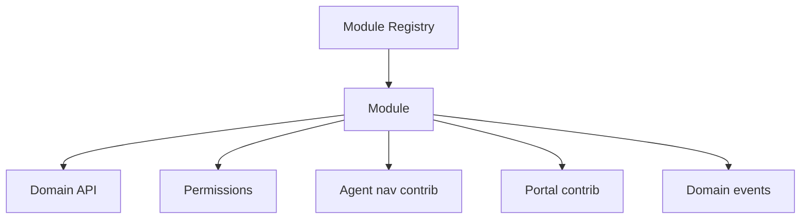
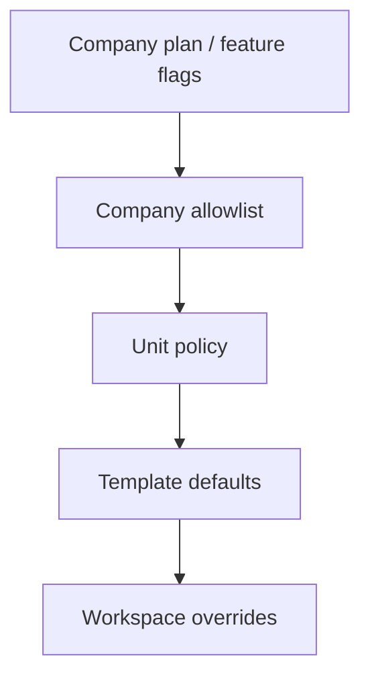

# 06 — Module System

**Status:** Architecture Phase  
**Scale:** Many modules × millions of workspaces × 100,000 companies  
**Companion:** [05_CLIENT_WORKSPACE_STRUCTURE.md](./05_CLIENT_WORKSPACE_STRUCTURE.md) · [04_USER_PERMISSION_SYSTEM.md](./04_USER_PERMISSION_SYSTEM.md)

---

## 1. Purpose

Define how RIVA packages capabilities as **modules**: contracts, registry, enablement, dependencies, and portal exposure — so the product can grow without rewriting navigation or tenancy.

---

## 2. What a module is

A **module** is a bounded capability with:

| Element | Meaning |
| --- | --- |
| `module_key` | Stable functional id (`tasks`, `timeline`, `finance`, …) |
| Domain API | Commands/queries for its entities |
| Permissions | Required capabilities |
| Agent navigation | Workspace-local nav contribution |
| Portal contribution | Optional client-visible sections |
| Automation hooks | Domain events it emits/consumes |
| Settings schema | Company / unit / workspace settings |

A module is **not** merely a sidebar link.



---

## 3. Core module registry (v1 target)

| module_key | Zone | Agent | Portal |
| --- | --- | --- | --- |
| `timeline` | Operations | Yes | Yes (visible items) |
| `tasks` | Operations | Yes | Limited / future |
| `meetings` | Operations | Yes | Optional |
| `approvals` | Operations | Yes | Yes (client decide) |
| `vendors` | Partners | Yes (assignments) | No (default) |
| `finance` | Commercial | Yes | Invoices / payments |
| `files` | Assets | Yes | Published files |
| `gallery` | Assets | Yes | Published gallery |
| `portal_config` | Experience | Yes | N/A (drives portal) |
| `activity` | Signal | Yes | Notifications feed |

Company-level (not workspace modules, but related):

| key | Scope |
| --- | --- |
| `clients` | Company CRM |
| `vendor_catalog` | Company catalog |
| `team` | Company / unit memberships |
| `automation` | Scoped rules |
| `ai` | Phase 6+ |

---

## 4. Module contract (required)

Every module must declare:

```text
module_key: string
version: semver
scope: workspace | company | unit | platform
entities: [...]
permissions:
  read: capability
  write: capability
  special: [...]
events_emitted: [...]
events_consumed: [...]
portal:
  sections: [...] | none
  visibility_model: flag | publish_job | none
dependencies: [module_key...]
```

**Example (logical):** `finance` depends on workspace identity; portal section `invoices` requires `finance` enabled + publish rules.

---

## 5. Enablement layers

Modules turn on through stacked policy:



| Layer | Effect |
| --- | --- |
| Platform flag | Kill-switch globally |
| Company plan | Commercial packaging (Phase 8) |
| Company allowlist | Admin disables risky modules |
| Unit policy | Division standards |
| Template | Industry defaults |
| Workspace | Final enable/disable where allowed |

Disabled module ⇒ routes 404, APIs deny, nav hidden.

---

## 6. Domain events (module integration bus)

Modules communicate via **domain events**, not direct DB cross-writes when avoidable.

Examples:

| Event | Emitter | Consumers |
| --- | --- | --- |
| `workspace.created` | workspace core | templates, portal_config, automation |
| `task.overdue` | tasks | notifications, automation |
| `invoice.sent` | finance | email, portal notifications |
| `payment.recorded` | finance | activity, client receipt |
| `portal.published` | portal_config | client notify |
| `approval.pending` | approvals | email, portal |

This keeps 100k-tenant systems evolvable (async workers later).

---

## 7. Agent integration points

| Integration | Behavior |
| --- | --- |
| Workspace nav | Registry order + enabled modules |
| Workspace home widgets | Modules register attention providers |
| Quick create | Modules register create actions |
| Search (later) | Modules register indexed fields |

---

## 8. Portal integration points

| Integration | Behavior |
| --- | --- |
| Section registry | Module declares portal section keys |
| Visibility | Entity-level flags or publish snapshots |
| CTA | e.g. finance registers “Pay” |

Client Portal shell only renders **registered + enabled + configured** sections ([07_PORTAL_SYSTEM.md](./07_PORTAL_SYSTEM.md)).

---

## 9. Data ownership per module

| Rule | Detail |
| --- | --- |
| Single writer | Each entity type owned by one module |
| Shared read | Other modules read via APIs |
| No shadow tables | Portal doesn’t own a second invoice table |

---

## 10. Versioning & compatibility

- Additive entity fields preferred  
- Breaking module API changes require version bump + migration plan  
- Portal sections should tolerate missing optional fields  

---

## 11. Scale implications

| Topic | Design |
| --- | --- |
| Registry | Code-defined in early phases; DB overrides for enablement |
| Hot path | Resolve enabled set once per workspace request (cache) |
| Custom modules | Not in v1; architecture leaves registry open |
| Noisy neighbors | Per-tenant automation rate limits later |

---

## 12. Rebuild rule vs Prototype V0

V0 feature folders mapped as flat dashboard pages are **not** modules yet.

Rebuild introduces module boundaries **before** recreating CRM screens.

---

## 13. Anti-patterns

- Hard-coding nav for every new feature without registry  
- Module A updating Module B tables directly without events/API  
- Portal reimplementing finance math  
- “God module” that owns tasks+files+finance  

---

## 14. Acceptance criteria

1. Module definition contract exists  
2. Core registry listed  
3. Enablement stack defined  
4. Event-oriented integration defined  
5. Agent + portal contribution model defined
