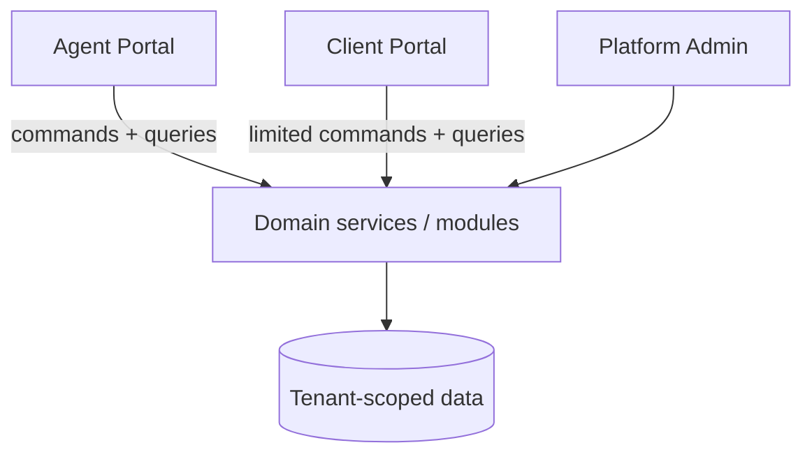
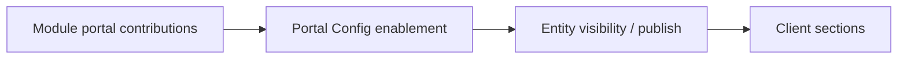
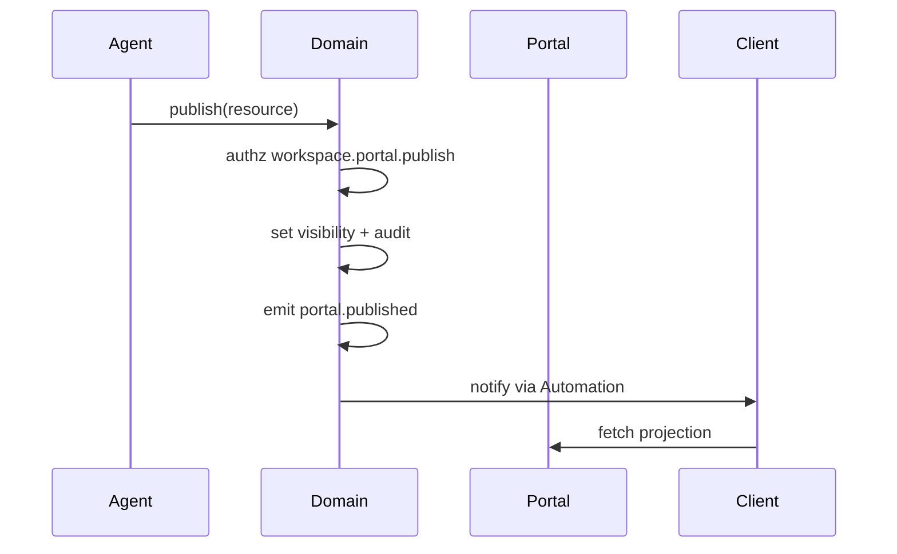

# 07 — Portal System

**Status:** Architecture Phase  
**Surfaces:** Agent Portal · Client Portal · (future Vendor Portal)  
**Companion:** [01_NAVIGATION_ARCHITECTURE.md](./01_NAVIGATION_ARCHITECTURE.md) · Product [05](../product/05_AGENT_PORTAL.md) / [06](../product/06_CLIENT_PORTAL.md)

---

## 1. Purpose

Define the **portal system**: how multiple portals coexist, share domain truth, enforce separation, and publish client experiences safely at global scale.

---

## 2. Portal inventory

| Portal | Audience | Path prefix | System of record |
| --- | --- | --- | --- |
| **Agent Portal** | Company operators | `/app` | Writes most domain data |
| **Client Portal** | Customers | `/portal` | Reads projection; limited writes (pay, approve, prefs) |
| **Platform Admin** | Super Admins | `/platform` | Platform registry |
| **Vendor Portal** (future) | Vendors | `/vendor` | Assignment-scoped |



**Hard rule:** Portals never share application chrome or session cookies across agent/client.

---

## 3. Separation guarantees

| Guarantee | Mechanism |
| --- | --- |
| Shell separation | Distinct route trees & layouts |
| Session separation | Distinct cookie/storage namespaces |
| AuthZ separation | Agent memberships vs portal memberships |
| API separation | Portal APIs cannot call agent-admin capabilities |
| Error separation | Generic 404 across tenants |

---

## 4. Client Portal architecture

### 4.1 Binding

```text
portalKey → portal_config → workspace_id → company_id
```

| Object | Role |
| --- | --- |
| `portalKey` | Public opaque id in URLs |
| `portal_config` | Experience settings + section flags |
| Workspace | Source of truth |

### 4.2 Section pipeline



Sections (functional): Landing · Countdown · Timeline · Files · Gallery · Invoices · Payments · Notifications · Music · Background · Personalization controls.

### 4.3 Visibility models

| Model | Use |
| --- | --- |
| **Flag** | `portal_visible` on entity (timeline item, file) |
| **Status gate** | Invoice `sent|paid` visible; `draft` hidden |
| **Publish action** | Explicit “publish gallery set” event |
| **Approval gate** | Visible only after approval |

Default for new agent artifacts: **not visible**.

---

## 5. Publish boundary (critical)

Publishing is a first-class domain operation:



**Never** infer publish from “agent can see it”.

---

## 6. Agent Portal’s relationship to Client Portal

Agents manage Client Portal via **`portal_config` module** inside the workspace:

- Toggle sections  
- Set countdown target, music, background  
- Invite portal users  
- Review publish checklist  
- Preview logical projection (not necessarily pixel preview in v1)

Agents do not “log into” the Client Portal to operate the business.

---

## 7. Client writes (allowed set)

| Action | Module | Notes |
| --- | --- | --- |
| Pay invoice | finance | Creates payment; triggers automation |
| Decide approval | approvals | Records decision |
| Update personalization prefs | portal_config | Mute, locale, etc. |
| Mark notification read | notifications | Self-only |

All other mutations remain agent-side.

---

## 8. Multi-workspace clients

A client person may access multiple portals over years.

| Approach | Detail |
| --- | --- |
| Identity | One client user identity |
| Memberships | Many portal memberships |
| UX | Portal picker if >1 active; else direct entry |
| Isolation | Switching portals switches workspace scope completely |

---

## 9. Security architecture

| Topic | Requirement |
| --- | --- |
| Keys | `portalKey` non-enumerable |
| Tokens | Short-lived session; rotate refresh |
| Invites | Expiring portal invites; single-use where required |
| Rate limits | Auth and pay endpoints limited per key/IP |
| PII | Client sees only published + own commercial docs |
| Audit | Portal login, pay, approve, invite |

---

## 10. Scale (100k companies)

| Topic | Design |
| --- | --- |
| Routing | Portal traffic shardable by `portalKey` hash later |
| CDN | Static personalization assets (background/music) via object storage/CDN |
| Read models | Optional cached projection per workspace for hot portals |
| Isolation | Every portal query includes company+workspace constraints |

---

## 11. Future Vendor Portal (slot)

Reserved architecture:

- Path `/vendor`  
- Memberships on vendor assignment  
- Sees only assignment files/tasks allowed  
- Same domain services; different AuthZ  

Do not build now; do not block Client Portal design.

---

## 12. Prototype V0 note

V0 has no true dual-portal system. Rebuild must introduce **Agent vs Client shells** from the start — not bolt a viewer onto `/dashboard`.

---

## 13. Anti-patterns

- iframe of agent UI for clients  
- Shared “app” layout with `if role === client`  
- Publishing by emailing raw dashboard screenshots as the product  
- Client APIs that accept `company_id` from the client body without membership proof  

---

## 14. Acceptance criteria

1. Portal inventory and separation guarantees defined  
2. `portalKey` binding defined  
3. Visibility + publish boundary defined  
4. Allowed client writes listed  
5. Scale and security constraints stated  

---

## 15. Architecture Phase completion checklist

When **all** of the following are approved, rebuild may begin:

- [ ] [00_ARCHITECTURE_PHASE.md](./00_ARCHITECTURE_PHASE.md)  
- [ ] [01_NAVIGATION_ARCHITECTURE.md](./01_NAVIGATION_ARCHITECTURE.md)  
- [ ] [02_WORKSPACE_ARCHITECTURE.md](./02_WORKSPACE_ARCHITECTURE.md)  
- [ ] [03_COMPANY_HIERARCHY.md](./03_COMPANY_HIERARCHY.md)  
- [ ] [04_USER_PERMISSION_SYSTEM.md](./04_USER_PERMISSION_SYSTEM.md)  
- [ ] [05_CLIENT_WORKSPACE_STRUCTURE.md](./05_CLIENT_WORKSPACE_STRUCTURE.md)  
- [ ] [06_MODULE_SYSTEM.md](./06_MODULE_SYSTEM.md)  
- [ ] [07_PORTAL_SYSTEM.md](./07_PORTAL_SYSTEM.md)  

**Until then: no feature development, no V0 CRM optimization, no dashboard fixes.**
