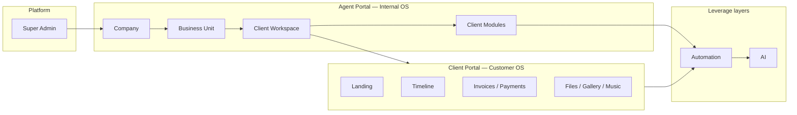

# 01 — RIVA Software Vision

**Status:** Official Product Bible foundation  
**Scope:** Documentation only — no application code, schema, or UI in this phase  
**Product:** RIVA

---

## 1. What RIVA is

**RIVA is the operating system for service businesses.**

It is not a single CRM, not a project board, and not a marketing website with a login. RIVA is a **multi-tenant operating platform** where companies run client work end-to-end:

- Internal teams operate through the **Agent Portal** (the business OS).
- Clients experience progress through the **Client Portal** (the customer OS).
- **Automation** connects both sides with reliable workflows.
- **AI** amplifies operators and personalizes client experiences — after the system of record is solid.

RIVA starts with high-touch service verticals (events and wedding planning first) and expands to any service business that runs **companies → business units → client workspaces**.

---

## 2. Approved vision statement

> **RIVA gives every service company one operating system: agents run the work, clients see the journey, automation moves the process, and AI compounds the advantage.**

### Vision pillars

| Pillar | Meaning |
| --- | --- |
| **One platform** | A single product spine from Platform → Company → Business Unit → Client Workspace |
| **Two portals** | Agent Portal for operators; Client Portal for customers — never mixed surfaces |
| **Client-centric delivery** | Every engagement lives in a Client Workspace with modules, timeline, files, finance, and communication |
| **Automation-native** | Reminders, approvals, emails, and workflows are first-class — not bolt-ons |
| **AI as leverage** | AI assists after data, portals, and automation exist; it does not replace the operating model |
| **Invitation-only growth → public SaaS** | Enterprise control first; public self-serve later |

---

## 3. The hierarchical operating model

Everything in RIVA hangs from this hierarchy. No feature may invent a parallel tenancy tree.

```text
Platform
  → Company
    → Business Unit
      → Client Workspace
        → Client Modules
          → Client Portal
            → Automation
              → AI
```

| Layer | Responsibility |
| --- | --- |
| **Platform** | RIVA itself — identity, billing (future), cross-company admin, Super Admin controls |
| **Company** | Legal / commercial tenant — brand, people, policies, companies-wide settings |
| **Business Unit** | Operational division within a Company (e.g. Weddings, Corporate Events, Studio) |
| **Client Workspace** | One client engagement / project container where work happens |
| **Client Modules** | Functional systems inside a workspace (timeline, tasks, finance, files, …) |
| **Client Portal** | Customer-facing experience of that workspace |
| **Automation** | Rules and workflows that move work without manual chasing |
| **AI** | Intelligence layer over structured data and workflows |

Detailed hierarchy: [03_INFORMATION_ARCHITECTURE.md](./03_INFORMATION_ARCHITECTURE.md).

---

## 4. Who RIVA serves

| Audience | Surface | Primary outcome |
| --- | --- | --- |
| **Platform operators (Super Admin)** | Platform admin | Invite companies, govern platform health |
| **Company owners / admins** | Agent Portal | Configure company, units, team, access |
| **Agents (planners, coordinators, finance, sales, design)** | Agent Portal | Deliver client work daily |
| **Clients** | Client Portal | See progress, approve, pay, enjoy the journey |
| **Vendors (future)** | Limited portal / shared slices | Deliver assigned scope |
| **Guests (future)** | Read-only shares | View curated moments |

---

## 5. Product surfaces (conceptual)



- **Agent Portal** = how the business runs.  
- **Client Portal** = how the client feels the business.  
- **Automation + AI** = how RIVA scales without proportional headcount.

Do not design screens in this bible — surfaces are defined by **workflows and information**, not UI kits. See [05_AGENT_PORTAL.md](./05_AGENT_PORTAL.md) and [06_CLIENT_PORTAL.md](./06_CLIENT_PORTAL.md).

---

## 6. What RIVA is not

| Not this | Why |
| --- | --- |
| A wedding-only app | Weddings are the first vertical; the model is service-business general |
| A public social network | Access is controlled; portals are invitation / share gated |
| An AI chatbot product | AI is a layer, not the product |
| A generic Notion/Airtable clone | RIVA encodes service delivery workflows and portals |
| A white-label website builder first | Client Portal is an operating experience, not a CMS vanity project |

---

## 7. Success definition

RIVA succeeds when:

1. A **Company** can onboard a team into a **Business Unit** without engineering help.
2. Every client engagement has a single **Client Workspace** as system of record.
3. Agents stop using scattered chats/spreadsheets for core delivery.
4. Clients open the **Client Portal** as the default place to check status, files, and payments.
5. **Automation** removes repetitive chasing (reminders, approvals, follow-ups).
6. **AI** improves speed and quality *on top of* clean structured data.
7. The same spine supports **Mobile Apps** and later **Public SaaS** without rewriting the hierarchy.

---

## 8. Relationship to prior work

Engineering prototypes and docs under the previous product name established authentication, invitation-only access, and early operator modules.  

**This Product Bible supersedes the previous roadmap and product framing.**  

Feature development is paused until this bible is approved. Implementation must follow [08_ROADMAP.md](./08_ROADMAP.md) and [10_DEVELOPMENT_RULES.md](./10_DEVELOPMENT_RULES.md).

---

## 9. Document map

| Doc | Purpose |
| --- | --- |
| [02_PRODUCT_PRINCIPLES.md](./02_PRODUCT_PRINCIPLES.md) | Non-negotiable product laws |
| [03_INFORMATION_ARCHITECTURE.md](./03_INFORMATION_ARCHITECTURE.md) | Full hierarchy |
| [04_DATA_ARCHITECTURE.md](./04_DATA_ARCHITECTURE.md) | Entities and relationships |
| [05_AGENT_PORTAL.md](./05_AGENT_PORTAL.md) | Internal operating workflows |
| [06_CLIENT_PORTAL.md](./06_CLIENT_PORTAL.md) | Customer experience design |
| [07_AUTOMATION.md](./07_AUTOMATION.md) | Automation catalog |
| [08_ROADMAP.md](./08_ROADMAP.md) | Phased delivery plan |
| [09_NAMING_GUIDE.md](./09_NAMING_GUIDE.md) | Temporary functional naming |
| [10_DEVELOPMENT_RULES.md](./10_DEVELOPMENT_RULES.md) | Engineering rules |

---

## 10. Approval gate

This vision is the foundation of the Product Bible.  

**No new feature development until Product Bible approval is recorded.**
