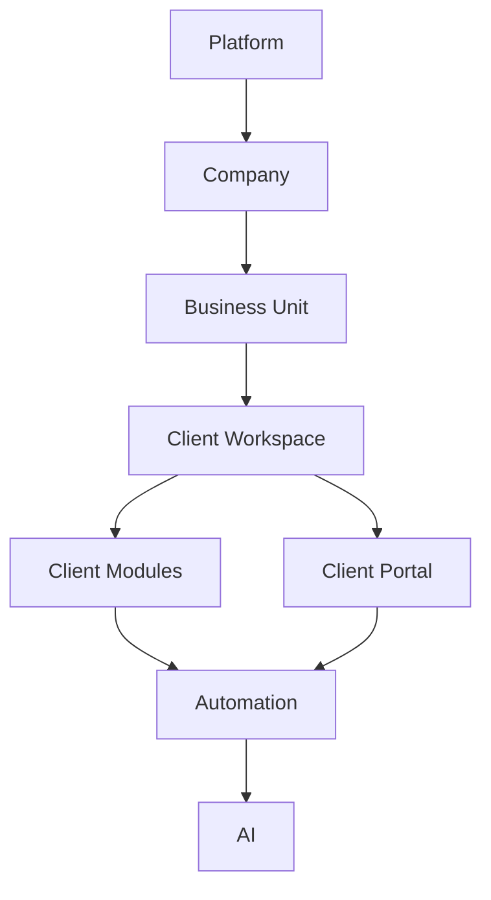
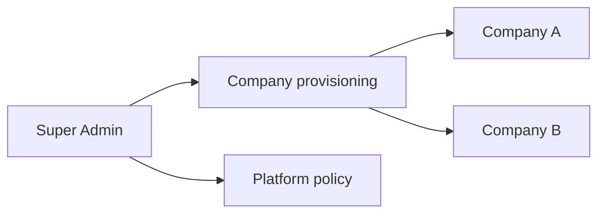
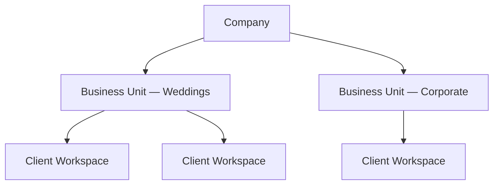
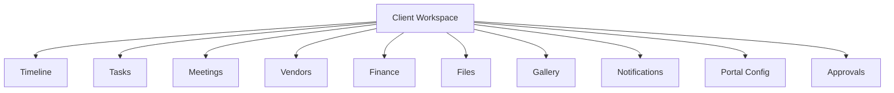
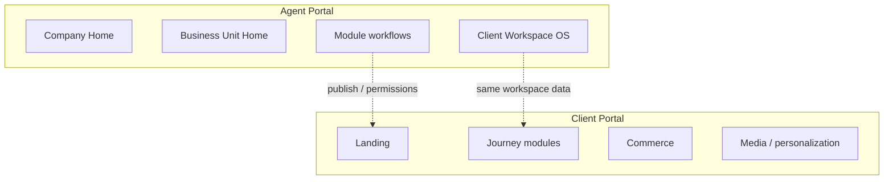

# 03 — Information Architecture

**Status:** Canonical hierarchy for RIVA  
**Companion:** [01_SOFTWARE_VISION.md](./01_SOFTWARE_VISION.md) · [04_DATA_ARCHITECTURE.md](./04_DATA_ARCHITECTURE.md)

---

## 1. Purpose

This document defines the **complete information hierarchy** of RIVA. Navigation, permissions, data scoping, and roadmap phases must map to these layers.

---

## 2. Master hierarchy

```text
Platform
  ↓
Company
  ↓
Business Unit
  ↓
Client Workspace
  ↓
Client Modules
  ↓
Client Portal
  ↓
Automation
  ↓
AI
```



---

## 3. Layer definitions

### 3.1 Platform

**What it is:** RIVA as a multi-tenant product.

**Contains:**

- Platform identity and Super Admin controls
- Company provisioning / invitation to create or join Companies
- Cross-company operational policies (future)
- Platform health, feature flags, billing (future Public SaaS)

**Does not contain:** Day-to-day client delivery work.



---

### 3.2 Company

**What it is:** The commercial and identity tenant (a real business using RIVA).

**Contains:**

- Company profile (legal name, brand defaults, timezone, currency)
- People (agents) and company-level roles
- Business Units
- Company-wide vendor directory (optional share-down)
- Company templates and standards
- Company billing relationship to Platform (future)

**Isolation:** Company A never sees Company B data.

---

### 3.3 Business Unit

**What it is:** An operational division inside a Company.

Examples (functional, not marketing names):

- Wedding Unit
- Corporate Events Unit
- Studio / Creative Unit

**Contains:**

- Unit membership (subset of company agents)
- Unit defaults (pipelines, checklists, portal themes)
- Client Workspaces owned by the unit
- Unit-level reporting

**Why it exists:** One company often runs multiple service lines with different processes. Units prevent a flat, chaotic workspace list.



---

### 3.4 Client Workspace

**What it is:** The **primary delivery container** for one client engagement.

Typically: one primary Client + one major occasion / retainer / project.

**Contains:**

- Workspace identity and status
- Links to Client (and optional related contacts)
- All Client Modules
- Portal configuration for this engagement
- Automation bindings for this engagement
- Audit of major delivery actions

**Rule:** If agents ask “where does this live?”, the answer is almost always the Client Workspace.

---

### 3.5 Client Modules

**What they are:** Functional systems inside a Client Workspace.

| Module | Purpose |
| --- | --- |
| **Timeline** | Planning and day-of sequence |
| **Tasks** | Work items and ownership |
| **Meetings** | Scheduled interactions |
| **Vendors** | Assignments for this workspace |
| **Finance** | Invoices, payments, expenses, balances |
| **Files** | Documents and deliverables |
| **Gallery** | Visual media |
| **Notifications** | In-workspace signal stream (agent + portal triggers) |
| **Portal Config** | What the client sees and how it is personalized |
| **Approvals** | Decision gates (design, quote, timeline freeze, etc.) |

Modules are **capabilities**, not necessarily top-level nav items forever — but they are distinct domains in the IA.



---

### 3.6 Client Portal

**What it is:** The customer-facing projection of a Client Workspace.

**Principles:**

- Same underlying records as Agent Portal modules (no shadow database of truth)
- Curated presentation (progress, emotion, clarity)
- Personalization (music, background, language, highlights)

Full design: [06_CLIENT_PORTAL.md](./06_CLIENT_PORTAL.md).

```mermaid
flowchart LR
  CW[Client Workspace modules] -->|project / publish| CP[Client Portal]
  CP --> L[Landing + Countdown]
  CP --> T[Timeline]
  CP --> F[Files / Gallery]
  CP --> $ [Invoices / Payments]
  CP --> N[Notifications]
  CP --> P[Personalization]
```

---

### 3.7 Automation

**What it is:** Cross-cutting layer that reacts to module and portal events.

Automation is not a “page”; it is an **execution plane** bound to Company / Unit / Workspace scopes.

Full catalog: [07_AUTOMATION.md](./07_AUTOMATION.md).

---

### 3.8 AI

**What it is:** Intelligence services that read structured RIVA data and assist agents/clients.

AI sits **above** automation and modules. It must not become the system of record.

---

## 4. Dual-portal information architecture



| Concern | Agent Portal | Client Portal |
| --- | --- | --- |
| Create timeline items | Yes | No (view / comment / approve as allowed) |
| Upload working files | Yes | Limited / request-based |
| Issue invoice | Yes | View + pay |
| Change workspace status | Yes | No |
| Personalize music/background | Configure | Experience |

---

## 5. Navigation intent (non-UI)

Conceptual navigation for agents:

1. Select **Company** (if multi-company user)
2. Select **Business Unit**
3. Open **Client Workspace**
4. Work inside **modules**
5. Manage **portal publish** and **automations** for that workspace

Conceptual navigation for clients:

1. Enter **Client Portal** (invite / magic link / account)
2. Land on **personalized home**
3. Move through **timeline / files / gallery / finance / notifications**

---

## 6. Permission scoping (logical)

| Scope | Typical control |
| --- | --- |
| Platform | Super Admin |
| Company | Owner / Company Admin |
| Business Unit | Unit Admin / Unit Members |
| Client Workspace | Assigned agents; client users for portal |
| Module actions | Role × capability matrix (future detail) |

---

## 7. Extensibility rules

1. New verticals add **templates and defaults** under Business Unit / Workspace — not new top-level platforms.
2. New client features appear as **modules** or **portal sections** bound to Client Workspace.
3. New channels (WhatsApp, etc.) appear under **Automation**, not as separate products.
4. Mobile apps mirror this IA — they do not invent a different hierarchy.

---

## 8. IA compliance test

A change is IA-compliant only if you can point to:

- its **layer**
- its **parent**
- its **portal** (agent / client / platform / automation / AI)
- its **owning entity** in [04_DATA_ARCHITECTURE.md](./04_DATA_ARCHITECTURE.md)
