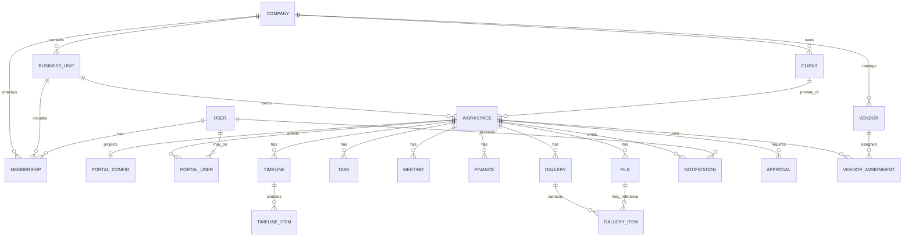

# 04 — Data Architecture

**Status:** Conceptual entity model for RIVA  
**Note:** Documentation only — does **not** modify the live database  
**Companion:** [03_INFORMATION_ARCHITECTURE.md](./03_INFORMATION_ARCHITECTURE.md)

---

## 1. Purpose

Define every core entity RIVA must support, their ownership, and relationships. Physical schema comes later and must implement this model (or an approved evolution of it).

---

## 2. Entity catalog

### 2.1 Company

| Attribute | Description |
| --- | --- |
| Meaning | Commercial tenant using RIVA |
| Owns | Business Units, company agents, company settings, optional vendor master |
| Key fields (logical) | `id`, `name`, `slug`, `timezone`, `currency`, `brand_defaults`, `status`, timestamps |

---

### 2.2 Workspace *(Client Workspace)*

In RIVA product language this is the **Client Workspace**. In data language it may be stored as `workspace` with type/context = client engagement.

| Attribute | Description |
| --- | --- |
| Meaning | Delivery container for one client engagement |
| Parent | Business Unit (required); Company via unit |
| Links | Primary Client; optional related contacts |
| Owns | Timeline, tasks, meetings, finance docs, files, gallery, portal config, notifications for the engagement |
| Key fields | `id`, `business_unit_id`, `primary_client_id`, `name`, `status`, `event_date?`, `template_key?`, `portal_settings`, timestamps |

> **Naming:** Product docs say **Client Workspace**. Engineering may use `workspace` functionally — see [09_NAMING_GUIDE.md](./09_NAMING_GUIDE.md).

---

### 2.3 Client

| Attribute | Description |
| --- | --- |
| Meaning | Person or organization being served |
| Parent | Company (CRM record); linked into Client Workspaces |
| Access | May receive Client Portal users bound to one or more workspaces |
| Key fields | `id`, `company_id`, `name`, `email`, `phone`, `status`, `notes`, `follow_up_at`, timestamps |

---

### 2.4 Vendor

| Attribute | Description |
| --- | --- |
| Meaning | Supplier / partner |
| Parent | Company catalog; assigned to Client Workspaces |
| Join | Workspace ↔ Vendor assignment (role, fee, status) |
| Key fields | `id`, `company_id`, `name`, `category`, `email`, `phone`, `notes`, timestamps |

---

### 2.5 Finance

Logical cluster (may be multiple tables physically):

| Concept | Description |
| --- | --- |
| **Invoice** | Amount owed by client for a workspace |
| **Payment** | Money received / outbound |
| **Expense** | Cost attributed to workspace / company |
| **Financial record** | Generic ledger line when needed |

| Attribute | Description |
| --- | --- |
| Parent | Client Workspace (preferred); optional Company-level overhead |
| Portal | Invoices/payments visible to clients when published |
| Key fields | `id`, `workspace_id`, `client_id?`, `type`, `amount`, `currency`, `status`, `due_at`, `paid_at`, timestamps |

---

### 2.6 Timeline

| Attribute | Description |
| --- | --- |
| Meaning | Ordered plan / run-of-show for a Client Workspace |
| Parent | Client Workspace |
| Items | Timeline entries (title, start, end, owner, visibility to portal) |
| Key fields (header) | `id`, `workspace_id`, `title`, `status`, timestamps |
| Key fields (item) | `id`, `timeline_id`, `title`, `starts_at`, `ends_at`, `assignee_id?`, `portal_visible`, `status`, sort order |

---

### 2.7 Task

| Attribute | Description |
| --- | --- |
| Meaning | Work item for agents (and limited client actions later) |
| Parent | Client Workspace (preferred); may allow unit-level backlog later |
| Links | Optional vendor, meeting, timeline item |
| Key fields | `id`, `workspace_id`, `title`, `priority`, `status`, `due_at`, `assignee_id?`, timestamps |

---

### 2.8 Meeting

| Attribute | Description |
| --- | --- |
| Meaning | Scheduled interaction |
| Parent | Client Workspace or Business Unit (internal) |
| Links | Client, vendors, workspace |
| Key fields | `id`, `workspace_id?`, `business_unit_id?`, `title`, `starts_at`, `ends_at`, `location_or_link`, timestamps |

---

### 2.9 File

| Attribute | Description |
| --- | --- |
| Meaning | Stored object (doc, PDF, image, etc.) |
| Parent | Polymorphic: Workspace, Client, Vendor, Company library |
| Portal | Explicit publish / visibility flag |
| Key fields | `id`, `owner_type`, `owner_id`, `name`, `storage_key`, `mime`, `visibility`, `uploaded_by`, timestamps |

---

### 2.10 Gallery

| Attribute | Description |
| --- | --- |
| Meaning | Curated visual set for a Client Workspace (and portal) |
| Parent | Client Workspace |
| Items | Media references (often Files) with order and captions |
| Key fields | `id`, `workspace_id`, `title`, `is_portal_visible`, timestamps |

---

### 2.11 Notification

| Attribute | Description |
| --- | --- |
| Meaning | In-app (and channel) signal to a user |
| Parent | Derived from events; scoped to Company / Workspace / Portal audience |
| Key fields | `id`, `recipient_user_id`, `workspace_id?`, `type`, `title`, `body`, `read_at`, `channel`, timestamps |

---

### 2.12 Portal

Logical cluster for Client Portal configuration and access:

| Concept | Description |
| --- | --- |
| **Portal Config** | Landing copy, countdown target, theme, music, background, enabled sections |
| **Portal User** | Client identity allowed into this workspace portal |
| **Portal Session / Link** | Auth or magic-link access mechanism |

| Attribute | Description |
| --- | --- |
| Parent | Client Workspace (1:1 config typical) |
| Key fields (config) | `workspace_id`, `countdown_at`, `music_url?`, `background_ref?`, `locale`, `section_flags`, personalization JSON |

---

## 3. Supporting entities (required for the hierarchy)

These are part of the architecture even if not listed in the short entity prompt:

| Entity | Role |
| --- | --- |
| **Platform Admin** | Super Admin actors |
| **Business Unit** | Division under Company |
| **Membership** | User ↔ Company / Unit / Workspace roles |
| **Invitation** | Controlled onboarding of agents (and later clients) |
| **Approval** | Decision object bound to workspace artifacts |
| **Automation Rule / Run** | Definitions and execution logs |
| **Audit Log** | Security and compliance trail |

---

## 4. Relationship diagram

---

## 5. Ownership and tenancy rules

1. **Every delivery row** resolves to a Company through Business Unit → Workspace (or Company directly for CRM vendors/clients).
2. **No cross-company joins** in normal product queries.
3. **Portal** never becomes a second source of truth — it reads workspace entities with visibility rules.
4. **Files** always declare an owner; portal visibility is explicit.
5. **Finance** documents that clients can pay must be workspace-scoped and status-driven.

---

## 6. Status lifecycles (logical)

| Entity | Example statuses |
| --- | --- |
| Workspace | inquiry → active → delivered → archived |
| Task | todo → in_progress → blocked → done → cancelled |
| Finance invoice | draft → sent → partially_paid → paid → void |
| Timeline item | planned → confirmed → done → cancelled |
| Approval | pending → approved → rejected → expired |
| Invitation | pending → accepted → expired → revoked |

---

## 7. Mapping note to prior models

Earlier docs used Workspace as a flat tenant and Event as the core delivery object.  

**RIVA model upgrade:**

| Prior concept | RIVA concept |
| --- | --- |
| Flat Workspace tenant | **Company** + **Business Unit** |
| Event / Wedding project | **Client Workspace** (optionally typed by template) |
| Viewer | **Client Portal** |
| Operator app | **Agent Portal** |

Physical migration is out of scope for this documentation phase.

---

## 8. Data architecture compliance

New tables/entities must:

- Name the parent in this hierarchy
- Declare portal visibility needs
- Avoid duplicating an existing entity’s responsibility
- Update this document in the same change set as schema proposals
