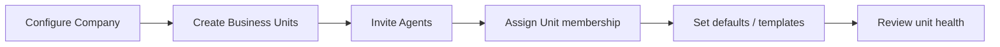
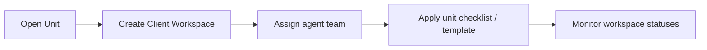
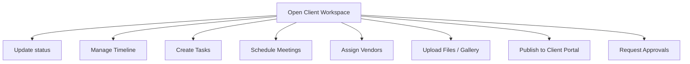
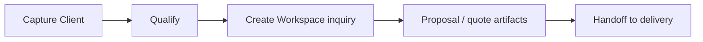
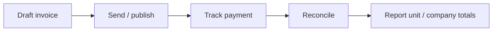
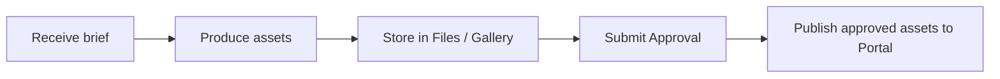
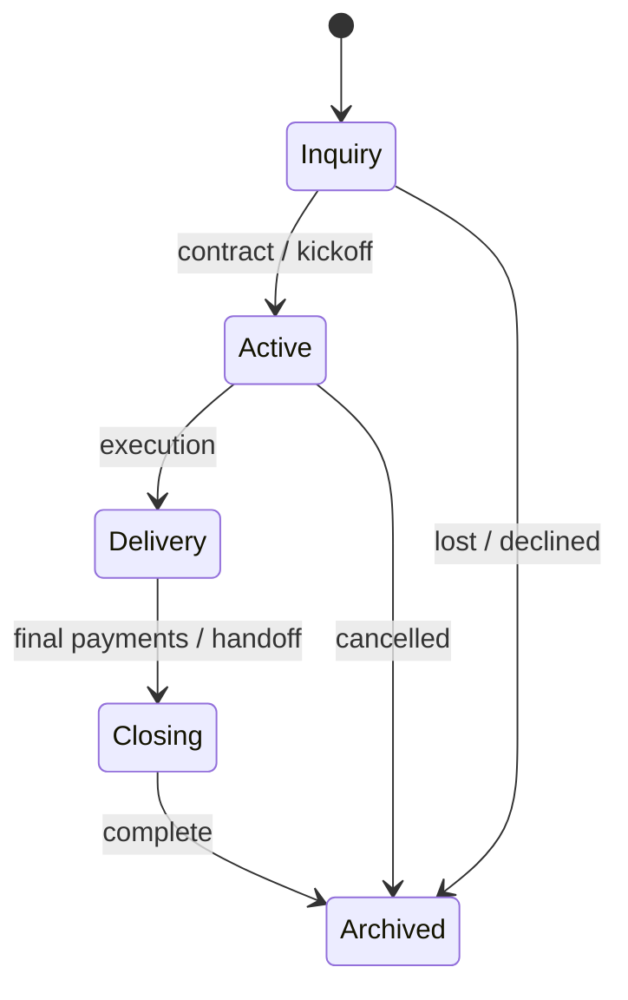
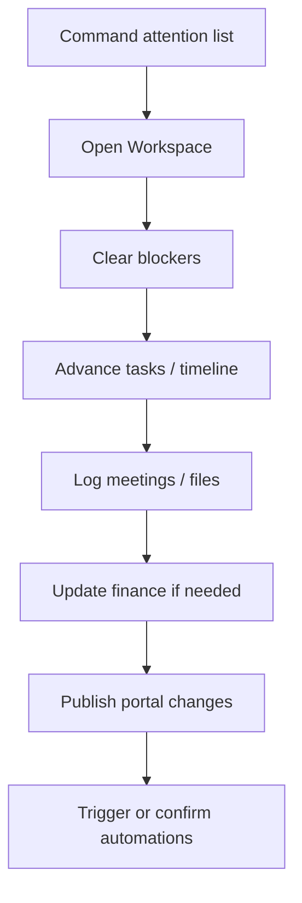
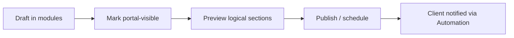
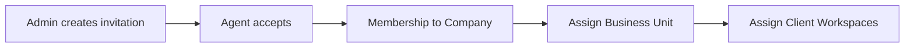

# 05 — Agent Portal

**Status:** Internal operating system design  
**Constraint:** Workflow and information design only — **do not treat this as a UI spec**

---

## 1. Purpose

The **Agent Portal** is how RIVA companies run delivery. It is the internal operating system for owners, admins, planners, coordinators, finance, sales, and design roles.

Clients do not use the Agent Portal.

---

## 2. Operating goals

| Goal | Description |
| --- | --- |
| Situational awareness | Know what needs attention today across units and workspaces |
| Controlled intake | New clients and workspaces enter through defined stages |
| Execution | Tasks, meetings, vendors, timeline move in clear states |
| Money control | Quotes → invoices → payments are traceable |
| Portal publishing | Agents decide what clients see and when |
| Governance | Roles, invitations, audit, company standards |

---

## 3. Actor workflows (by role)

### 3.1 Company Owner / Admin

**Core jobs:**

- Maintain company profile and policies
- Create and archive Business Units
- Invite / deactivate agents
- Define role capabilities
- Oversee cross-unit portfolio (optional)

---

### 3.2 Business Unit Lead

**Core jobs:**

- Own unit pipeline of Client Workspaces
- Staff workspaces
- Enforce unit playbooks (checklists, stages)
- Escalate blockers

---

### 3.3 Event Planner / Coordinator (delivery agents)

**Core jobs:**

- Keep workspace system of record accurate
- Drive timeline and task completion
- Coordinate vendors
- Prepare client-visible artifacts
- Trigger approvals and portal updates

---

### 3.4 Sales

**Core jobs:**

- Client CRM hygiene
- Inquiry workspace creation
- Handoff package to delivery agents

---

### 3.5 Finance

**Core jobs:**

- Issue and void invoices
- Record payments and expenses
- Expose payable documents to Client Portal
- Flag overdue items (feeds Automation)

---

### 3.6 Designer

---

## 4. End-to-end delivery workflow

Canonical path from lead to archive:

| Stage | Agent focus | Portal focus |
| --- | --- | --- |
| Inquiry | Capture, propose | Optional teaser / limited access |
| Active | Plan modules, kickoff | Landing + countdown + early timeline |
| Delivery | Execute timeline/tasks/vendors | Progress, files, gallery, approvals |
| Closing | Final invoice, assets | Payments, final gallery |
| Archived | Read-only reference | Optional keepsake access |

---

## 5. Workspace operating loop (daily)

**Attention list inputs (logical):**

- Overdue tasks
- Meetings today
- Pending approvals
- Overdue invoices
- Portal messages / client activity (future)
- Failed automation runs

---

## 6. Portal publishing workflow

Agents control client visibility deliberately.

Rules:

- Default new artifacts to **not client-visible** unless template says otherwise
- Approvals may gate publish
- Publishing is an auditable action

---

## 7. Collaboration boundaries

| Interaction | Mechanism |
| --- | --- |
| Agent ↔ Agent | Workspace membership, tasks, comments (future), meetings |
| Agent ↔ Vendor | Assignment records, shared file slices (future vendor portal) |
| Agent ↔ Client | Client Portal + notifications + approvals — not Agent OS access |

---

## 8. Invitation and access workflows

Platform Super Admin may invite first Company operators. Company Admins invite their teams.  

Detailed auth mechanics remain engineering concerns; product rule is **invitation-first** until Phase 8.

---

## 9. Non-goals for this document

- Screen layouts, components, or visual design
- Pixel-level navigation
- Implementation of APIs

Those come after Product Bible approval and roadmap phase entry.

---

## 10. Definition of done (Agent Portal phase)

Agent Portal is “workflow-complete” for a phase when agents can:

1. Operate inside Company → Unit → Client Workspace without spreadsheets for core state  
2. Run timeline, tasks, meetings, vendors, files, finance for a workspace  
3. Publish a coherent Client Portal projection  
4. Rely on automation for standard reminders and approvals routing
