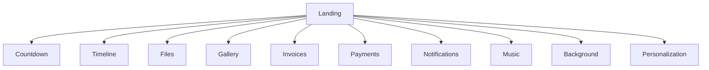
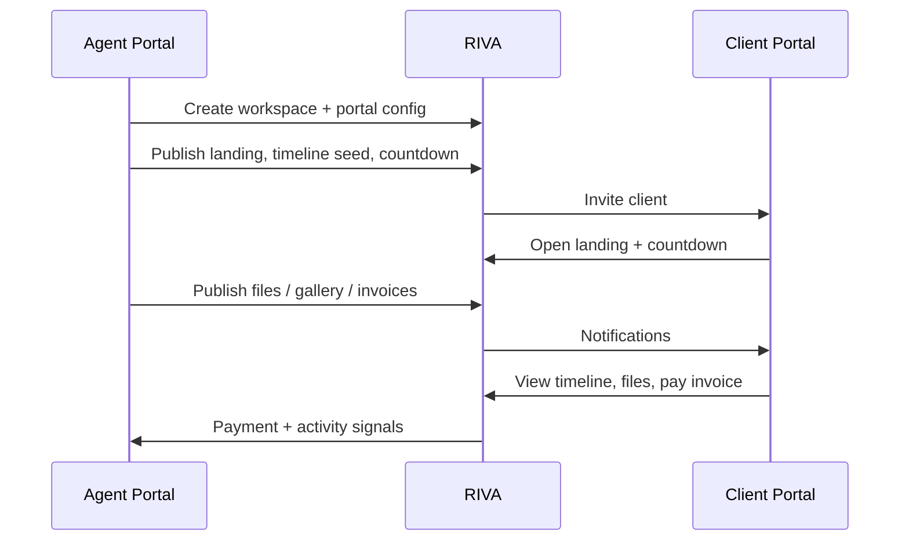

# 06 — Client Portal

**Status:** Customer experience design  
**Constraint:** Experience and information design — not a visual UI kit

---

## 1. Purpose

The **Client Portal** is how clients feel RIVA. It translates Client Workspace truth into a calm, premium, personalized journey.

It is not a second CRM. It is the customer operating experience.

---

## 2. Experience principles

| Principle | Meaning |
| --- | --- |
| Clarity | Client always knows what’s next and what’s done |
| Emotion | Landing and media create presence — not a dense admin table |
| Trust | Invoices, files, and approvals are accurate and current |
| Personalization | Music, background, language, and highlights feel tailored |
| Restraint | Show curated progress; hide internal noise |
| Same truth | Portal reads Agent Portal data with visibility rules |

---

## 3. Entry and access

Rules:

- Access is scoped to authorized workspaces only
- One client may eventually have multiple workspaces (history)
- Session is isolated from Agent Portal

---

## 4. Portal information map

---

## 5. Section designs

### 5.1 Landing page

**Job:** Orient the client in one breath — who this journey is for, what the milestone is, and how to continue.

**Must communicate:**

- Client / couple / organization names (as configured)
- Workspace title
- Primary date (if any)
- Status summary (“Planning”, “2 weeks to go”, etc.)
- Primary calls to action (view timeline, pay invoice, open gallery)

**Must not:**

- Expose internal task queues, vendor fees, or agent notes

---

### 5.2 Countdown

**Job:** Make time tangible.

| Element | Behavior |
| --- | --- |
| Target | Usually workspace event date / go-live date from Portal Config |
| States | Counting down → day-of → completed (commemorative) |
| Visibility | Optional per workspace |

---

### 5.3 Timeline

**Job:** Show the journey as the client should understand it.

| Rule | Detail |
| --- | --- |
| Source | Workspace Timeline items with `portal_visible` |
| Presentation | Chronological phases; completed vs upcoming |
| Interaction | View details; optional acknowledge / approve milestones when enabled |

Internal-only timeline rows never appear.

---

### 5.4 Files

**Job:** Deliver documents the client needs (contracts, run-sheets, tickets, briefs).

| Rule | Detail |
| --- | --- |
| Source | Files marked portal-visible |
| Actions | Download / preview |
| Requests | Optional “request file” later — not required in v1 |

---

### 5.5 Gallery

**Job:** Emotional media surface — moodboards, photos, films.

| Rule | Detail |
| --- | --- |
| Source | Gallery + items published to portal |
| Order | Curated, not raw upload dump |
| Access | May include keepsake mode after archive |

---

### 5.6 Invoices

**Job:** Clear commercial obligations.

| State | Client meaning |
| --- | --- |
| Draft | Not visible |
| Sent | Visible, payable / due |
| Partially paid | Remaining balance clear |
| Paid | Receipt / confirmation |
| Void | Hidden or marked void per policy |

---

### 5.7 Payments

**Job:** Complete payment and see history.

Payment provider choice is an engineering decision later; product requires reliable status sync back to Finance entities.

---

### 5.8 Notifications

**Job:** Tell the client what changed without requiring them to hunt.

Examples:

- New file published
- Timeline milestone unlocked
- Invoice issued / due soon
- Approval requested
- Payment received

Notifications are generated primarily by Automation ([07_AUTOMATION.md](./07_AUTOMATION.md)).

---

### 5.9 Music

**Job:** Ambient personalization on landing / gallery.

| Element | Detail |
| --- | --- |
| Source | Portal Config music reference |
| Control | Client may mute; agent configures default |
| Policy | Licensed / owned assets only |

---

### 5.10 Background

**Job:** Visual atmosphere for the portal shell/landing.

| Element | Detail |
| --- | --- |
| Source | Image / video / gradient reference in Portal Config |
| Rule | Supports brand + per-workspace personalization |
| Performance | Must not block core content access |

---

### 5.11 Personalization

**Job:** Make the portal feel like *their* workspace.

| Dimension | Examples |
| --- | --- |
| Identity | Names, honorifics, preferred language |
| Theme | Background, music, accent (within company brand limits) |
| Content | Featured gallery item, pinned message from agents |
| Accessibility | Reduced motion, mute defaults |

Personalization settings are stored on Portal Config / Portal User preferences — still workspace-scoped.

---

## 6. Client journey (happy path)

---

## 7. Permissions (logical)

| Action | Typical client |
| --- | --- |
| View published timeline / files / gallery | Yes |
| Download published files | Yes |
| Pay invoices | Yes |
| Edit master timeline | No |
| See vendor costs / internal notes | No |
| Change portal theme beyond allowed prefs | Limited |

---

## 8. Quality bar for Client Portal release

A Client Portal version is releasable when:

1. Landing + countdown work from Portal Config  
2. Timeline / files / gallery respect visibility flags  
3. Invoices and payments reflect Finance truth  
4. Notifications reach the client for core events  
5. Music / background / personalization can be configured per workspace  
6. No agent-only data leaks  

---

## 9. Explicit non-goals (this doc)

- Mockups, component libraries, or CSS direction  
- Marketing microsite builders unrelated to workspace truth
