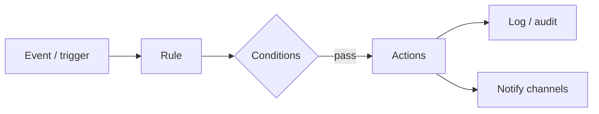
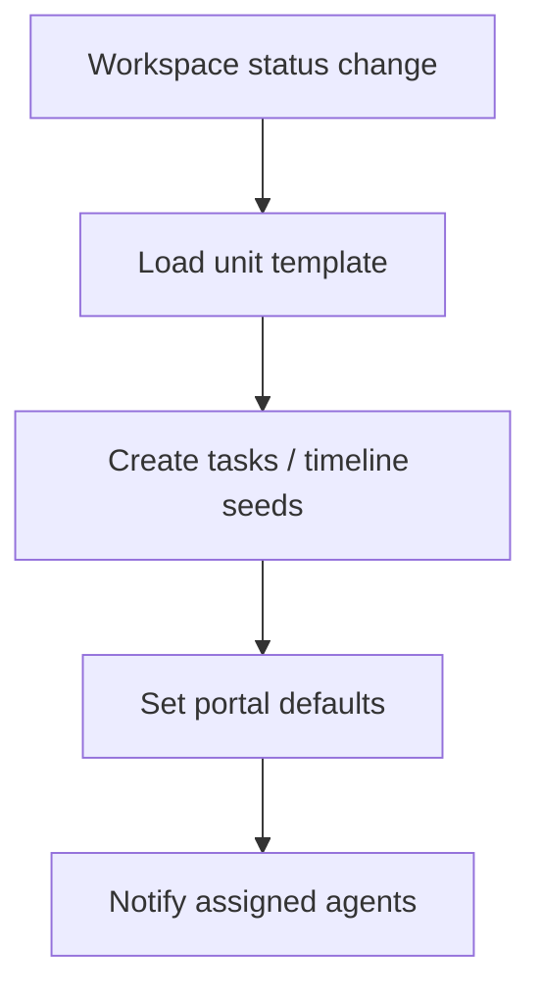
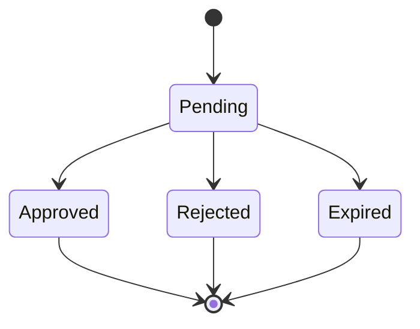

# 07 — Automation

**Status:** Automation catalog for RIVA  
**Principle:** Automation before AI ([02_PRODUCT_PRINCIPLES.md](./02_PRODUCT_PRINCIPLES.md) P6)

---

## 1. Purpose

Define **all automation classes** RIVA must support. Automation is the execution plane connecting Agent Portal, Client Portal, and future channels.

---

## 2. Automation model

| Concept | Meaning |
| --- | --- |
| **Trigger** | Domain event (invoice sent, task overdue, approval pending, countdown T-7, …) |
| **Rule** | Scoped configuration (Platform / Company / Unit / Workspace) |
| **Condition** | Filters (status, role, amount, days before date) |
| **Action** | Email, in-app notification, reminder, status change, webhook, future WhatsApp / AI |
| **Run log** | Success / failure for operability |

---

## 3. Scope levels

| Scope | Example |
| --- | --- |
| Platform | Security / system notices |
| Company | Brand-from email defaults, escalation policies |
| Business Unit | Unit playbook reminders |
| Client Workspace | Per-engagement schedules and portal alerts |

More specific scopes override or extend broader defaults without breaking tenancy.

---

## 4. Automation catalog

### 4.1 Email

| Automation | Trigger | Action |
| --- | --- | --- |
| Agent invitation | Invitation created | Email invite link |
| Client portal invite | Portal user invited | Email access link |
| Invoice sent | Invoice status → sent | Email invoice summary + portal link |
| Payment received | Payment recorded | Email receipt to client; notify finance agents |
| Approval requested | Approval → pending | Email approver (client or agent) |
| Approval resolved | Approved / rejected | Email requester |
| Digest (optional) | Schedule | Daily/weekly agent summary |

**Rules:**

- Prefer portal deep links over attachments when possible
- Never email secrets (raw tokens in logs, service keys)
- Respect locale / personalization where available

---

### 4.2 Notification (in-app)

| Automation | Trigger | Audience |
| --- | --- | --- |
| Task assigned | Assignee set | Agent |
| Task overdue | Due date passed + open | Agent (+ lead optional) |
| Meeting starting soon | T-60 / T-15 | Participants |
| File published to portal | Visibility → portal | Client |
| Gallery updated | Publish | Client |
| Invoice due soon | T-3 / T-1 | Client + finance |
| Automation failed | Run error | Company admin |

---

### 4.3 Reminder

Time-based companion to notifications.

| Reminder | Anchor | Default idea |
| --- | --- | --- |
| Countdown milestones | Portal countdown / event date | T-30, T-7, T-1 |
| Task reminder | Task `due_at` | T-1, due day |
| Meeting reminder | Meeting start | T-24h, T-1h |
| Payment reminder | Invoice `due_at` | T-7, T-3, due day, overdue cadence |
| Follow-up reminder | Client `follow_up_at` | On date |

Reminders must be cancellable when underlying status makes them obsolete (e.g. invoice paid).

---

### 4.4 Workflow

Deterministic state / assignment automations.

| Workflow | Behavior |
| --- | --- |
| Inquiry → Active checklist | On status change, spawn unit template tasks |
| Kickoff pack | On Active, ensure timeline skeleton + portal landing defaults |
| Closing pack | On Closing, generate final invoice checklist + archive gallery publish step |
| Stale workspace | If no agent activity N days, notify unit lead |
| Auto-expire invitations | Pending invites past TTL → expired + audit |

---

### 4.5 Approval

| Automation | Behavior |
| --- | --- |
| Request routing | Notify the right approver set |
| SLA escalation | If pending > N hours/days, escalate to unit lead |
| Gate publishing | Block portal publish of gated assets until approved |
| Expiry | Auto-expire approvals; notify requester |

---

### 4.6 Future — WhatsApp

| Capability | Intent |
| --- | --- |
| Template messages | Payment reminders, meeting reminders, portal links |
| Two-way later | Client confirms attendance / approval via WhatsApp |
| Constraints | Opt-in, template compliance, company-level sender config |

WhatsApp is a **channel action** under Automation — not a separate product.

---

### 4.7 Future — AI

AI automations are **assisted**, not silent mutations of money or legal documents without review (unless explicitly configured later).

| Capability | Intent |
| --- | --- |
| Draft email / reminder copy | Generate text; send only on rule or approval |
| Summarize workspace | Agent digest |
| Suggest next tasks | From timeline gaps |
| Portal personalization hints | Recommend music/background (agent confirms) |
| Risk detection | Flag overdue clusters / budget anomalies |

AI actions still produce **run logs** and respect tenancy.

---

## 5. Channel matrix

| Channel | Now / Near | Later |
| --- | --- | --- |
| In-app notification | Required | — |
| Email | Required | — |
| WhatsApp | — | Phase 5+ |
| Push (mobile) | — | Phase 7 |
| AI-generated content | — | Phase 6 |
| Webhook out | Optional | Public SaaS integrations |

---

## 6. Operability requirements

Every automation family needs:

1. **Enable/disable** at appropriate scope  
2. **Run history** (success, failure, replay policy)  
3. **Idempotency** (no duplicate invoice emails on double event)  
4. **Audit** for security-sensitive sends (invites, payments)  
5. **Fail soft** for client experience (log + alert agents; don’t crash portals)

---

## 7. Minimum automation set by roadmap phase

| Phase | Minimum automations |
| --- | --- |
| Foundation | Invitation email, invite expiry |
| Agent Portal | Task/meeting reminders (in-app), assignment notify |
| Client Workspace | Status workflow seeds |
| Client Portal | Portal invite, publish notifications, invoice email |
| Automation phase | Full reminder cadences, approvals SLA, digests |
| AI phase | Drafting + summaries behind review gates |
| Mobile | Push channel parity for critical alerts |
| Public SaaS | Self-serve lifecycle emails, billing automation |

---

## 8. Explicit non-goals

- Building a general-purpose Zapier clone in v1
- Unattended AI that changes invoice amounts
- Spamming clients without cadence caps
