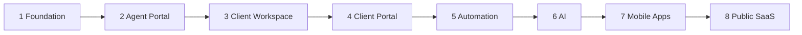

# 08 — Roadmap

**Status:** Official RIVA delivery roadmap (replaces prior Aura OS roadmap)  
**Rule:** Feature development follows these phases after Product Bible approval

---

## 1. Roadmap principles

1. **Hierarchy before features** — Company → Unit → Client Workspace must exist before deep modules.  
2. **Agent before Client Portal chrome** — operators need system of record first.  
3. **Portal before heavy automation** — publish path must exist to automate against.  
4. **Automation before AI.**  
5. **Mobile mirrors web IA** — does not invent a new product.  
6. **Public SaaS last** — after invitation-era operations are proven.

---

## 2. Phase 1 — Foundation

**Goal:** Platform spine and trust.

| Workstream | Outcomes |
| --- | --- |
| Product Bible | Approved vision, principles, IA, data, portals, automation, rules |
| Identity | Secure auth; invitation-only agent onboarding |
| Tenancy skeleton | Company (+ Super Admin platform controls) |
| Engineering standards | Docs-first, API-first, review/build gates |
| Observability basics | Health, error logging, audit for invites |

**Exit criteria:**

- Product Bible approved
- Agents can be invited securely
- Company entity exists conceptually and in implementation plan
- No public registration

---

## 3. Phase 2 — Agent Portal

**Goal:** Internal OS for company operators.

| Workstream | Outcomes |
| --- | --- |
| Company administration | Profile, members, roles |
| Business Units | Create/select units; membership |
| Agent home | Attention-oriented operating view |
| Team governance | Invites, revoke, role assignment |
| Navigation IA | Company → Unit → Workspace entry points |

**Exit criteria:**

- Admins manage company + units + agents without engineering help
- Agents can enter a unit context reliably

---

## 4. Phase 3 — Client Workspace

**Goal:** System of record for delivery.

| Workstream | Outcomes |
| --- | --- |
| Client CRM | Client entity under Company |
| Client Workspace | Create/manage workspaces under Unit |
| Core modules | Timeline, Tasks, Meetings, Vendors, Files, Finance (agent-side) |
| Gallery | Agent curation |
| Status lifecycle | Inquiry → Active → Delivery → Closing → Archived |
| Portal Config (agent-side) | Draft settings even if portal UX is limited |

**Exit criteria:**

- A full engagement can be run in a Client Workspace without spreadsheets for core state
- Modules share one workspace parent

---

## 5. Phase 4 — Client Portal

**Goal:** Customer experience.

| Workstream | Outcomes |
| --- | --- |
| Access | Client invite / secure entry |
| Landing + Countdown | Personalized home |
| Timeline / Files / Gallery | Visibility-filtered |
| Invoices + Payments | View and pay |
| Notifications | Client-facing signal stream |
| Music / Background / Personalization | Portal Config driven |

**Exit criteria:**

- Clients complete a journey loop: land → track → receive files → pay
- No agent-only data leakage

---

## 6. Phase 5 — Automation

**Goal:** Remove repetitive chasing.

| Workstream | Outcomes |
| --- | --- |
| Rules engine | Triggers, conditions, actions, logs |
| Email + in-app | Full minimum catalog from [07_AUTOMATION.md](./07_AUTOMATION.md) |
| Reminders | Countdown, tasks, meetings, invoices |
| Workflow packs | Status-change templates |
| Approvals routing + SLA | Escalations |
| Channel prep | WhatsApp-ready abstractions (implementation optional) |

**Exit criteria:**

- Standard reminders and invoice/approval emails run without manual sends
- Failed runs are visible to admins

---

## 7. Phase 6 — AI

**Goal:** Leverage structured data.

| Workstream | Outcomes |
| --- | --- |
| Agent assistants | Summaries, draft messages, task suggestions |
| Risk signals | Overdue / budget anomaly highlights |
| Portal assistance | Personalization suggestions (human confirm) |
| Guardrails | No silent money/legal mutations |

**Exit criteria:**

- AI features prove time saved on real workspaces
- All AI actions audited; tenancy enforced

---

## 8. Phase 7 — Mobile Apps

**Goal:** Field and client mobility.

| Workstream | Outcomes |
| --- | --- |
| Agent mobile | Attention list, tasks, meetings, quick updates |
| Client mobile | Portal parity for landing, timeline, files, pay, notifications |
| Push | Critical automation channel |
| Offline-tolerant basics | As needed for events day-of |

**Exit criteria:**

- Day-of agents can operate without desktop
- Clients can pay and check status on mobile

---

## 9. Phase 8 — Public SaaS

**Goal:** Scalable self-serve growth.

| Workstream | Outcomes |
| --- | --- |
| Controlled public signup | Company self-provisioning with safeguards |
| Billing | Plans, seats, unit limits |
| Onboarding | Templates for first Business Unit + sample workspace |
| Marketplace / integrations | Optional webhooks, WhatsApp providers, payment providers |
| Compliance hardening | Retention, exports, enterprise controls |

**Exit criteria:**

- New companies can start without manual Super Admin intervention
- Invitation-era controls remain available for enterprise mode

---

## 10. What this roadmap replaces

The previous three-phase Aura OS roadmap (planner core → wedding ops → AI/mobile) is **retired** as the planning source of truth.

Historical engineering docs may remain for reference but must defer to this file for prioritization.

---

## 11. Freeze policy (current)

Until Product Bible approval:

- No new feature development
- Documentation and planning only
- Existing production fixes may proceed only if they do not expand product scope

---

## 12. Phase entry checklist

Before starting a phase:

1. Previous phase exit criteria met (or explicit waiver)  
2. Principles check ([02](./02_PRODUCT_PRINCIPLES.md))  
3. IA + data impact updated  
4. API/workflow design noted  
5. Automation/AI implications listed
