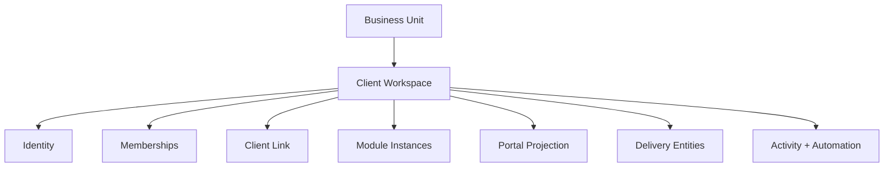

# 01 — Workspace Blueprint

**Sprint 008 · Architecture only**  
**Companion:** [architecture/02_WORKSPACE_ARCHITECTURE.md](../architecture/02_WORKSPACE_ARCHITECTURE.md) · [architecture/05_CLIENT_WORKSPACE_STRUCTURE.md](../architecture/05_CLIENT_WORKSPACE_STRUCTURE.md)

---

## 1. Purpose

Specify the **Client Workspace** as the single delivery container in RIVA — the system of record for one client engagement — in enough detail to implement later without re-litigating structure.

The workspace unifies operations (tasks, timeline, meetings, approvals), commercial (finance), assets (files, gallery), experience (portal config), and signal (notifications, activity) under one tenant-scoped root.

---

## 2. Entity hierarchy

```text
Business Unit
  └── Client Workspace
        ├── Workspace Identity (status, template, dates, locale/currency)
        ├── Workspace Membership (agents × workspace role)
        ├── Client Link (primary + related contacts)
        ├── Module Instances (enabled set + settings)
        ├── Portal Projection (portal_config + portal users)
        ├── Delivery Entities (tasks, timeline, meetings, finance, files, gallery, approvals)
        └── Activity / Automation bindings
```



---

## 3. Relationships

| Relationship | Cardinality | Rule |
| --- | --- | --- |
| Business Unit → Client Workspace | 1 : N | Workspace has exactly one owning unit |
| Company → Client Workspace | 1 : N (via unit) | `company_id` denormalized on workspace |
| Client → Client Workspace | 1 : N | One primary client; related contacts many |
| Workspace → Module Instance | 1 : N | Enabled subset only |
| Workspace → Portal Config | 1 : 1 | Single projection config |
| Workspace → Portal User | 1 : N | Client-side access |
| Workspace → Delivery Entity | 1 : N each | All carry `workspace_id` + `company_id` |

**Invariant:** `workspace.company_id == business_unit.company_id`, always.

---

## 4. Future scalability

- Stable opaque `workspace_id` usable as a partition/shard key.
- Child tables indexed by `(workspace_id)` and `(company_id, business_unit_id, status)`.
- Read model for "workspace home" aggregation (attention cards) computed, not stored as truth.
- Archive lifecycle (`archived_at`, status) enables cold-tier storage later.
- No global cross-tenant workspace index; lists are always unit/company scoped.

---

## 5. SaaS considerations

- Workspace counts and enabled modules feed plan/quota enforcement (Phase 8 billing).
- Template packs are data-driven, allowing per-plan defaults.
- Suspended company ⇒ all workspaces write-blocked (read/keepsake allowed per policy).
- Export/retention operate per company, cascading to workspaces.

---

## 6. Multi-company support

- Every workspace resolves to exactly one company; no shared workspaces.
- A multi-company agent has separate workspace memberships per company.
- Queries never union workspaces across companies.

---

## 7. Multi-country support

- Workspace inherits `timezone` and `currency` from Company/Unit, with **optional per-workspace override** (e.g. destination event in another country).
- `primary_date` stored in UTC with a display timezone; countdown computed per locale.
- Locale for portal content stored on portal config; falls back to company default.

---

## 8. Client Portal compatibility

- Portal is a **projection** of workspace entities (visibility flags / publish snapshots), never a second source of truth.
- `portal_config` (1:1) drives enabled sections; portal users bind at workspace scope.
- Archived workspace may expose read-only keepsake portal.

---

## 9. Acceptance criteria

1. Single delivery container (Client Workspace) with defined interior.
2. Relationships + invariants explicit.
3. Scale, SaaS, multi-company, multi-country, and portal lenses addressed.
4. No implementation artifacts produced.
