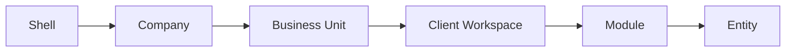

# 02 — Navigation Blueprint

**Sprint 008 · Architecture only**  
**Companion:** [architecture/01_NAVIGATION_ARCHITECTURE.md](../architecture/01_NAVIGATION_ARCHITECTURE.md)

---

## 1. Purpose

Define the concrete navigation model for RIVA: the separated shells, the agent context stack, the route grammar, and the switcher behavior — specified enough to implement without inventing a parallel structure.

---

## 2. Entity hierarchy (navigation contexts)

```text
Shell (platform | app | portal)
  └── Company (agent shell)
        └── Business Unit
              └── Client Workspace
                    └── Module
                          └── Entity
```



| Shell | Audience | Path prefix |
| --- | --- | --- |
| Platform Admin | Super Admin | `/platform` |
| Agent Portal | Company agents | `/app` |
| Client Portal | Clients | `/portal` |

---

## 3. Relationships

- A **route** always encodes enough context to resolve tenancy: agent delivery routes carry company (+ unit, + workspace as needed).
- **Switchers** change context, never blend it: one active company, one active unit at a time.
- **Deep links** re-run context resolution + authorization from scratch.

Target agent grammar:

```text
/app/c/:companySlug/u/:unitSlug/home
/app/c/:companySlug/u/:unitSlug/workspaces
/app/c/:companySlug/u/:unitSlug/workspaces/:workspaceId/:moduleKey
/app/c/:companySlug/clients
/app/c/:companySlug/vendors
/app/c/:companySlug/team
/app/c/:companySlug/settings
```

Client grammar:

```text
/portal/:portalKey
/portal/:portalKey/:sectionKey
```

---

## 4. Future scalability

- Slugs for human-readable company/unit; opaque ids for high-volume workspaces and portals.
- Switchers query only the user's membership set (small) — no global directory scans.
- Recent-workspace list cached per user; searchable within active unit.
- Route resolution is stateless and cacheable per `(user, company)`.

---

## 5. SaaS considerations

- Company slug namespace is global and must be reserved/validated at provisioning.
- Feature-flagged modules hide/deny routes without breaking the grammar.
- Marketing/public pages (Phase 8) live outside `/app` and `/portal` shells.

---

## 6. Multi-company support

- The company segment (`/c/:companySlug`) is mandatory for agent delivery routes.
- Switching company resets unit/workspace context.
- No route can implicitly aggregate multiple companies.

---

## 7. Multi-country support

- Navigation chrome resolves locale from company/unit/user preference.
- Date/time and currency rendering are context-derived (company/workspace), not global.
- Right-to-left and translation readiness handled at shell level, not per page hacks.

---

## 8. Client Portal compatibility

- Portal navigation is section-based, driven by `portal_config` + module portal contributions.
- No company/unit switcher in the portal shell.
- Portal deep links use `portalKey`; agent and client sessions are isolated.

---

## 9. Prototype V0 mapping (discard, not polish)

| V0 | Target |
| --- | --- |
| `/dashboard` | `/app/c/:company/u/:unit/home` |
| `/dashboard/crm` | `/app/c/:company/clients` |
| `/dashboard/weddings` | `/app/c/:company/u/:unit/workspaces` |
| Flat sidebar | Context stack + workspace module nav |

---

## 10. Acceptance criteria

1. Three separated shells with distinct prefixes.
2. Agent routes always encode company (+ unit/workspace where required).
3. Switchers scoped to membership; no global indexes.
4. Portal nav config-driven and isolated.
5. Multi-country and SaaS lenses addressed. No code produced.
