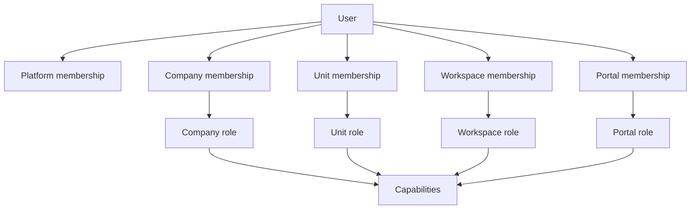
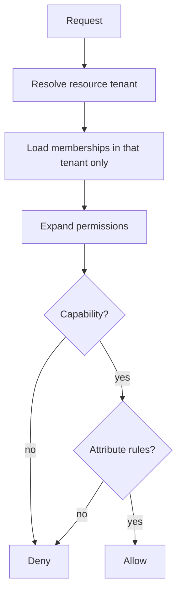

# 03 — Permission Blueprint

**Sprint 008 · Architecture only**  
**Companion:** [architecture/04_USER_PERMISSION_SYSTEM.md](../architecture/04_USER_PERMISSION_SYSTEM.md)

---

## 1. Purpose

Define RIVA authorization as **scoped membership + role + capability + resource scope**, specified for implementation at global multi-tenant scale, with deny-by-default and zero cross-tenant leakage.

---

## 2. Entity hierarchy

```text
Identity (User)
  └── Membership (scoped binding)
        ├── scope: platform | company | business_unit | workspace | portal
        ├── Role (per scope)
        └── Capabilities (expanded from role)
```



| Scope | Grants |
| --- | --- |
| platform | Platform admin APIs |
| company | Company catalogs, settings, units (role-permitting) |
| business_unit | Unit home, workspace lists, unit settings |
| workspace | Modules/entities in one workspace |
| portal | Client Portal projection for one workspace |

---

## 3. Relationships

- Access to a workspace resource requires a **path**: platform OR company (sufficient role) OR unit (policy) OR explicit workspace membership — then a **capability** check on the action.
- Invitations **materialize** memberships on acceptance; expired/revoked invites grant nothing.
- Portal memberships never authorize agent APIs and vice versa.



---

## 4. Future scalability

- Memberships per user per company are small ⇒ cache permission expansion per `(user_id, company_id)` with invalidation on role change.
- Capability keys are stable strings; new modules add keys without schema churn.
- No "grant all workspaces in all companies" fan-out.
- Indexed lookups on `(user_id, company_id)` and `(workspace_id, user_id)`.

---

## 5. SaaS considerations

- Plans can gate capability sets (e.g. advanced finance) per company (Phase 8).
- Super Admin lives in a **separate platform table**, not a company role.
- Access reviews / audit tooling reserved for enterprise mode.

---

## 6. Multi-company support

- Separate membership rows per company; one active company per agent session.
- Cross-company resource id ⇒ generic deny (no existence leakage).
- List endpoints return only authorized rows via query-level tenant filters.

---

## 7. Multi-country support

- Permissions are country-agnostic, but data-residency policies (future) may restrict where a membership can operate.
- Locale/timezone are user attributes, independent of role.
- Legal/finance capabilities can later be region-conditioned via attribute rules.

---

## 8. Client Portal compatibility

- Portal roles: `portal_owner`, `portal_member`, `portal_viewer`.
- Allowed client writes are explicit and narrow: pay invoice, decide approval, update personalization prefs, mark notifications read.
- Everything else remains agent-side.

---

## 9. Role catalog (functional defaults)

| Scope | Roles |
| --- | --- |
| Platform | `platform_super_admin` |
| Company | `company_owner`, `company_admin`, `company_member` |
| Business Unit | `unit_admin`, `unit_member` |
| Workspace | `workspace_lead`, `workspace_editor`, `workspace_finance`, `workspace_viewer` |
| Portal | `portal_owner`, `portal_member`, `portal_viewer` |

---

## 10. Acceptance criteria

1. Scoped membership model defined across five scopes.
2. Deterministic evaluation order with deny-by-default.
3. Invite→membership materialization defined.
4. Scale, SaaS, multi-company/country, portal lenses addressed. No code produced.
