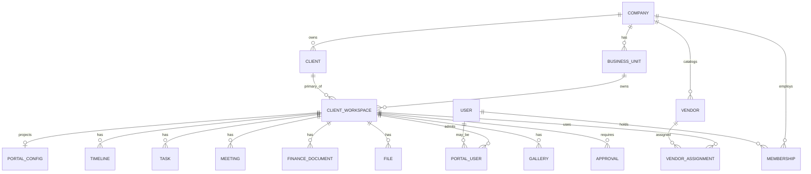

# 04 — Database Blueprint

**Sprint 008 · Architecture only — NO migration, NO SQL executed**  
**Companion:** [architecture/03_COMPANY_HIERARCHY.md](../architecture/03_COMPANY_HIERARCHY.md) · [product/04_DATA_ARCHITECTURE.md](../product/04_DATA_ARCHITECTURE.md)

---

## 1. Purpose

Provide a conceptual (logical) database blueprint for RIVA: the tables, tenancy columns, keys, and relationships required to implement the hierarchy at 100,000-company scale. This is a **specification**, not a migration.

---

## 2. Entity hierarchy (logical tables)

```text
platform_admins
companies
  business_units
    client_workspaces
      workspace_members
      workspace_clients (link)
      timelines / timeline_items
      tasks
      meetings
      finance_documents / payments
      files
      galleries / gallery_items
      approvals
      portal_configs
      portal_users
      notifications
      activity_log
clients            (company-scoped CRM)
vendors            (company catalog)
vendor_assignments (workspace ↔ vendor)
memberships        (company/unit scoped)
invitations
automation_rules / automation_runs
audit_logs
```



---

## 3. Relationships & keys

| Table | Tenancy columns | Notable keys |
| --- | --- | --- |
| `companies` | `id` | unique `slug` |
| `business_units` | `company_id` | unique `(company_id, slug)` |
| `client_workspaces` | `company_id`, `business_unit_id` | index `(company_id, business_unit_id, status, updated_at)` |
| delivery tables | `company_id`, `workspace_id` | index `(workspace_id)`; FK to workspace |
| `clients` | `company_id` | index `(company_id, status)` |
| `vendors` | `company_id` | index `(company_id, category)` |
| `memberships` | `company_id` + scope refs | index `(user_id, company_id)` |
| `portal_users` | `company_id`, `workspace_id` | unique `(workspace_id, user_id)` |
| `portal_configs` | `company_id`, `workspace_id` | unique `(workspace_id)`; opaque `portal_key` |
| `invitations` | `company_id?` | `token_hash` unique; partial unique pending per email |

**Invariant enforcement:** every delivery table carries denormalized `company_id` for tenant filtering and defense-in-depth policies.

---

## 4. Future scalability

- `company_id` present on all tenant data ⇒ ready for row-level security and future sharding by tenant.
- `workspace_id` as a stable partition-key candidate for hot delivery tables.
- Object storage holds file/gallery/music/background bytes; DB stores metadata + keys only.
- Append-only `activity_log` / `audit_logs` partitioned by time later.
- Notifications stored per-recipient (no "notify whole company" rows).

---

## 5. SaaS considerations

- `companies.plan` / entitlements table gates modules and quotas.
- `companies.status` (`provisioning|active|suspended|closed`) gates writes.
- Billing tables (subscriptions, seats) reserved for Phase 8 — not in v1 build.
- Per-company export and retention jobs operate on `company_id` slices.

---

## 6. Multi-company support

- No table mixes two companies in one row.
- All product queries filter by resolved `company_id` first.
- Global uniqueness limited to `companies.slug`, `portal_key`, and identity emails; everything else unique **within** a company.

---

## 7. Multi-country support

- `companies.default_currency`, `default_timezone`, `default_locale`.
- Workspace-level overrides for destination engagements.
- Money stored as integer minor units + `currency` code; never float.
- Timestamps stored in UTC; display timezone resolved per context.
- Address/phone fields country-aware; locale drives formatting.
- Data-residency-ready: `company_id` slice can map to a region later.

---

## 8. Client Portal compatibility

- Portal reads the same delivery tables with visibility columns (`portal_visible`, status gates) — no shadow tables.
- `portal_configs` holds section flags, countdown target, music/background refs, personalization JSON.
- `portal_users` + tokenized sessions isolate client access at workspace scope.

---

## 9. Explicit non-goals (this sprint)

- No SQL migration files.
- No physical schema applied.
- No changes to Prototype V0 tables.
- Vendor choice (Postgres/Supabase specifics), RLS policy text, and indexes are refined at build time against this blueprint.

---

## 10. Acceptance criteria

1. Logical table set + tenancy columns defined.
2. Keys/indexes described for scale.
3. Money/time/locale rules stated for multi-country.
4. Portal reads-from-truth confirmed.
5. No migration or SQL produced.
