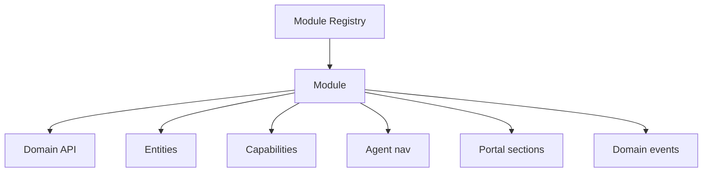

# 05 — Module Blueprint

**Sprint 008 · Architecture only**  
**Companion:** [architecture/06_MODULE_SYSTEM.md](../architecture/06_MODULE_SYSTEM.md)

---

## 1. Purpose

Define how RIVA capabilities are packaged as **modules** with stable contracts, a registry, layered enablement, and event-based integration — so the product grows without rewriting navigation, tenancy, or portals.

---

## 2. Entity hierarchy

```text
Module Registry
  └── Module (module_key)
        ├── Domain API (commands/queries)
        ├── Entities (single-writer ownership)
        ├── Capabilities (required permissions)
        ├── Agent nav contribution
        ├── Portal section contribution
        ├── Settings schema (company/unit/workspace)
        └── Domain events (emitted/consumed)
```



Core registry (v1 target): `timeline`, `tasks`, `meetings`, `approvals`, `vendors`, `finance`, `files`, `gallery`, `portal_config`, `activity`.  
Company-scope: `clients`, `vendor_catalog`, `team`, `automation`, `ai` (Phase 6+).

---

## 3. Relationships

- **Single writer:** each entity type is owned by exactly one module; others read via API.
- **Integration via events:** modules emit/consume domain events instead of cross-writing tables.
- **Portal exposure:** a module optionally registers portal sections; the portal shell renders only enabled + configured + published sections.

| Event | Emitter | Consumers |
| --- | --- | --- |
| `workspace.created` | workspace core | templates, portal_config, automation |
| `task.overdue` | tasks | notifications, automation |
| `invoice.sent` | finance | email, portal notifications |
| `payment.recorded` | finance | activity, portal receipt |
| `portal.published` | portal_config | client notify |
| `approval.pending` | approvals | email, portal |

---

## 4. Future scalability

- Registry code-defined early; DB-backed **enablement** overrides per company/unit/workspace.
- Enabled-module set resolved once per workspace request and cached.
- Event bus can move from in-process to async workers without contract changes.
- New modules = new registry entries + capabilities; no navigation rewrite.

---

## 5. SaaS considerations

- Module availability gated by **company plan / feature flags** (Phase 8 packaging).
- Platform kill-switch per module for incident response.
- Custom/third-party modules not in v1, but the registry is left open.

---

## 6. Multi-company support

- Enablement stack: platform flag → company plan → company allowlist → unit policy → template default → workspace override.
- A disabled module ⇒ routes 404, APIs deny, nav hidden — per company/workspace independently.
- No module reaches across companies.

---

## 7. Multi-country support

- Modules render dates/currency/locale from workspace/company context, not hard-coded formats.
- Finance module uses minor-unit integers + currency code; tax/locale rules are pluggable later.
- Content modules (timeline, portal) support localized strings via config.

---

## 8. Client Portal compatibility

- Modules declare portal **section keys** and a visibility model (`flag`, `status gate`, `publish action`, `approval gate`).
- Default for new agent artifacts: **not portal-visible**.
- Portal never reimplements module business rules (e.g. finance math) — it consumes the module API/projection.

---

## 9. Module contract (specification shape)

```text
module_key: string
version: semver
scope: workspace | company | unit | platform
entities: [...]
permissions: { read, write, special[] }
events_emitted: [...]
events_consumed: [...]
portal: { sections[] | none, visibility_model }
dependencies: [module_key...]
settings_schema: {...}
```

---

## 10. Acceptance criteria

1. Module contract + core registry defined.
2. Single-writer ownership + event integration defined.
3. Layered enablement for multi-company scale.
4. Portal section/visibility model defined.
5. Multi-country and SaaS lenses addressed. No code produced.
