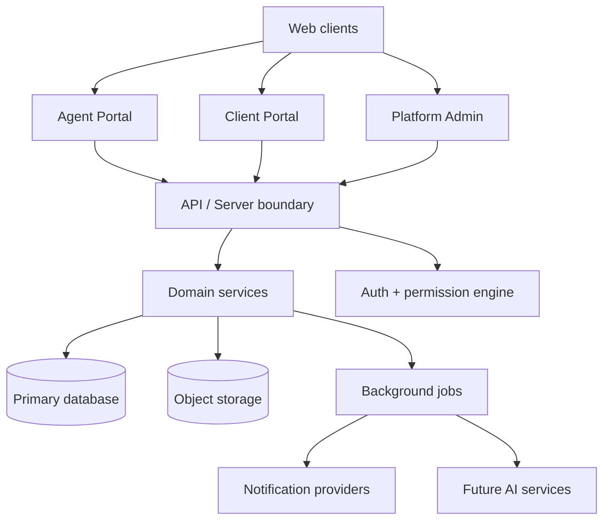

# 01 — System Architecture

**Status:** CTO Technical Blueprint  
**Scope:** Documentation only

---

## 1. Purpose

Define the target system architecture for RIVA as a scalable multi-tenant SaaS platform supporting Agent Portal, Client Portal, automation, and future AI.

---

## 2. System layers



---

## 3. Runtime boundaries

| Boundary | Responsibility |
| --- | --- |
| Presentation shells | `/app`, `/portal`, `/platform`; no shared user assumptions |
| API/server boundary | Validates input, resolves context, calls domain services |
| Domain services | Business workflows and invariants |
| Permission engine | Scoped authorization decisions |
| Persistence | Tenant-scoped relational data |
| Object storage | Files, gallery, music, background assets |
| Background jobs | Notifications, reminders, workflows, future AI |

---

## 4. Tenancy model

Every request resolves a tenant context before domain data access:

```text
company_id → business_unit_id? → workspace_id? → module_key?
```

Client Portal requests resolve:

```text
portal_key → portal_config → workspace_id → company_id
```

Tenant context is never accepted blindly from client input.

---

## 5. Multi-workspace support

- Client Workspace is the delivery root.
- Modules are workspace-scoped unless explicitly company/platform scoped.
- Workspace switching is route/context-driven, not global mutable state alone.
- Background jobs always carry `company_id` and `workspace_id` where applicable.

---

## 6. Multi-company support

- Company is the hard isolation boundary.
- All tenant tables carry `company_id` or resolve to it through immutable parents.
- No cross-company list endpoints for product users.
- Platform Admin is the only cross-company operational surface.

---

## 7. Multi-country support

- Company defaults: locale, timezone, currency, country, legal settings.
- Workspace overrides: destination timezone/currency/locale.
- Storage and deployment design remain region-ready.
- Timestamps are stored in UTC; rendering uses context timezone.

---

## 8. Portal support

Agent Portal and Client Portal share domain services but not shells, sessions, or authorization roles. Client Portal receives projections of workspace truth through explicit publish/visibility rules.

---

## 9. SaaS readiness

- Plan/entitlement gates attach at Company.
- Feature flags can disable modules globally or per company.
- Jobs and storage are quota-aware.
- Observability must support tenant-level debugging.

---

## 10. Technical principles

1. Domain-first, UI-second.
2. API-first boundaries.
3. Deny-by-default authorization.
4. Async-ready workflows.
5. No duplicated domain logic across portals.
6. Prototype V0 is reference only, not an architecture base.
