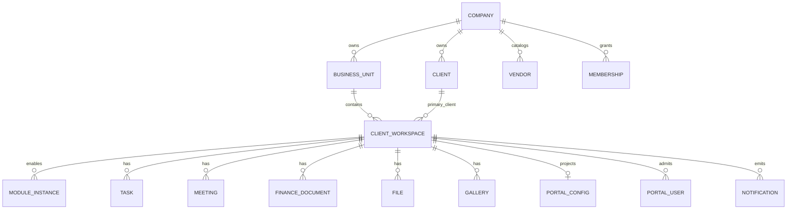

# 02 — Database Schema

**Status:** CTO Technical Blueprint  
**Scope:** Logical schema only — no SQL migration

---

## 1. Purpose

Define the target database structure for RIVA as a multi-company, multi-workspace SaaS platform. This document describes entities, ownership, keys, tenancy, indexing strategy, and future regional readiness without producing SQL.

---

## 2. Logical entity groups

```text
Platform
  platform_admins
  platform_audit_logs
  feature_flags

Company
  companies
  company_settings
  business_units
  memberships
  invitations
  clients
  vendors

Client Workspace
  client_workspaces
  workspace_members
  workspace_clients
  module_instances
  timelines / timeline_items
  tasks
  meetings
  finance_documents / payments
  files
  galleries / gallery_items
  approvals
  portal_configs
  portal_users
  notifications
  activity_logs

Automation
  automation_rules
  automation_runs
  notification_deliveries
```

---

## 3. Relationship model



---

## 4. Tenancy columns

| Entity type | Required tenant fields |
| --- | --- |
| Company root | `id` |
| Business Unit | `company_id` |
| Client Workspace | `company_id`, `business_unit_id` |
| Delivery entities | `company_id`, `workspace_id` |
| Company catalogs | `company_id` |
| Portal entities | `company_id`, `workspace_id` |
| Automation entities | `company_id`, optional `business_unit_id`, optional `workspace_id` |

Every tenant query filters by `company_id` first, either directly or through a verified parent.

---

## 5. Key rules

- `companies.slug` is globally unique.
- `business_units.slug` is unique within a company.
- `portal_configs.portal_key` is globally unique and opaque.
- Delivery records are unique within workspace unless explicitly global.
- Finance amounts use integer minor units plus currency code.
- Timestamps are stored in UTC.

---

## 6. Indexing strategy

| Query pattern | Index direction |
| --- | --- |
| Unit workspace list | `company_id`, `business_unit_id`, `status`, `updated_at` |
| User company access | `user_id`, `company_id` |
| Workspace module entities | `workspace_id`, status/date as needed |
| Client Portal resolve | `portal_key` |
| Notifications inbox | `recipient_user_id`, `read_at`, `created_at` |
| Automation due runs | `status`, `scheduled_at` |

Indexes are designed per access path, not added reactively after slow global scans.

---

## 7. Multi-country support

| Concern | Rule |
| --- | --- |
| Currency | Store ISO currency code with every financial amount |
| Timezone | Company default, workspace override, UTC persistence |
| Locale | Company default, user preference, portal preference |
| Phone/address | Country-aware structured fields where needed |
| Data residency | Keep `company_id` as future region-sharding key |

---

## 8. Client Portal compatibility

Portal reads from canonical workspace entities. It must not create duplicate timeline, invoice, file, or gallery truth. Visibility is controlled by fields, status gates, and publish events.

---

## 9. SaaS considerations

- Entitlements can attach to Company.
- Module usage can be counted per Company and Workspace.
- Billing, seat limits, quotas, retention, and export all operate by `company_id`.
- Suspended companies are write-blocked but may retain read/export paths.

---

## 10. Non-goals

This is not a migration, not SQL, and not an implementation task.
