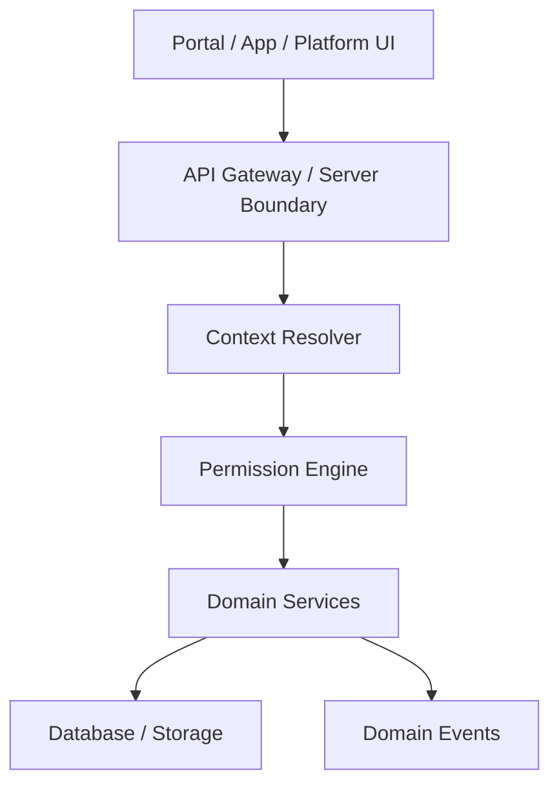

# 03 — API Architecture

**Status:** CTO Technical Blueprint  
**Scope:** API contracts and boundaries only — no implementation

---

## 1. Purpose

Define how RIVA exposes domain capabilities to the Agent Portal, Client Portal, Platform Admin, automation workers, and future SaaS integrations.

APIs are the product boundary. UI must consume APIs; UI must not own business rules.

---

## 2. API layers



| Layer | Responsibility |
| --- | --- |
| Gateway | Parse request, validate input, route to service |
| Context resolver | Resolve company/unit/workspace/portal context |
| Permission engine | Authorize capability on resource |
| Domain service | Enforce workflow invariants |
| Persistence adapters | Database/storage/provider calls |
| Event publisher | Emit domain events for notifications/automation |

---

## 3. API families

| Family | Scope |
| --- | --- |
| Platform APIs | Company provisioning, platform health, global feature flags |
| Company APIs | Settings, clients, vendors, members, business units |
| Workspace APIs | Workspace lifecycle and module data |
| Portal APIs | Client-safe projections and limited client actions |
| Automation APIs | Rule management and run logs |
| Public SaaS APIs (future) | Self-service provisioning, billing, integrations |

---

## 4. Route/context principles

- Agent APIs require resolved `company_id`; workspace APIs require `workspace_id`.
- Client Portal APIs resolve `portal_key` to workspace and company.
- Client-supplied tenant ids are treated as hints only; server verifies all parents.
- Platform APIs are isolated from Company APIs.

---

## 5. Domain service pattern

Each domain exposes:

```text
commands: mutate state and emit events
queries: read authorized projections
policies: reusable authorization/visibility helpers
events: typed domain events
```

Example domains: company, business unit, workspace, clients, vendors, tasks, timeline, finance, files, gallery, portal, notifications, automation.

---

## 6. Agent Portal support

Agent APIs return operational data and allow domain mutations according to scoped capabilities. They may include draft/internal data that is never exposed to Client Portal.

---

## 7. Client Portal support

Client Portal APIs return curated projections only:

- published timeline items
- visible files/gallery
- sent/payable invoices
- client notifications
- personalization settings

Allowed mutations are narrow: payment intent/record flow, approval decisions, read notification, portal preferences.

---

## 8. Multi-company support

Every API logs and enforces `company_id`. Cross-company access fails before domain service execution. No API provides implicit multi-company aggregation except Platform Admin.

---

## 9. Multi-country support

APIs return raw canonical values plus context metadata where needed:

- UTC timestamps + display timezone
- minor currency amount + ISO currency
- locale-aware labels only at projection layer

---

## 10. Versioning

Internal APIs may evolve during rebuild, but public/portal contracts must be versioned once external clients or mobile apps exist.

Future public SaaS APIs use explicit version prefixes and backwards-compatible additions.

---

## 11. Error model

| Error | Rule |
| --- | --- |
| Unauthorized | Generic, no tenant existence leakage |
| Validation | Field-level user-safe messages |
| Domain conflict | Stable business error codes |
| Provider failure | Logged internally; safe user message externally |

---

## 12. Non-goals

No endpoint code, no server actions, no generated clients.
