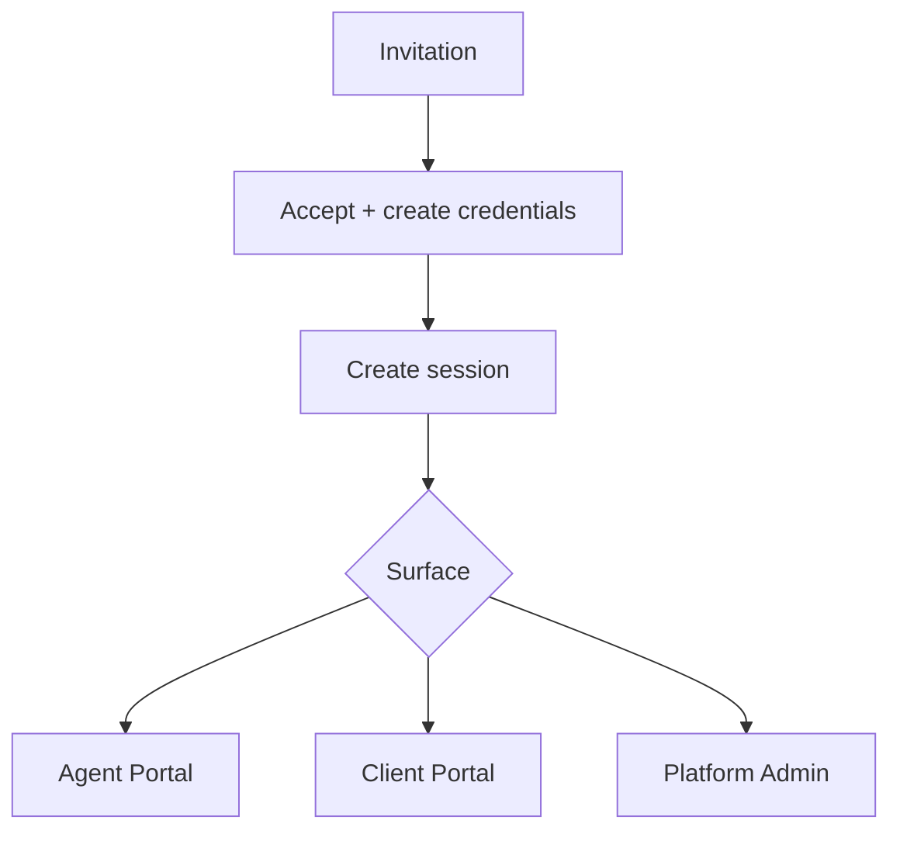

# 04 — Authentication

**Status:** CTO Technical Blueprint  
**Scope:** Identity and session design only

---

## 1. Purpose

Define how users authenticate into RIVA across Platform Admin, Agent Portal, and Client Portal while preserving portal separation, invitation-first access, and future public SaaS readiness.

---

## 2. Identity types

| Identity | Surface | Notes |
| --- | --- | --- |
| Platform admin | `/platform` | RIVA internal operators |
| Agent user | `/app` | Company staff |
| Client user | `/portal` | Customer access to workspace projection |
| Vendor user (future) | future vendor portal | Assignment-scoped external partner |

One human may eventually have multiple identity relationships, but sessions and authorization are evaluated per active surface.

---

## 3. Authentication flows

### Agent flow

1. Company/platform actor sends invitation.
2. Invitee accepts.
3. User identity is created or linked.
4. Membership is materialized.
5. Agent session enters `/app` with company context.

### Client flow

1. Agent invites client to a Client Portal.
2. Client accepts secure portal access.
3. Portal membership is materialized.
4. Client session enters `/portal/:portalKey`.

---

## 4. Session separation

| Surface | Rule |
| --- | --- |
| Platform Admin | Separate authorization from Company roles |
| Agent Portal | Company/unit/workspace memberships apply |
| Client Portal | Portal memberships only |

Agent sessions do not automatically grant client portal actions. Client sessions never grant agent actions.

---

## 5. Invitation-first policy

Until Public SaaS:

- No public agent registration.
- Company onboarding is platform/provisioning controlled.
- Agent and client access begins from invite or secure provisioning.

Phase 8 may introduce public company signup, but it still creates Company + Owner membership through controlled provisioning.

---

## 6. Multi-company support

An authenticated agent may belong to several companies. Authentication proves identity; authorization decides company access. Active company context is selected after login or via deep link resolution.

---

## 7. Multi-country support

- Auth flow must support localized email templates.
- Login and invite timestamps render in recipient locale/timezone.
- Future data residency may route auth-adjacent audit logs by company region.

---

## 8. Client Portal compatibility

Portal auth resolves `portal_key` and membership before returning any workspace data. Portal invites are workspace-scoped and must not expose Company/Agent navigation.

---

## 9. Security requirements

- Store no raw invitation tokens.
- Expiring, single-use invitation tokens.
- Password reset and invite acceptance audited.
- Session invalidation on membership removal.
- Rate limit auth endpoints.
- Never log secrets or raw tokens.

---

## 10. SaaS considerations

Public SaaS later adds:

- self-serve company creation
- owner verification
- billing attachment
- onboarding templates

It does not remove invitation-based team/client access.
