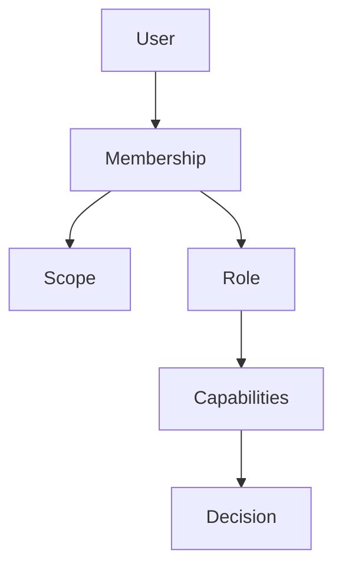

# 05 — Permission Model

**Status:** CTO Technical Blueprint  
**Scope:** Authorization design only

---

## 1. Purpose

Define RIVA's authorization model for 100,000-company scale: scoped memberships, roles, capabilities, and resource checks across Agent Portal, Client Portal, and Platform Admin.

---

## 2. Core model

```text
User
  → Membership(scope)
    → Role
      → Capabilities
        → Resource/action decision
```



---

## 3. Scopes

| Scope | Example capabilities |
| --- | --- |
| Platform | provision companies, suspend tenants |
| Company | manage settings, clients, vendors, members |
| Business Unit | manage unit settings, workspace lists |
| Client Workspace | operate modules, publish portal |
| Portal | view published content, pay invoices, approve |

---

## 4. Default roles

| Scope | Roles |
| --- | --- |
| Platform | `platform_super_admin` |
| Company | `company_owner`, `company_admin`, `company_member` |
| Business Unit | `unit_admin`, `unit_member` |
| Workspace | `workspace_lead`, `workspace_editor`, `workspace_finance`, `workspace_viewer` |
| Portal | `portal_owner`, `portal_member`, `portal_viewer` |

Roles are presets; capabilities are the actual enforcement mechanism.

---

## 5. Capability examples

| Capability | Meaning |
| --- | --- |
| `company.members.invite` | Invite agents |
| `company.clients.write` | Manage company CRM clients |
| `unit.workspaces.create` | Create Client Workspace |
| `workspace.tasks.write` | Manage tasks |
| `workspace.finance.write` | Manage finance records |
| `workspace.portal.publish` | Publish client-visible content |
| `portal.invoice.pay` | Pay invoice from Client Portal |
| `portal.approval.decide` | Approve/reject portal approval |

---

## 6. Authorization algorithm

1. Authenticate user.
2. Resolve resource and tenant context.
3. Load memberships for that user in the relevant company/scope.
4. Expand roles to capabilities.
5. Check requested capability.
6. Apply attribute rules (ownership, visibility, status).
7. Allow or deny.

All denied cross-tenant requests use generic errors.

---

## 7. Multi-workspace support

Workspace access may be granted by:

- company-level admin role
- unit-level role
- explicit workspace membership

Large companies should prefer explicit workspace assignment to prevent accidental broad access.

---

## 8. Multi-company support

Memberships are isolated per company. A user with admin access in Company A has no implied access in Company B.

---

## 9. Multi-country support

Country does not change base authorization. Later compliance rules may add attribute conditions by company region or legal entity.

---

## 10. Client Portal compatibility

Portal membership is workspace-scoped and exposes only portal capabilities. Client Portal cannot call Agent Portal capabilities.

---

## 11. SaaS considerations

- Plans can disable capability groups.
- Enterprise plans may add custom roles.
- Access review reports operate per company.
- Audit logs record sensitive grants and denials.

---

## 12. Non-goals

No code, no policies, no migration.
