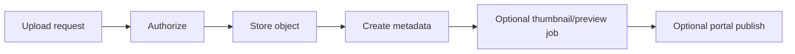

# 06 — Storage Architecture

**Status:** CTO Technical Blueprint  
**Scope:** File/media storage design only

---

## 1. Purpose

Define how RIVA stores, secures, publishes, and retains files and media across companies, client workspaces, modules, and portals.

---

## 2. Storage categories

| Category | Examples | Scope |
| --- | --- | --- |
| Documents | PDFs, contracts, invoices, briefs | Company / workspace |
| Media | Images, video, gallery assets | Workspace / portal |
| Portal assets | music, backgrounds, personalization media | Workspace portal |
| System exports | reports, backups, archives | Company |
| Generated assets | future AI drafts, thumbnails, previews | Workspace |

---

## 3. Metadata vs object bytes

Database stores metadata:

- `company_id`
- `workspace_id`
- owner type/id
- storage key
- mime type
- size
- visibility
- checksum
- created/updated fields

Object storage stores bytes only.

---

## 4. Storage hierarchy

```text
company/{company_id}/
  workspace/{workspace_id}/
    files/
    gallery/
    portal/
      backgrounds/
      music/
    generated/
  company-library/
  exports/
```

This is a logical key structure; provider-specific paths may differ.

---

## 5. Access model

| Access type | Rule |
| --- | --- |
| Agent private file | Agent membership + capability |
| Portal file | Portal membership + published visibility |
| Public CDN asset | Only explicitly public portal-safe assets |
| Export | Company admin / owner capability |

Signed URLs are short-lived. Raw storage buckets are not directly browsable.

---

## 6. Client Portal compatibility

Portal can see only:

- files marked portal-visible
- gallery items published to portal
- portal background/music configured for that workspace
- invoice/payment documents with client-visible status

Portal never receives agent-private storage paths.

---

## 7. Multi-company support

All file metadata includes `company_id`. Storage keys include tenant prefix. Cross-company file references are invalid.

---

## 8. Multi-country support

- Company may declare preferred storage region in future.
- CDN should support global delivery for portal assets.
- Legal retention may vary by company country.
- Filename and metadata support Unicode.

---

## 9. SaaS considerations

- Storage usage counted per company.
- Plan limits can apply to total GB, media transforms, exports, and retention.
- Suspended companies may lose upload rights while retaining read/export.

---

## 10. Processing pipeline



---

## 11. Retention and deletion

- Prefer archive/soft-delete metadata first.
- Hard deletion requires policy and audit.
- Portal keepsake mode can keep selected gallery assets after workspace archive.

---

## 12. Non-goals

No provider implementation, no bucket creation, no upload component.
