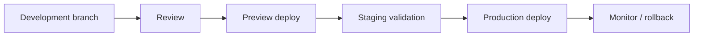

# 08 — Deployment Strategy

**Status:** CTO Technical Blueprint  
**Scope:** Environments, release, SaaS readiness

---

## 1. Purpose

Define how RIVA should be deployed safely as it evolves from archived Prototype V0 into a scalable multi-company SaaS platform.

---

## 2. Environment model

| Environment | Purpose |
| --- | --- |
| Local | Developer work only |
| Preview | Pull request / review deployments |
| Staging | Production-like validation |
| Production | Live customer data |

Production data never flows to local without anonymization.

---

## 3. Release flow

---

## 4. Deployment principles

- Documentation-approved architecture before build.
- Small vertical slices.
- Feature flags for risky modules.
- Forward-only migrations once implementation starts.
- Build/test gates before deploy.
- Rollback strategy documented before high-risk releases.

---

## 5. Multi-company deployment considerations

- Deployments must not require per-company manual changes.
- Tenant-level feature flags allow controlled rollout.
- Tenant-aware monitoring and logs are mandatory.
- Data migrations must be safe for large tenant counts.

---

## 6. Multi-country deployment considerations

- Region-ready architecture: future data residency by company region.
- CDN for portal assets.
- Environment variables support country-specific providers later.
- Locale/currency configuration stored per company/workspace, not deploy-time constants.

---

## 7. Client Portal considerations

Client Portal must be highly cacheable where safe, but never cache private portal data without authorization controls. Public-looking portal URLs still require secure resolution.

---

## 8. SaaS readiness

Phase 8 adds:

- public signup
- billing
- plan gates
- tenant provisioning automation
- status pages / incident playbooks
- customer export/delete workflows

The deployment path should avoid assumptions that only one company exists.

---

## 9. Observability

| Signal | Required dimension |
| --- | --- |
| Logs | request id, company id, workspace id when applicable |
| Metrics | tenant-safe aggregates |
| Errors | route/surface/module, no secrets |
| Jobs | run id, retry count, company id |
| Audit | actor, scope, action |

---

## 10. Non-goals

No CI/CD implementation, no hosting config, no infrastructure changes.
